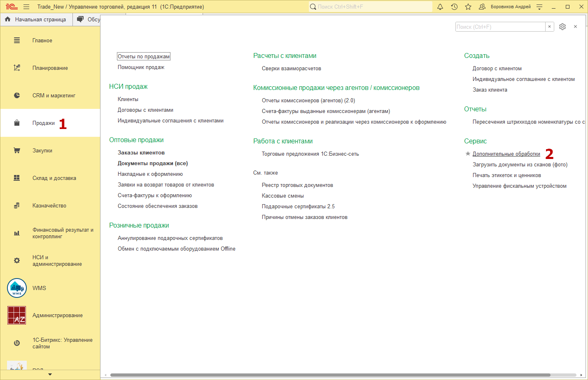
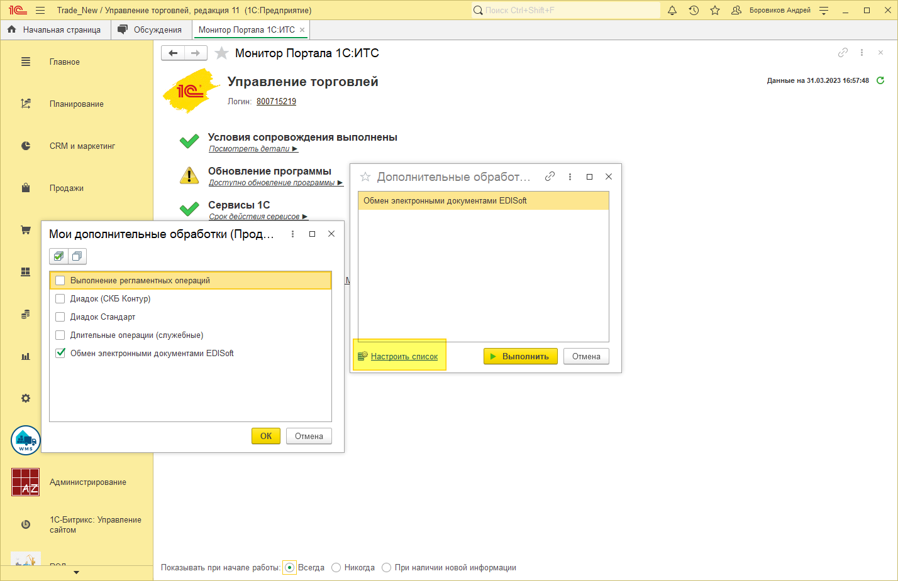
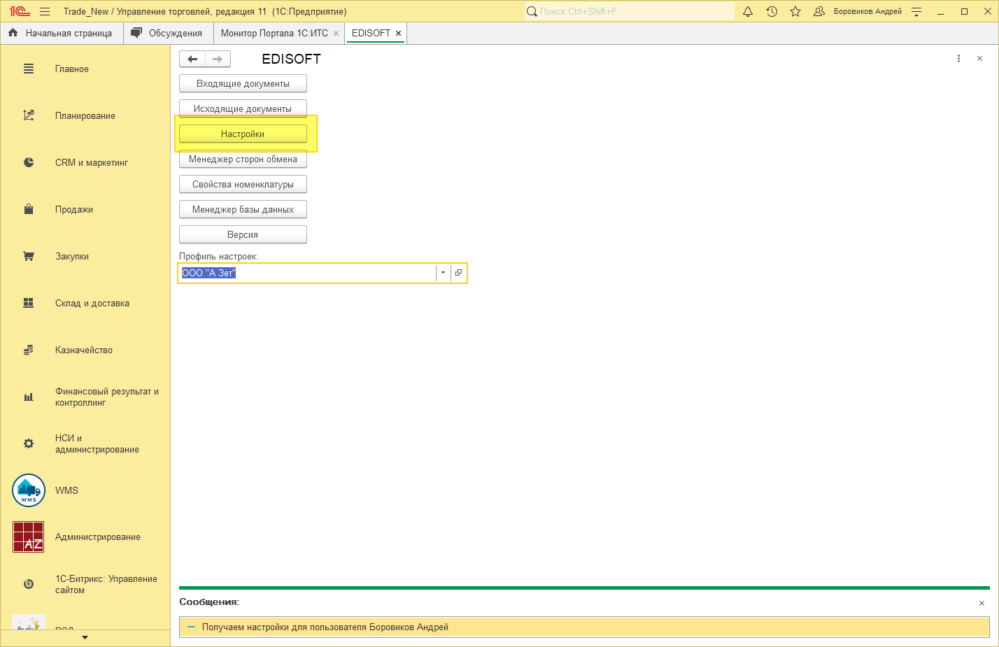
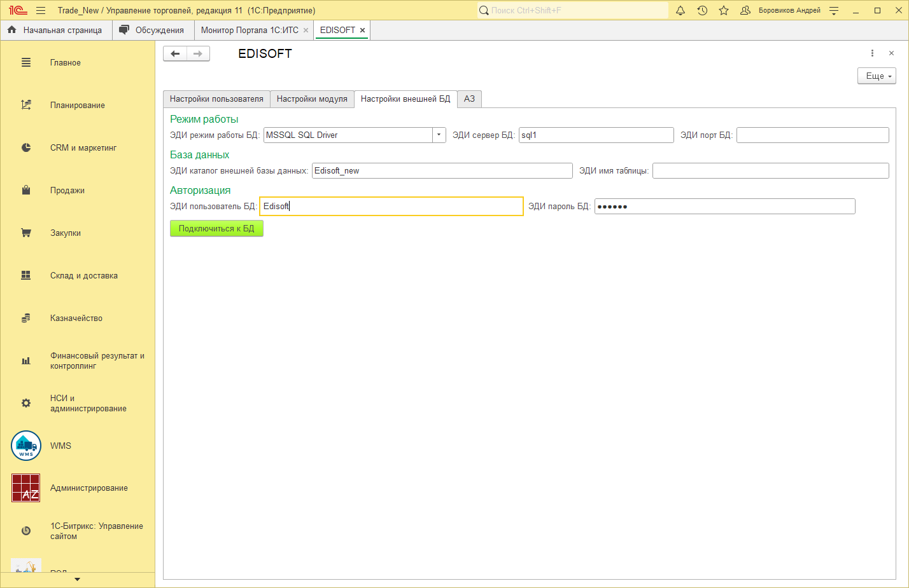
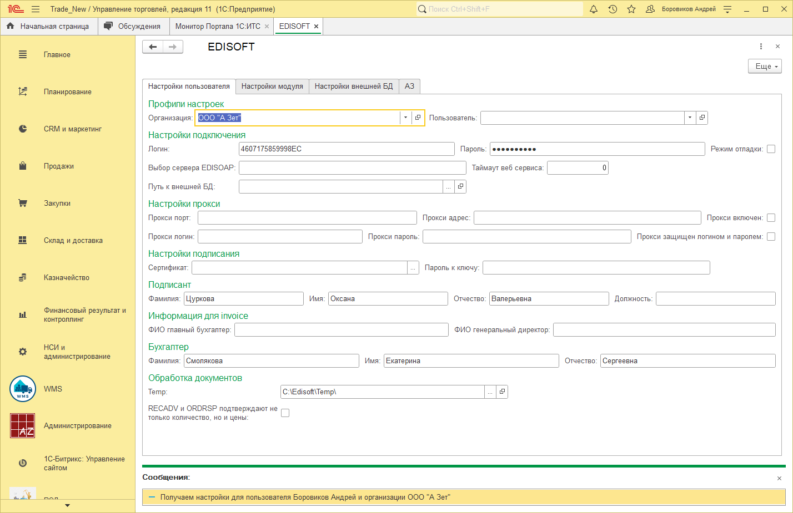
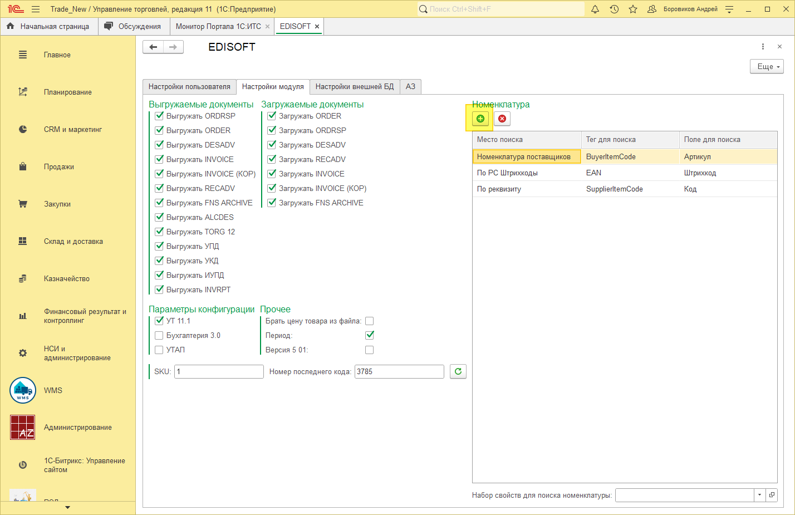
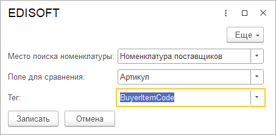
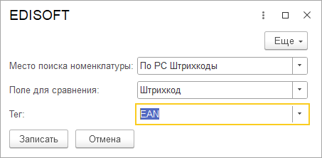
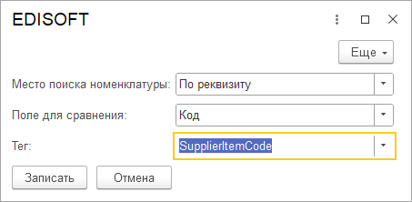

# Едисофт первый запуск

## Запуск модуля ЭДО Едисофт
Переходим в раздел Продажи – Сервис – Дополнительные обработки

Если в окне «Дополнительные обработки» пусто, то нажимаем кнопку «Настроить список».

Ставим галочку напротив нужной обработки и нажимаем ОК.

Далее запускаем обработку кнопкой Выполнить.

Открываем «Настройки»

Переходим на вкладку «Настройки внешней БД», указываем настройки:

`Режим работы: MSSQL SQL Driver`

`Эди сервер БД: sql1`

`ЭДИ каталог внешней базы данных: Edisoft\_new``

`ЭДИ пользователь: Edisoft`

`ЭДИ пароль БД: 141414`

Нажимаем кнопку «Подключится к БД», если все хорошо кнопка станет зеленой, в противном случае проверяем настройки заново.

Далее выбираем организацию и заполняем поля по скрину (пример АЗ):

`Логин: А ЗЕТ`

`Пароль: 3rofw1l`

`Подписант: Цуркова Оксана Валерьевна `

`Должность: Руководитель отдела по работе с ключевыми клиентами`

`Бухгалтер: Смолякова Екатерина Сергеевна`

Temp: C:\Edisoft\Temp\ (эту папку нужно предварительно создать на диске «С», если её нет)

Переходим на страницу «Настройки модуля»

`Галочки «Выгружаемые документы» ставьте только те, с которыми работаете`

Остальные параметры как на скрине:

`Галочка «УТ 11.1», Галочка «Период»`

SKU 1

Номер последнего кода 3785

Далее добавляем поля поиска номенклатуры, ниже скрины

Нажимаем кнопку Добавить (зеленый плюс), и так три раза, не забывая нажать записать

