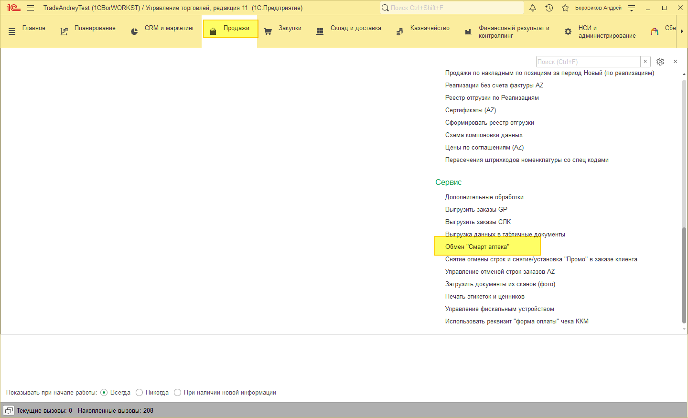
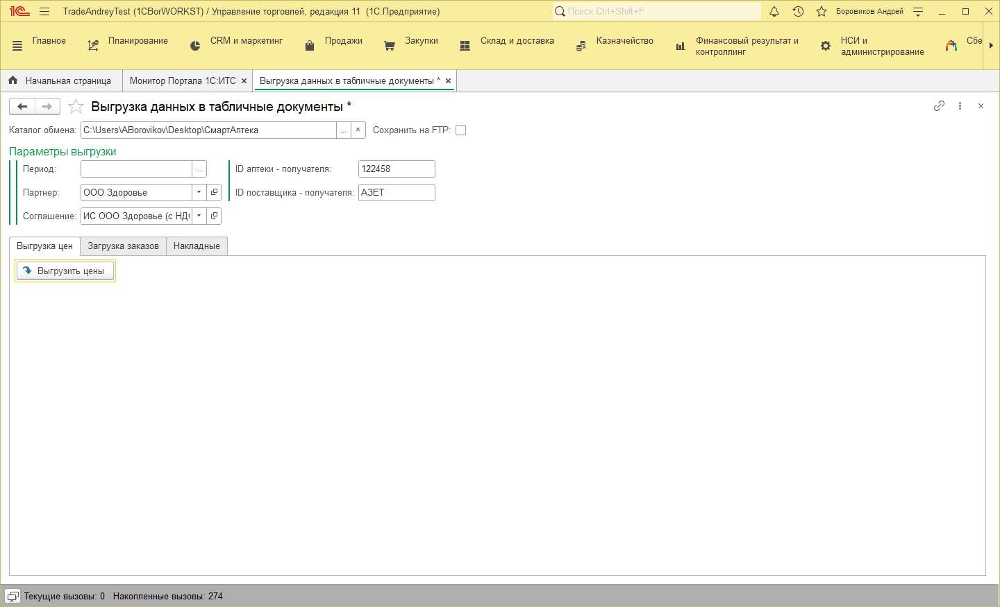
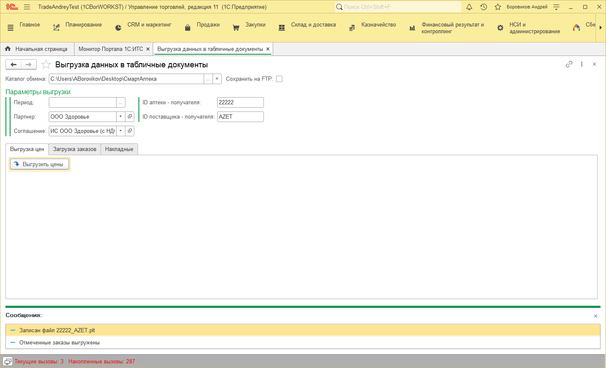
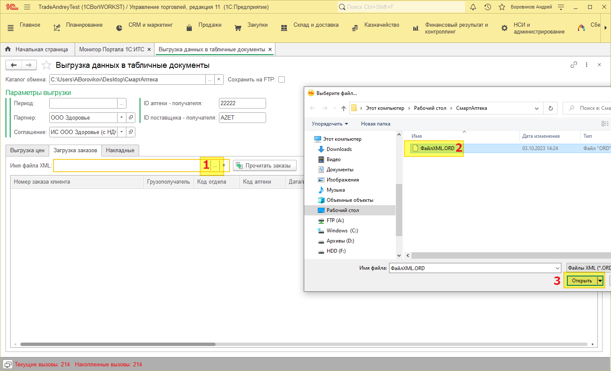
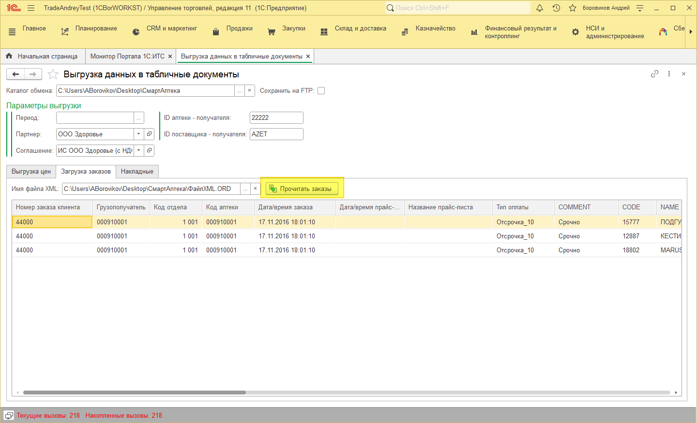

# Обмен Смарт Аптека

## Обмен «Смарт аптека»
Обработка обмена находится в подсистеме Продажи – Сервис – Обмен «Смарт аптека».

## Выгрузка прайс листа
Для выгрузки прайс листа небходимо заполнить шапку формы.

- Каталог обмена – это папку куда будут сохранятся файлы
- Партнер – для которого идёт выгрузка
- Соглашение – откуда будут братся цены
- ID аптеки – получателя
- ID поставщика

Эти параметры сохраняются в настройках программы, и при следующем открытии будут подставлятся автоматически.

Для выгрузки цен необходимо нажать кнопку «Выгрузить цены», по окончании выйдет сообщение о завершении.

## Загрузка заказов
Для загрузки заказов переходим на вкладку «Загрузка заказов», нажимаем кнопку выбора файла (1), выбираем нужный файл (2), нажимаем кнопку Открыть (3).

Далее нажимаем кнопку «Прочитать заказ», заказ будет прочитан, можно визуально убедится что все данные загружены.

Инструкция будет дополнятся по мере готовности функционала.
