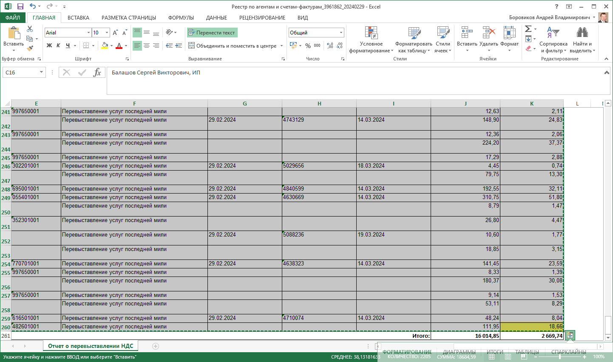

# Загрузка перевыставления услуг

#### **_Открытие обработки и первичные настройки_**

Обработка находится в «Расширении А Зет» - «Сервис» – «Загрузка перевыставления услуг (АЗ)».

При открытии все поля автоматически заполнятся, для организации «ООО "А Зет"».
Единственное поле, которое нужно выбрать, это договор контрагента взаимозачёта.
Также можно сменить любые поля на свои, при следующем запуске обработки откроются уже они.
Для загрузки нажимаем кнопку «Загрузить из табличного документа».

### Упрощение копирования данных из файла

Чтобы проще было копировать данные их XL файла можно воспользоваться удобным способом.
Открываем файл и ставим курсор мышки на первый элемент первой строки копируемой таблицы, как на скрине ниже.

Далее прокручиваем таблицу до конца используя полосы прокрутки справа и снизу, нам нужно увидеть правый нижний угол таблицы. На саму таблицу мы пока не кликаем мышкой.
Когда последний элемент последней строки нам виден, нажимаем на клавиатуре кнопку «Shift» и не отпуская её кликаем на последний элемент таблицы левой кнопкой мыши, на скрине ниже. В результате мы выделяем для копирования всю таблицу, теперь её можно скопировать, нажав на клавиатуре клавиши «Ctrl» потом «С». Всё область скопированна.

### Загрузка и создание документов

Нажимаем кнопку «Загрузить из табличного документа» и откроется окно загрузки.

В окне загрузки кликаем мышкой в первый элемент второй строки, шапку загрузки удалять/изменять нельзя. Вставляем ранее скопированную таблицу например нажав на клавиатуре кнопки «Ctrl» потом «V», таблица вставлена.
После вставки нажимаем кнопку «Загрузить».

### После загрузки видим таблицу загруженных данных.

Если контрагента ранее не было в базе, то он будет автоматически создан вместе с договором. Поиск контрагента идёт по ИНН.
Далее идёт поиск созданных документов по соответствию: Дата СФ, Номер СФ, Сумма с НДС. Если подобные документы будут найдены, то они подставятся в поле документ и в последующей обработке будут пропущены.
Для создания документов нажимаем кнопку «Создать документы».

###В результате будут созданы документа поступления услуг.

В движении документа будет создано движение взаимозачёта с контрагентом взаимозачёта.
В движениях будет установлен признак «Ручная корректировка», т.к. без этого признака при перепроведнии документа движени взаимозачёта будет стёрто.

