# Инструкция Ozon

**Инструкция написана для версии 0.0.0.40.**

**Если вы устанавливаете более новую версию, то смотрите дополнительно историю изменений, чтобы понимать что появилось в новых версиях.**

**История обновлений доступна по адресу**

[**https://infostart.ru/public/1396736/**](https://infostart.ru/public/1396736/#%D0%B8%D1%81%D1%82%D0%BE%D1%80%D0%B8%D1%8F%20%D0%BE%D0%B1%D0%BD%D0%BE%D0%B2%D0%BB%D0%B5%D0%BD%D0%B8%D0%B9)

**Установка.**

1\.Расширение надо добавить стандартным образом в конфигурацию.

Через **Администрирование-Печатные формы и обработки-Расширения.**

**Не забудьте снять галочку Безопасный режим у установленного расширения.**

2\. Добавить внешнюю печатную форму ПечатьСтикеровОЗОН.epf

Через **Администрирование-Печатные формы и обработки-Дополнительные отчеты и обработки.**

3\.Там же добавить внешнуюю обработку для обмена с озоном по расписанию (ОбменСОзон.epf). Расписание лучше настроить позже после внесения настроек и тестрования.

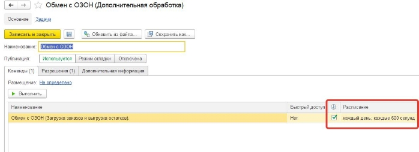

4\. Если планируйется использоватение под пользователем с неполными правами, то пользователю надо добавить роль **«Работа с Озон api»**

После добавления расширения в базе появится новая подсистема со значком Озона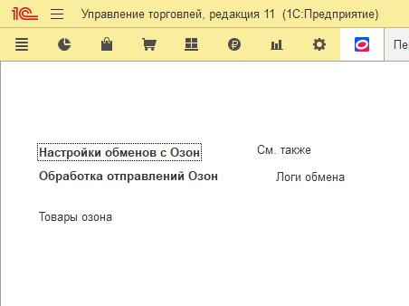

Далее нужно создать новую настройку обмена в справочнике **Настройки обменов с Озон**.

Их может быть несколько, на случай если у вас несколько магазинов в озоне.

Вам понадобится номер ID вашей компании и токен api-key. В личном кабинете они расположены в настройках по адресу https://seller.ozon.ru/app/settings/api-keys

Ключ api-key можно тут же сгенерировать, укажите название ключа, например «1С» и нажмите создать ключ. Не забудьте его скопировать.

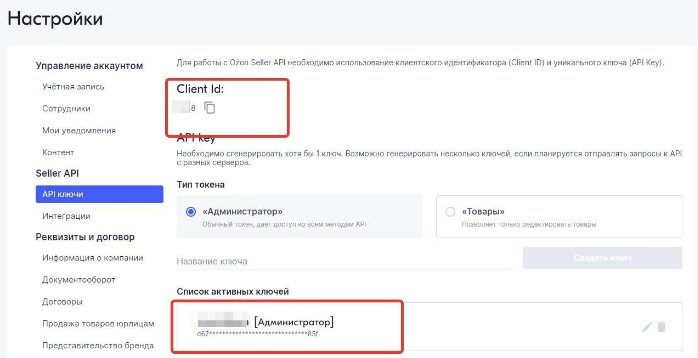

Создайте новый элемент в справочнике **Настройки обменов с Озон.**

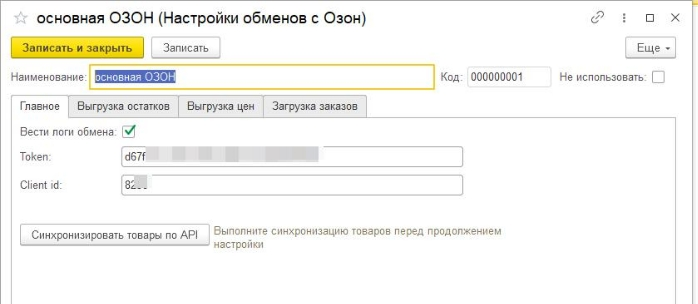

Укажите свой Client id и токен и запишите настройку обмена.

Сразу же можно синхронизировать товары. Для этого нажмите на кнопку **Синхронизировать товары по API.** Если данные были указаны верно откроется форма, которая автоматически заполнится товарами озона. Программа сама попытается сопоставить товары сначала по штрихкоду затем по артикулу, если это не удастся то номенклатуру надо будет указать вручную. Это надо сделать один раз и повторять только после добавления новых позиций на озон. Нажмите кнопку записать чтобы сохранить соответствия карточек озона и номенклатуры.

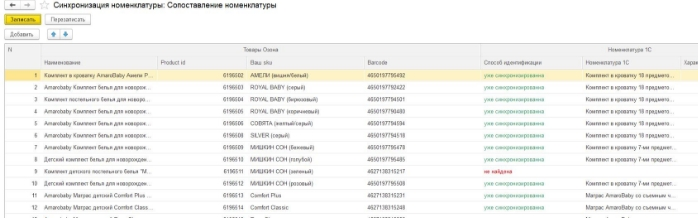

## Выгрузка остатков

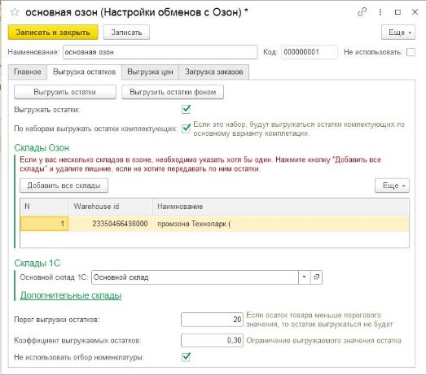

Здесь надо указать склад из 1С. Можно указать дополнительные склады, если вы хотите чтобы показывался общий остаток по нескольким складам.

Нажмите **Добавить все склады**, и если надо удалите неиспользуемые.

Если вы используете наборы, можно выгружать остаток исходя из расчета остатков комплектующих, для жтого поставьте галочку «По наборам выгружать остатки комплектующих»

Порог выгрузки остатков понадобится если вы не хотите выгружать товар которого у вас мало на остатках.

Коэффициент выгружаемых остатков это модификатор позволяющий выгружать например только 10% от реальных остатков на складе, для этого укажите коэффициент 0,1.

Далее вам надо добавить в таблицу весь перечень номенклатуры, остатки по которой вы хотите выгружать выгружать на портал. Если вы все правильно сделали со свойствами указанными выше, то в таблице отобразятся их значения, это для проверки правильности заполнения.

Позиции можно добавить списком, нажав кнопку **Загрузить из Списка** и вставив в открывшееся окошко список артикулов , штрихкодов или кодов номенклатуры. Список можно получить, например, копированием колонки артикул в любом отчете.

Раздел закладка **Выгрузка цен**.

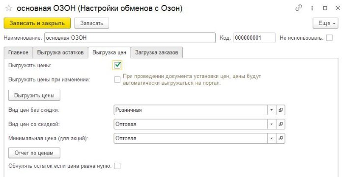

Для использования выгрузки цен, надо поставить галочку Выгружать цены. Выбрать вид цены без скидки и цены со скидкой и при необходимости минимальную цену для акций. Отчет по ценам позволит просмотреть цены на портале и в 1с для проверки. Кнопка «Выгрузить цены» запустит выгрузку цен.

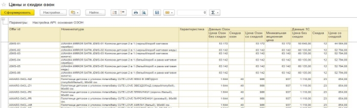

Далее **настройки загрузки сборочных заданий.**

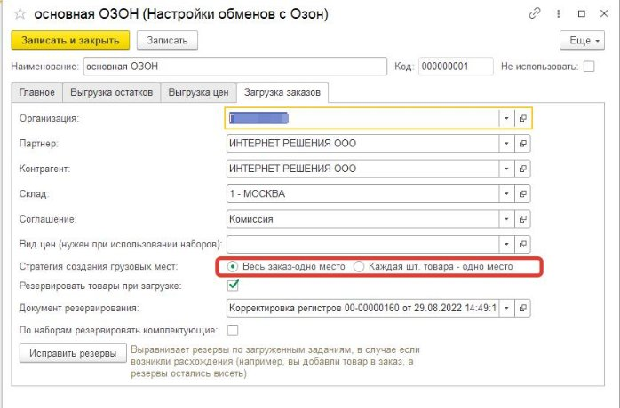

Здесь указываются данные которые будут использованы при создании отгрузки.

Партнера надо указать обязательно, иначе у вас не будут видны кнопки в заказе клиента для озона. Видимость кнопок определяется по партнеру.

Галочка «резервировать товары при загрузке» нужна для того чтобы предварительно резервировать товар по отправлениям озона, до того как вы добавите их в отгрузку.

Галочка «по наборам резервировать комплектующие» понадобится, если вы используете наборы.

**Важная настройка Стратегия создания грузовых. Если вам надо разбивать отправления, так чтобы в каждом оказалась только одна штука товара, то переключиться эту настройку в соответствующее положение.**

Иногда в результате ошибок возникает расхождения между загруженными отправлениями и зарезервированным товаром, кнопка исправить резервы поможет исправить ситуацию.

## Использование.

Если вы используете расписание обмена, то новые заказы наверно уже загрузились,

Если же нет то переходим в раздел **Интеграция Озон- Обработка отправлений Озон**

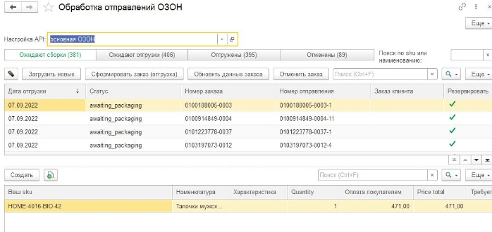

Укажите вашу настройку обмена сверху.

Здесь отображается список загруженных заказов и их состав товаров ниже.

По кнопке загрузить новые вам загрузятся новые заказы. Так можно действовать, если вас не интересует предварительное резервирование товара(т.е. не включать обмен по расписанию).

Здесь можно выделить нужные отправления и нажать кнопку «Сформировать заказ(отгрузка)». Откроется новый заполненный заказ клиента. Но

## Основной вариант работы предполагает работу из заказа клиента.

Допустим новые заказы у вас уже загружены, по расписанию, либо вручную.

Создайте новый заказ клиента на озон, заполните шапку, запишите его.

Далее все кнопки работы есть в самом заказе. Используйте их в порядке указанном на скриншоте.

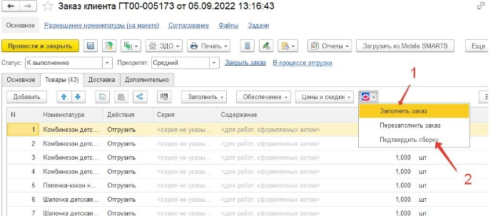

Кнопка **Заполнить заказ,** производит загрузку свежих отправлений за выбранную дату и добавляет всю номенклатуру из них в заказ клиента.

Так же добавлена кнопка для **Перезаполнить заказ**, она поможет, если были удалены какие то товары из документа. Эта кнопка перезаполняется заказ только товарами уже ранее добавленными в этот заказ товарами.

## Печать этикеток

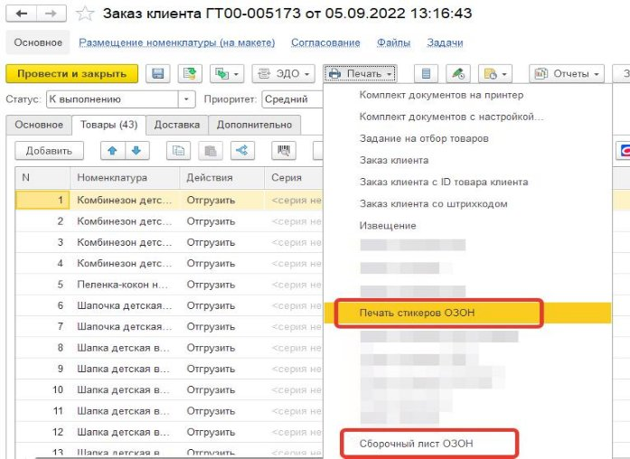

Можно распечатать Сборочный лист из документа заказ клиента напрямую, либо из формы печати стикеров (см.далее)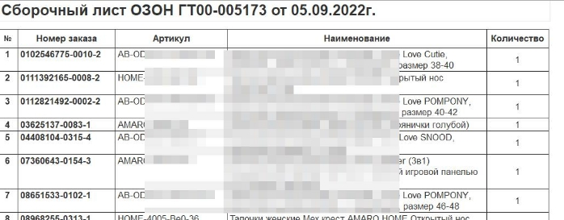

## Форма печати стикеров

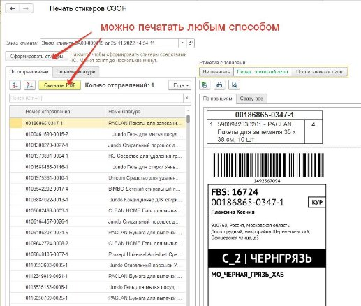

При открытии формы печати, если стикеры еще не были сформированы в фоне, поскольку это занимает какое то время, нажмите кнопку «Сформировать стикеры. Важно! На самом деле озон может передавать стикеры только в pdf, поэтому для печати через 1с их приходится конвертировать в картики с потерей качества, на некоторых принтерах качество может быть заметно хуже чем при печати из pdf. Так же именно поэтому формирование стикеров занимает много времени, в зависимости от количества товаров. Поэтому есть вариант скачивания этикеток в pdf. Можно просто выделить отправления (до 20ти за раз) и нажать «Скачать PDF». 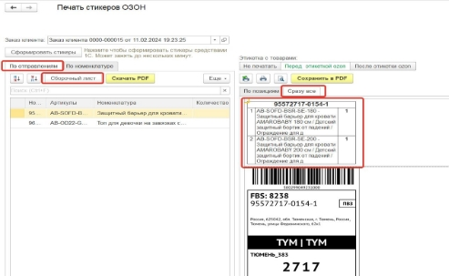

Можно печатать как по номенклатуре, так и по отправлениям. При печати по номенклатуре будут формироваться все стикеры отправлений с этой номенклатурой. При печати по отправлениям, печатается этикетка выделенного отправления. В этом случае можно распечатать общую ленту со всеми этикетками и перед каждой этикеткой будет следовать стикер с составом заказа этого отправления (либо состав можно не печатать и обклеивать по сборочному листу). Так же в этом варианте можно сформировать сборочный лист, уже в той сортировке которую вы сделаете в таблице отправлений, например, можно отсортировать по номенклатуре в алфавитном порядке. В этом же порядке сформируется сборочный лист (если сформировать его по кнопке из печати стикеров см рис. выше), а так же лента стикеров. Экспериментируйте, чтобы узнать какой метод сборки вам удобнее.

**Важно! Стикеры можно печатать только после подтверждения сборки (смены статусов отправлений).**

**Маркировки товаров передаются также при подтверждении сборки, для этого уже должна быть проведена Реализация товаров с проверенными кодами маркировки.**

Можно распечатать сборочный лист с маркировками, если вы хотите разложить товар в соответствии с маркировками.

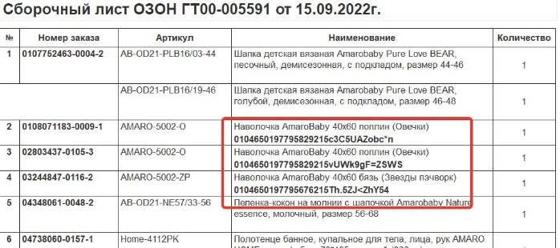

## Загрузка отчетов комиссионера

Для загрузки отчета комиссионера надо в самом документе отчет комиссионера использовать кнопку **Загрузить по API OZON.** Откроются настройки загрузки отчета, надо выбрать настройку обмена и месяц, за который будете грузить отчет(надо выбрать любую дату нужного месяца). Вариант отчета Полный, грузит и продажи и возвраты в один отчет, возвраты будут вычтены из продаж. Либо можно загрузить в разные документы продажи и возвраты.

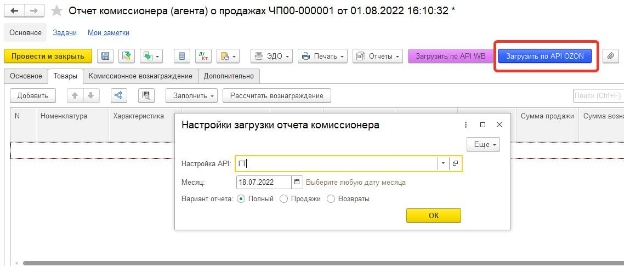

## Дополнительные возможности.

Загрузка номенклатуры из маркетплейса в 1С.

Добавлена возможность загрузки номенклатуры с маркетплейса в 1С. Подойдет для пустых баз 1С, если вы только начинаете вести учет, при этом на маркетплейсе у вас уже есть номенклатура. Кнопка доступна на форме синхронизации номенклатуры, далее все инструкции указаны в самом модуле. 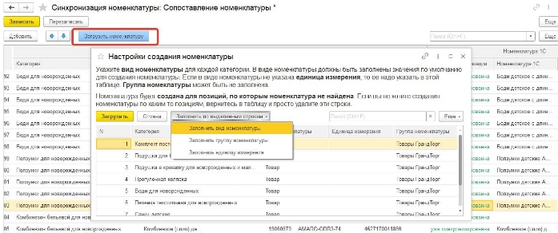
