# Инструкция СберМегаМаркет

**Инструкция написана для версии 1.0.1.10.**

**Если вы устанавливаете более новую версию, то смотрите дополнительно историю изменений, чтобы понимать что появилось в новых версиях.**

**История обновлений доступна по адресу**

[**https://infostart.ru/public/1396736/**](https://infostart.ru/public/1396736/#%D0%B8%D1%81%D1%82%D0%BE%D1%80%D0%B8%D1%8F%20%D0%BE%D0%B1%D0%BD%D0%BE%D0%B2%D0%BB%D0%B5%D0%BD%D0%B8%D0%B9)

**Внимание!** Расширение не требует установки web-сервера и публикации базы в интернет. Включать в личном кабинете интеграцию **НЕ НУЖНО!!!** В поддержку для подключения интеграции также обращаться не нужно, модуль работает без этого. Возможно вам придется обратиться в поддержку один раз для переключения способа обновления остатков, но об этом ниже.  С этой страницы вам нужно будет только взять авторизационный токен и ID вашего личного кабинета.

https://partner.sbermegamarket.ru/settings/api-integration

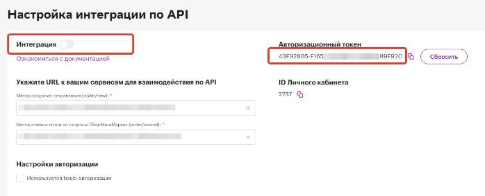

## Установка.

1\.Расширение надо добавить стандартным образом в конфигурацию. 

Через  **Администрирование-Печатные формы и обработки-Расширения.**

**Не забудьте снять галочку Безопасный режим у установленного расширения.**

2\. Добавить внешнюю печатную форму ПечатьСтикеровСБЕР.epf

Через  **Администрирование-Печатные формы и обработки-Дополнительные отчеты и обработки.** 

3\.Там же добавить внешнуюю обработку для обмена с Сбермегамаркетом по расписанию    (ОбменСоСберМегаМаркет.epf). Расписание лучше настроить позже после внесения настроек и тестрования.

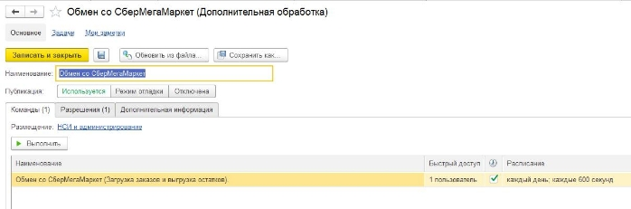

4\. Если планируйется использоватение под пользователем с неполными правами, то пользователю надо добавить роль **«Работа со Сбермегамаркет»**

После добавления расширения в базе появится новая подсистема со значком Сбер

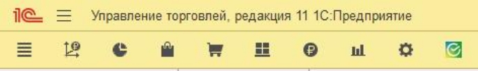

Далее нужно создать новую настройку обмена в справочнике  **Настройки обменов Сбермегамаркет**.

Их может быть несколько, на случай если у вас несколько магазинов в маркете. несколько складов.

Вам понадобится номер ID вашего личного кабинета и токен, где их  взять указно на первом скрине. 

Создайте новый элемент в справочнике **Настройки обменов с Сбермегамаркет.**

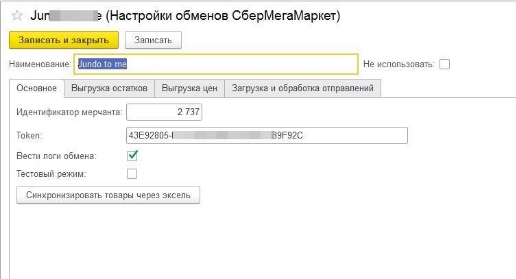

Сразу же можно синхронизировать товары. Для этого нажмите на кнопку **Синхронизировать товары через эксель.** Откроется форма с инструкцией где будет указано где взять файл. Файл надо взять в личном кабинете Ассортимент - Готовые связки, там будет кнопка Скачать. Скачиваете файл и выбираете его на форме.

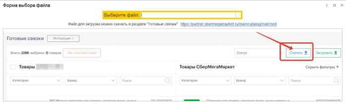

После анализа файла откроется форма сопоставления номенклатуры.

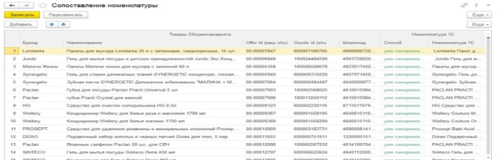

Будет выполнен поиск и сопоставление номенклатуры сначала по штрихкоду, потом по артикулу, потом по наименованию. Способ поика которым нашлась номенклатура будет указана в колонке Способ. Если номенклатура не определилась, в колонке способ будет указано «Не найдена», в этом лсучае вам надо указать номенклатуру вручную, соответствие запоминается. При след синхронизации они будут указаны как уже синхронизированные. Синхронизацию надо повторять каждый раз после добавления новых позиций на сбермегамаркете. Не забудьте нажать кнопку **Записать**, чтобы сохранить сопоставления. 

Если у вас несколько магазинов личном кабинете, (они переключаются сверху), надо сделать синхронизацию товаров с файлом из каждого из них.

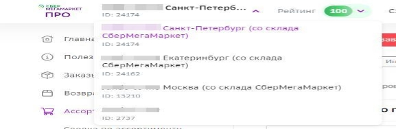

` `Далее закладка **Выгрузка остатков**

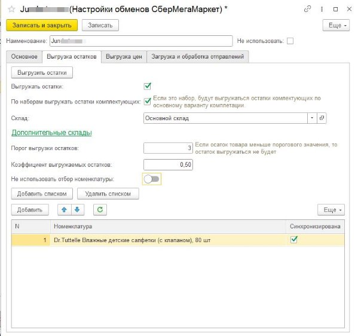

Вам надо заполнить указать склад из 1С. Можно указать дополнительные склады, если вы хотите чтобы показывался общий остаток по нескольким складам.

Если вы используете наборы, можно выгружать остаток исходя из расчета остатков комплектующих, для этого поставьте галочку «По наборам выгружать остатки комплектующих»

Порог выгрузки остатков понадобится если вы не хотите выгружать товар которого у вас мало на остатках. 

Коэффициент выгружаемых остатков это множитель позволяющий выгружать например только 10% от реальных остатков на складе, для этого укажите коэффициент  0,1.

Если вы хотите выгружать остатки по всей номенклатуре, которую вы синхронизировали на предыдущем этапе, то включите переключатель **Не использовать отбор номенклатуры.** Если же вы хотите выгружать остатки по ограниченному списку товаров, отключите этот переключатель и тогда вам надо добавить в таблицу весь перечень номенклатуры, остатки по которой вы хотите выгружать на портал. Если вы все правильно сделали со свойствами указанными выше, то в таблице отобразятся их значения, это для проверки правильности заполнения.

Протестировать выгрузку остатков можно кнопкой **Выгрузить остатки**. Если вы установили расписание, то они будут так же выгружаться по расписанию.

Если при тесте выгрузки остатков вы получаете сообщение 

«"Не удалось выполнить операцию. Проверьте настройку способа получения остатков."»

То вам надо будет обратиться в поддержку, чтобы вам включили возможность обновления остатков по api.

Позиции можно добавить списком, нажав кнопку **Загрузить из Списка** и вставив в открывшееся окошко список артикулов , штрихкодов или кодов номенклатуры. Список можно получить, например, копированием колонки артикул в любом отчете.

 ## Выгрузка цен.

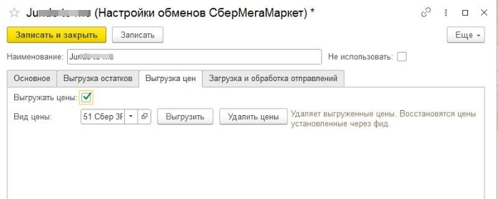

Для использования выгрузки цен, надо поставить галочку Выгружать цены. Выбрать вид цены.  Кнопки Выгрузить и Удалить цены соответственно выгружают и удаляют выгруженные цены. При этом цены установленные через фид, сохраняются в личном кабинете, при выгрузке новых цен, они станут зачеркнутыми и будут действовать новые цены, а при удалении цен, восстанавливаются цены из фида. 

## Загрузки и обработки отправлений.

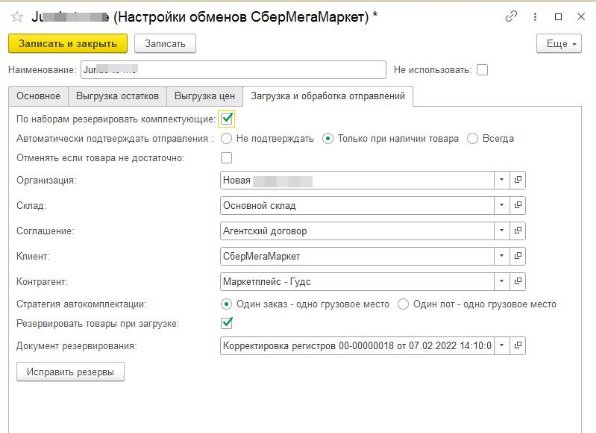

Здесь указываются данные которые будут использованы при создании отгрузки.

Галочка «резервировать товары при загрузке» нужна для того чтобы предварительно резервировать товар по заказам маркета, до того как вы добавите их в отгрузку.

Галочка «по наборам резервировать комплектующие» понадобится, если вы используете наборы.

Иногда в результате ошибок возникает расхождения между загруженными сборочными заказами и зарезервированным товаром, кнопка исправить резервы поможет исправить ситуацию.

Можно настроить автоматическое подтверждение заказа.

Также можно задать стратегию создания грузовых мест, есть два варианта. Весь заказ это одно грузовое место и каждая штука товара это отдельное грузовое место, выбирайте какой вариант вам удобнее. 

## Использование.

Если вы используете расписание обмена, то новые  заказы наверно уже загрузились,

Если же нет то переходим в раздел **Список отправлений СберМегаМаркет**

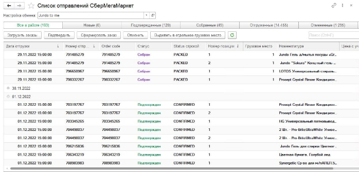

Укажите вашу настройку обмена сверху.

Здесь отображается список  загруженных заказов.

По кнопке загрузить заказы вам загрузятся новые заказы и обновятся статусы уже загруженных. Либо это делается по расписанию, самим модулем.

Можно выделить отправления и нажать кнопку **Сформировать заказ**, так можно действовать, если вы хотите не все отправления за дату отгрудки включать в одну отгрузку. 

Но **Основной вариант работы предполагает работу из заказа клиента.** 

Допустим новые заказы у вас уже загружены, по расписанию, либо вручную.

Создайте новый заказ клиента на сбермегамаркет, заполните шапку, запишите его.

Далее все кнопки работы есть в самом заказе. Используйте их в порядке указанном на скриншоте, на соответствующих этапах отгрузки.

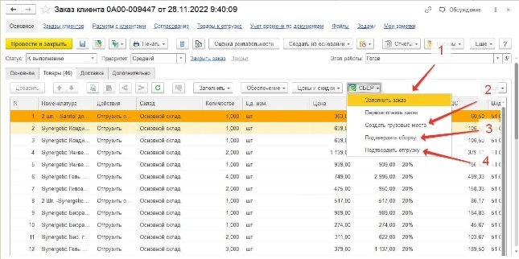

По кнопке **Заполнить заказ** программа предложит выбор дат отгрузки. После выбора даты, вам загрузится вся номенклатура из отправлений на эту дату.

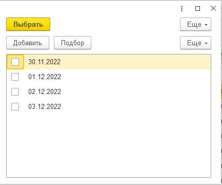

Так же добавлена кнопка для **Перезаполнить заказ**, она поможет, если были удалены какие то товары из документа. Эта кнопка перезаполняется заказ только товарами уже ранее добавленными в этот заказ товарами. 

Для того чтобы напечатать стикеры вам надо обязательно **Создать грузовые места**, они будут созданы в соответствии с выбранной вами стратегией в настройке обмена.

Если какие то товары вы захотие выделить в отдельное грузовое место, чтобы распечатать для них отдельную этикетку этоможно сделать в списке отправлений сбермегамаркет. Так же оттуда можно отменять позиции которые, анпример не нашлись на складе, после отмены надо просто перезаполнить заказ клиента.

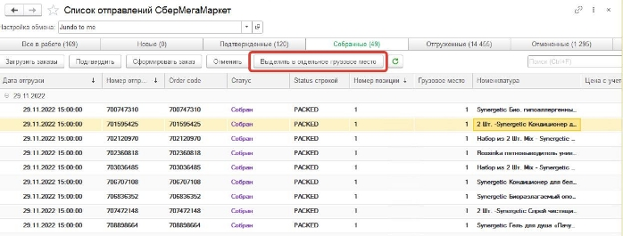

## Печать стикеров 

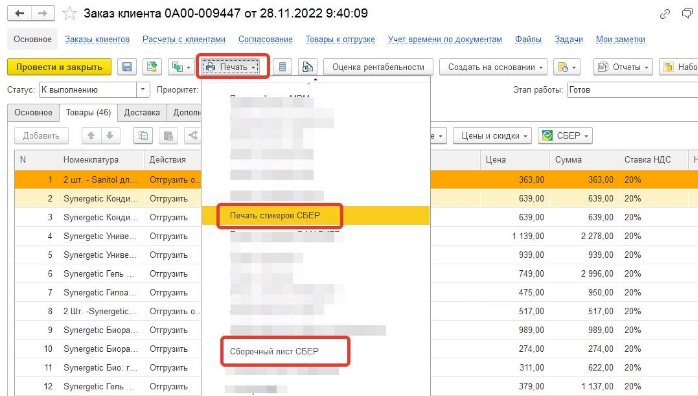

Стикеры печатаются сериями по одинаковой номенклатуре. Вначале серии печатается стикер с составом заказа, чтобы было понятно на какую позицию клеить данные ярлыки.

Выделите номенклатуру в списке номенклатуры и обработка сформирует все ярлыки с этой позицией. Если вы не видите штрихкодов на стикерах, значит вы не создали грузовые места.

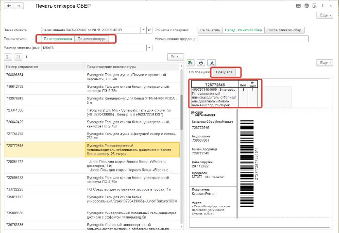

Так же можно печатать в режиме по отправлениям. В этом случае можно распечатать общую ленту со всеми ярлыками и перед каждым ярлыком будет следовать стикер с составом заказа этого ярлыка. Экспериментируйте, чтобы узнать какой метод сборки вам удобнее. 

Так же можно распечатать сборочный лист.

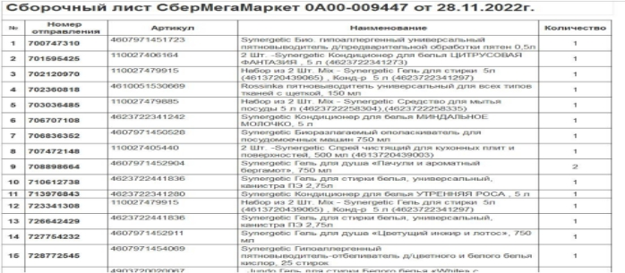

Коды маркировки(если они у вас есть)передаются при подтверждении сборки(кнопка **Подтвердить сборку**). После отгрузки надо нажать **Подтвердить отгрузку**

## Дополнительные возможности.

Загрузка номенклатуры из сбермегамаркета в 1С.

Добавлена возможность загрузки номенклатуры с маркетплейсе в 1С. Подойдет для пустых баз 1С, если вы только начинаете вести учет, при этом на маркетплейсе у вас уже есть номенклатура. Кнопка доступна на форме синхронизации номенклатуры, далее все инструкции указаны в самом модуле. 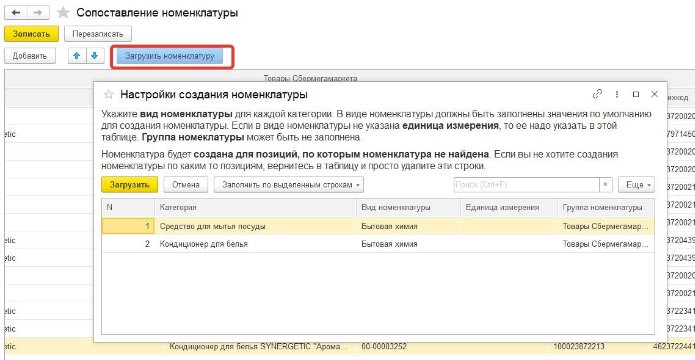

