# Инструкция Wildberries

**Инструкция написана для версии 2.0.4.10.**

**Если вы устанавливаете более новую версию, то смотрите дополнительно историю изменений, чтобы понимать что появилось в новых версиях.**

**История обновлений доступна по адресу**
[**https://infostart.ru/public/1396736/**](https://infostart.ru/public/1396736/#%D0%B8%D1%81%D1%82%D0%BE%D1%80%D0%B8%D1%8F%20%D0%BE%D0%B1%D0%BD%D0%BE%D0%B2%D0%BB%D0%B5%D0%BD%D0%B8%D0%B9)

**В конце инструкции обязательно смотрите раздел «Решение типовых проблем»**

**Подготовка.**

**Для работы вам понадобится два ключа api из личного кабинета. Создаются они в разделе Настройки- Доступ к APi**

Вам надо создать два ключа с видом Стандартный и Статистика. Имя ключа укажите любое.

_Обновление_. Вайлдберриз переходит на новые ключи, на картинках, слева старая генерация, справа новая. В новых ключах красным выделены права для стандартного ключа, синим права для ключа статистики. Если у вас новые ключи для простоты можно создать один ключ со всеми правами и указать его в настройке обмена и как стандратный и как ключ статистики.

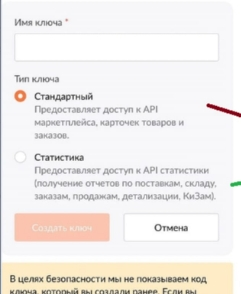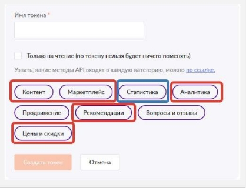

**Установка.**

1\.Расширение надо добавить стандартным образом в конфигурацию.

Через **Администрирование-Печатные формы и обработки-Расширения.**

**Не забудьте снять галочку Безопасный режим у установленного расширения.**

2\. Добавить внешнюю печатную форму Печать стикеров WB

Через **Администрирование-Печатные формы и обработки-Дополнительные отчеты и обработки.**

3\.Там же добавить внешнуюю обработку для обмена с вайлдберриз по расписанию. Расписание настроить позже после внесения настроек и тестрования.

![2021-05-28 02-20-26 [КОПИЯ] Управление торговлей, редакция 11.jpg](./assets/Aspose.Words.0b5fc25b-55fb-4468-b3dd-f18c59fb2aca.003.jpeg)

Если вы планируете использовать отчет по остаткам оборачиваемости, то вам так же надо включить расписание загрузки данных аналитики для отчетов, можно настроить на ночь.

4\. Если планируйется использоватение под пользователем с неполными правами, то пользователю надо добавить роль **Работа с Wildberries API**

**Описание модуля**

После добавления расширения в базе появится новая подсистема со значком Валдберриз

![2021-05-28 01-12-17 [КОПИЯ] Управление торговлей, редакция 11.jpg](./assets/Aspose.Words.0b5fc25b-55fb-4468-b3dd-f18c59fb2aca.004.jpeg)

Далее нужно создать новую настройку обмена в справочнике **Настройки обменов Вайлдберриз**.

Их может быть несколько, на случай если у вас несколько аккаунтов Вайлдберриз или несколько складов.

Вам понадобится Токены полученные в личном кабинете

Создайте новый элемент в справочнике **Настройки обменов Вайлдберриз.**

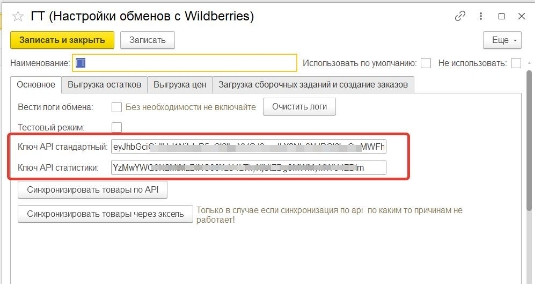

Укажите полученные токены. Запишите настройку. (Кнопка записать)

Сразу же можно синхронизировать товары. Для этого нажмите на кнопку **Синхронизировать товары по API.** Если токены и ключ поставщика были указаны верно откроется форма, которая автоматически заполнится товарами Вайлдберриз. Программа сама попытается сопоставить товары сначала по штрихкоду затем по артикулу, если это не удастся то номенклатуру надо будет указать вручную. Это надо сделать один раз и повторять только после добавления новых позиций на WB. Нажмите кнопку записать чтобы сохранить соответствия карточек вб и номенклатуры.

Так же есть возможность синхронизации товаров через эксель. При нажатии на кнопку, откроется выбор файла и инструкция откуда скачать файл. Этот способ нужен как резервный при проблемах с АПИ.

Далее закладка **Выгрузка остатков**

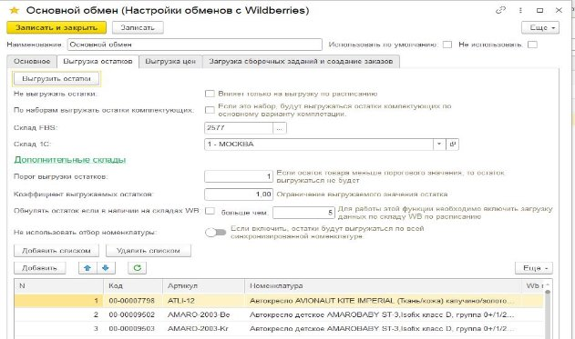

Вам указать ID склада FBS, если вы уже указали токены, то его можно просто выбрать.

Указать склад из 1С. Можно указать дополнительные склады, если вы хотите чтобы показывался общи остаток по нескольким складам.

Если вы используете наборы, можно выгружать остаток исходя из расчета остатков комплектующих, для жтого поставьте галочку «По наборам выгружать остатки комплектующих»

Порог выгрузки остатков понадобится если вы не хотите выгружать товар которого у вас мало на остатках.

Коэффициент выгружаемых остатков это множитель позволяющий выгружать например только 10% от реальных остатков на складе, для этого укажите коэффициент 0,1.

Далее вам надо добавить в таблицу весь перечень номенклатуры, остатки по которой вы хотите выгружать выгружать на портал. Если вы все правильно сделали со свойствами указанными выше, то в таблице отобразятся их значения, это для проверки правильности заполнения. Если вы не хотите ограничивать выгрузку определенным списком, а хотите выгуражить остатки по всем синхронизированным позициям, вклчите переключатель **Не использовать отбор номенклатуры**

Позиции можно добавить списком, нажав кнопку **Загрузить из Списка** и вставив в открывшееся окошко список артикулов , штрихкодов или кодов номенклатуры. Список можно получить, например, копированием колонки артикул в любом отчете.

Настройка Обнулять остаток если товар в наличии на складах WB, больше не актуальна, ее можно не использовать.

Раздел закладка **Выгрузка цен**.

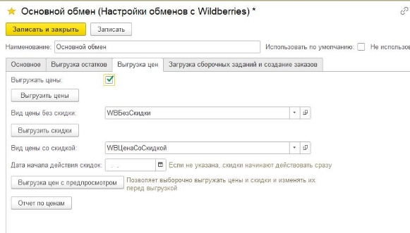

Для использования выгрузки цен, надо поставить галочку Выгружать цены. Выбрать вид цены и Нажать кнопку Выгрузить цены.

Цены пока выгружаются только по нажатию этой кнопки ввиду возможного нанесения ущерба в случае неправильной выгрузки цен. **Выгружаемые цены это цены ДО скидки.**

Чтобы выгружать скидки выберите вид цены со скидкой, и нажмите Выгрузки скидки, модуль сам рассчитает процент скидок и выгрузит их в виде процента. Так же есть возможность выгружать цены с предпросмотром, там вы можете переопределить выгружаемые цены.

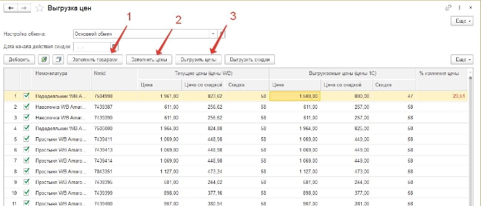

Так же есть отчет по ценам, где вы можете посмотреть и сравнить цены в 1с и на портале. Но выгрузку цен с предпросмотром можно использовать для тех же целей, для просмотра.

**Настройка загрузки сборочных заданий.**

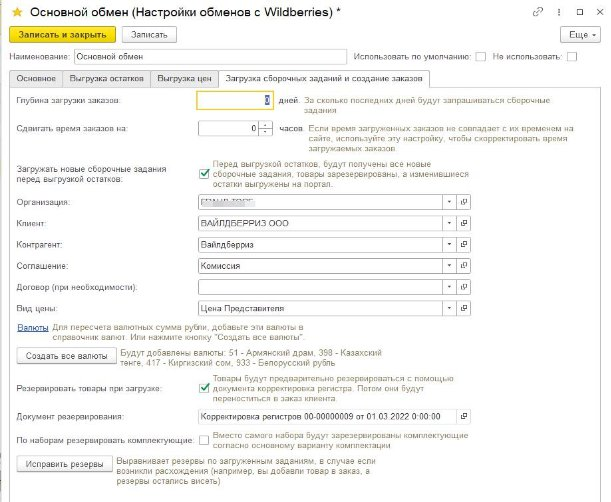

Здесь указываются данные которые будут использованы при создании заказов.

Партнера надо указать обязательно, иначе у вас не будут видны кнопки в заказе клиента на вайлдберриз. Видимость кнопок определяется по партнеру.

Глубину загрузки заказов можно оставить по умолчанию.

Сдвигать время заказов можно использовать если у вас время загруженных заказов отличается от времени на портале.

Галочка резервировать товары при загрузке нужна для того чтобы предварительно резервировать товар по сборочным заданиям, до того как вы добавите его в заказ.

Галочка по наборам резервировать комплектующие понадобится, если вы используете.

Иногда в результате ошибок возникает расхождения между загруженными сборочными заданиями и зарезервированным товаром, кнопка исправить резервы поможет исправить ситуацию.

Если вы хотите видеть валюту заказа, то нажмите кнопку Создать все валюты, в справочник валют будут добавлены валюты используемые в Валйдберриз. Для функционирования модуля это необязательно.

**Использование.**

Если вы используете расписание обмена, то новые сборочные задания наверно уже загрузились,

Если же нет то переходим в

Раздел **WB- Список сборочных заданий**

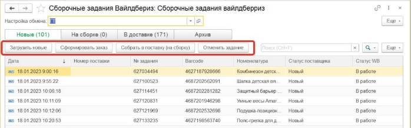

Здесь можно работать так сказать вручную. Не используя автоматический обмен.

Укажите вашу настройку обмена сверху.

По кнопке загрузить новые вам загрузятся сборочные задания. Или это сделаетя по расписанию.

Кнопка сформировать заказ создаст заказ и откроет его форму. Из формы заказа можно будет распечать стикеры. Далее рекомендуется управлять товарами из формы заказа, но можно это делать и в списке сборочных заданий, здесь можно товары включить в поставку, а поставку потом передать в доставку.

На закладке На сборке можно работать с поставками.

Здесь можно создавать новые поставки и передавать их в доставку после сборки. Можно распечатать состав поставки с qr кодом сформированным в 1С. Скачать qr переданный по api можно только после передачи в доставку

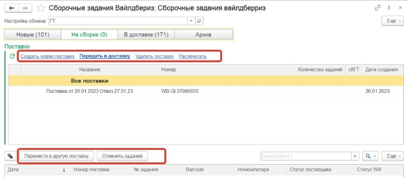

**Но основной вариант работы предполагает работу из заказа.**

Допустим новые сборочные задания у вас уже загружены, по расписанию либо вручную.

Создайте новый заказ клиента на вайлдберриз, заполните шапку, запишите его.

Далее все кнопки работы есть в самом заказе. Используйте их в порядке указанном на скриншоте.

Кнопка **Заполнить заказ,** производит загрузку свежих заданий и добавляет всю номенклатуру из текущих сборочных заданий в заказ.

Так же добавлена кнопка для **Перезаполнить заказ**, если были удалены какие то сборочные задания из списка заданий в 1с или на портале ВБ. Эта кнопка перезаполняется заказ только товарами уже ранее добавленными в этот заказ товарами за исключением удаленных.

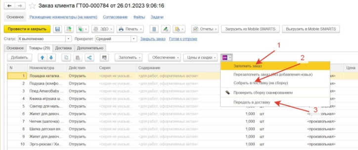

Кнопка «Собрать в поставку» передает все задания на сборку, после этого можно печатать стикеры.

**Печать стикеров**

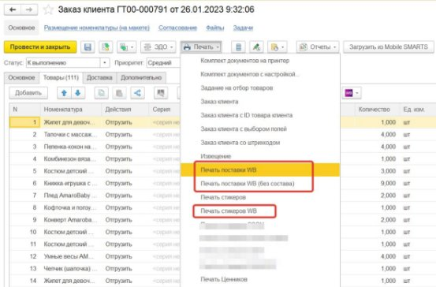

Стикеры печатаются сериями по одинаковой номенклатуре. Вначале серии печатается этикетка с наименованием, чтобы было понятно на какую позицию клеить данные стикеры. Если отгрузка небольшая можно распечатать Сразу все стикеры на одной ленте,

Есть второй вариант информационной этикетки, его можно выводить перед каждым стикером для переклейки своей внутренней этикетки. Вариант 2 добавлен для примера, его можно использовать для самостоятельной модификации, для этого вам понадобится помощь программиста 1С.

Так же из заказа можно распечатать qr код поставки сформирвоанный в 1с, с составом товаров или без.

![2021-05-28 01-39-25 [КОПИЯ] Управление торговлей, редакция 11.jpg](./assets/Aspose.Words.0b5fc25b-55fb-4468-b3dd-f18c59fb2aca.014.jpeg)


**Загрузка отчетов комиссионера**

Для загрузки отчета комиссионера надо указать период отчета в самом документе и использовать меню **Загрузить по API WB.** Откроются настройки загрузки отчета, надо выбрать настройку обмена и период. Разделения по странам я рекомендую не делать, загружать все в один отчет, потому что по АПИ качественно разделить отчет по странам не получается. Сумма двух отчетов будет правильная, но каждый отчет отдельно может не сойтись с детализацией вайлдберриз. Вариант отчета Полный, грузит и продажи и возвраты в один отчет, возвраты вычтены из продаж. Либо можно загрузить в разные документы продажи и возвраты.

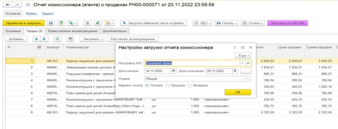

**Дополнительные возможности.**

**Загрузка номенклатуры из вайлдберриз в 1С.**

Добавлена возможность загрузки номенклатуры с вайлдберриз в 1С. Подойдет для пустых баз 1С, если вы только начинаете вести учет, при этом на вб у вас уже есть номенклатура. Кнопка доступна на форме синхронизации номенклатуры, далее все инструкции указаны в самом модуле. 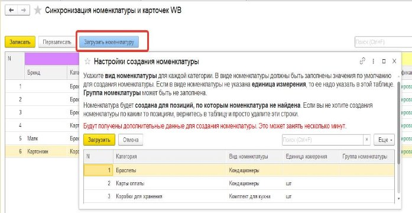

Проверка обклейки с помощью сканера

При больших объемах отгрузки, иногда возникает проблема проверки заказа. Бывает что не весь заказ обклеили пропустили какие то позиции, но выясняется это только при приемке у ВБ.

Добавлено рабочее место проверки сборки заказа с помощью сканера штрихкодов. Сканируются уже наклеенные стикеры WB. Отсканированные позиции помечаются галочкой Проверен в списке сборочных заданий. Так же есть возможность проверки номенклатуры (того что стикер наклеили на нужную позицию).

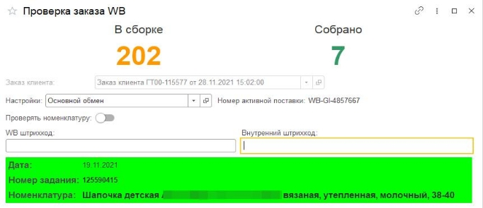

Обработку проверки можно открыть как из заказа клиента так и из списка сборочных заданий.

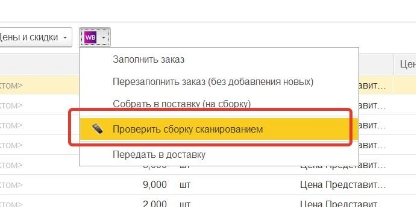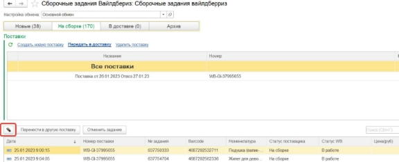

**Если в инструкции вам недостаточно какой-то информации вы можете обращаться в техподдержку за дополнительными пояснениями**

**Работа с рекомендациями**

В модуле есть возможность формировать рекомендации. Рекомендации можно редактировать вручную для каждой позиции, но это можно делать и в личном кабинете. Основная цель этого рабочего места массовое формирование рекомендаций. Можно создать пул карточек, из которого случайным образом будут подобраны рекомендации для карточек у которых вы установите признак случайных рекомендаций.

Рабочее место открывается из главного меню- Работа с рекомендациями.

Первым делом надо выбрать настройку обмена, после чего в левой таблице отобразятся карточки товаров. Вы можете выделить нужные карточки и переключить у низ способ формирования рекомендаций на случайный и обратно. Чтобы сформировать пул рекомендаций откройте ссылку _Пул для случайных рекомендаций_. 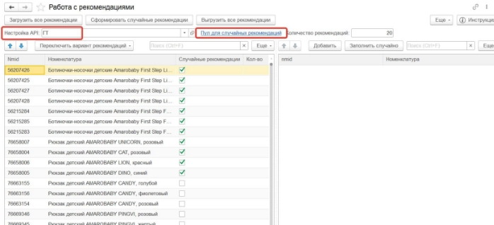

В пул вы можете добавить позиции списком, по кнопке Добавить списком и скопировав туда колонку с штрихкодами, артикулами или наименованиями вашей номенклатуры.

Укажите количество рекоменадаций которое надо формировать, для каждой карточки.

По кнопке _Сформировать случайные рекомендации_ можно сформировать рекомендации сразу для всех позиций с признаком Случайные рекоменадации и после этого _Выгрузить все рекомендации на сайт._

Можно так же сделать это точечно для отдельной позиции кнопкой _Заполнить случайно_ в правой таблице.

Для ручного редактирования рекомендаций вам нужно загрузить текущие рекомендации либо для всех позиций кнопкой _Загрузить все рекомендации,_ либо для каждой отдельной позиции кнопкой _Загрузить_. Рекомендации можно удалить из таблицы, добавить новые, а затем _Выгрузить._ Или выгрузить отредактированные рекомендации сразу для всех позиций кнопкой _Выгрузить все рекомендации_.

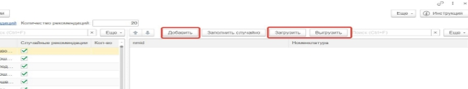

**Решение типовых проблем при использовании модулей.**

Если при выгрузке остатков или выгрузке цен вы получаете сообщение «Возникла ошибка!» Это означает что модуль получил нестандартный ответ от вайлдберриз.

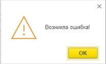

Для того чтобы понять в чем дело надо включить запись логов в настройке обмена, записать настройку и повторить проблемную операцию, например выгрузить остатки или цены.

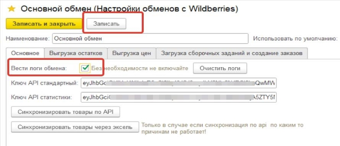

Затем надо зайти в Логи обмена в главном меню.

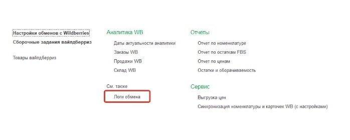 Там будут записи с типом «Выгрузка остатков» или «Цены» или «Скидки». В тексте ответов будет сообщение об ошибке от вайлдберриз.

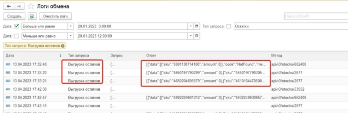

**Типовые ошибки. При выгрузке остатков**

1. `{"sku":"5901130714100","amount":0}],"code":"NotFound","message":"Не найдено"} `

Эта ошибка означает что данного баркода у вас нет в личном кабинете, это могут быть например удаленные позиции в личном кабинете. При этой ошибке вам надо найти эти позиции в справочнике Товары вайлдберриз и поставить галочку Выведена. (см. рисунки в конце)

1. ```{"sku":"5901130785636","amount":0},{"sku":"4687201662358","amount":0}],"code":"CargoWarehouseRestriction","message":"Выбранный склад не предназначен для крупногабаритных товаров. Добавьте их на соответствующий склад"}]```

Эта ошибка указывает скорее всего на то что у товара не указаны линейные размеры в личном кабинете и вайлдберриз по умолчанию считает его крупногабаритным. Если же это действительно крупногабаритный товар, то его надо так же исключить обмена в этой настройке обмена (галочка «Выведен») и для него создать отдельную настройку обмена со складом для крупногабаритного товара.

**Типовые ошибки. При выгрузке цен или скидок**

1.``` {"errors":["данных номенклатур не было в выгруженном с портала шаблоне: [87493837 133700985], добавление строк в шаблон запрещено"]}```

В сообщениях по ценам участвуют не баркоды а nmid, в данном случае так же помагает галочка Выведена, если это не активные ваши позиции. Если же это активные позиции, то, можно попробовать в первый раз установить цены и скидки вручную в личном кабинете.

1. `{"errors":["все номенклатуры с ценами из списка уже загружены, новая загрузка не создана"],"error\_code":1}`

Ошибка возникает когда цены по этим номенклатурам уже были выгружена, но еще не обновились на сайте. Надо просто подождать

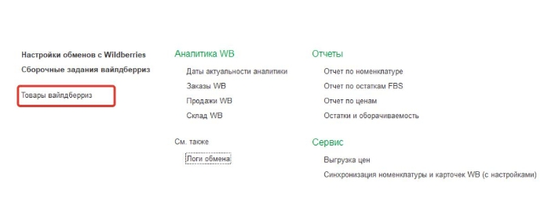

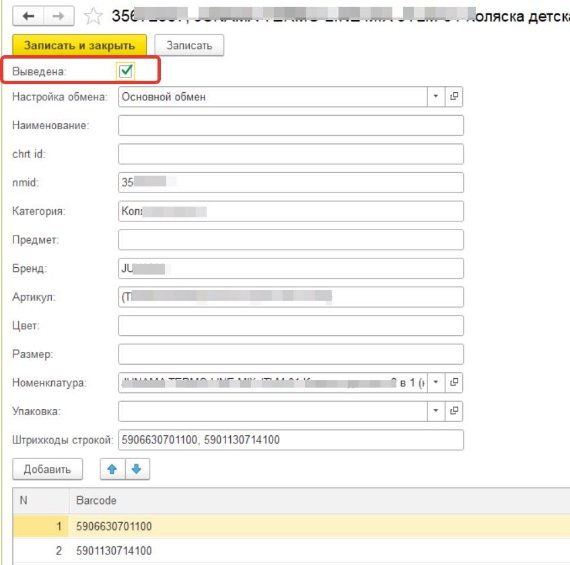
