# Инструкция ЯндексМаркет

**Инструкция написана для версии 1.0.2.11.**

**Если вы устанавливаете более новую версию, то смотрите дополнительно историю изменений, чтобы понимать что появилось в новых версиях.**

**История обновлений доступна по адресу**

[**https://infostart.ru/public/1396736/**](https://infostart.ru/public/1396736/#%D0%B8%D1%81%D1%82%D0%BE%D1%80%D0%B8%D1%8F%20%D0%BE%D0%B1%D0%BD%D0%BE%D0%B2%D0%BB%D0%B5%D0%BD%D0%B8%D0%B9)

**Внимание!** Расширение не требует установки web-сервера и публикации базы в интернет. Переключать личный кабинет на работу через api **НЕ НУЖНО!!!** Способ работы в личном кабинете в настройках API должен стоять «Вручную в кабинете»! 

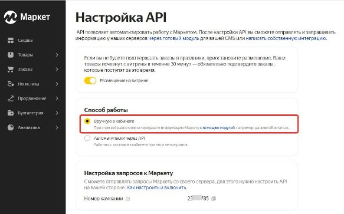

## Установка.

1\.Расширение надо добавить стандартным образом в конфигурацию. 

Через  **Администрирование-Печатные формы и обработки-Расширения.**

**Не забудьте снять галочку Безопасный режим у установленного расширения.**

2\. Добавить внешнюю печатную форму ПечатьСтикеровЯМаркет.epf

Через  **Администрирование-Печатные формы и обработки-Дополнительные отчеты и обработки.** 

3\.Там же добавить внешнуюю обработку для обмена с яндекс маркетом по расписанию    ( ОбменСЯндексМаркетом.epf). Расписание лучше настроить позже после внесения настроек и тестрования.

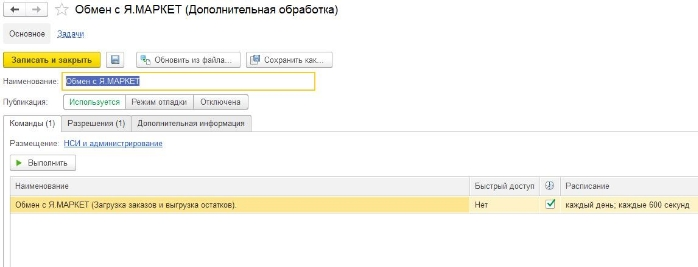

4\. Если планируйется использоватение под пользователем с неполными правами, то пользователю надо добавить роль **«Работа с яндекс маркет»**

После добавления расширения в базе появится новая подсистема со значком Яндекс Маркет

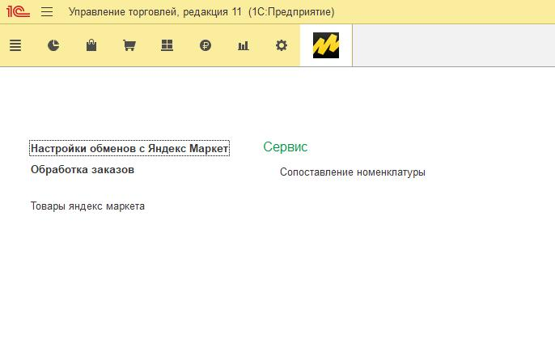

Далее нужно создать новую настройку обмена в справочнике  **Настройки обменов Яндекс маркет**.

Их может быть несколько, на случай если у вас несколько магазинов в Яндекс или несколько складов.

Вам понадобится номер ID вашей компании. Войдите в личный кабинет, в меню слева выберите **Настройки** → **Настройки API** и скопируйте из поля **Номер кампании**.

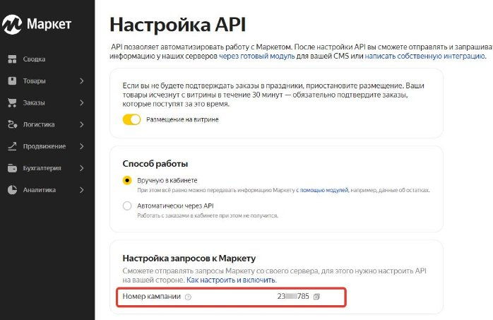

Создайте новый элемент в справочнике **Настройки обменов с Яндекс Маркет.**

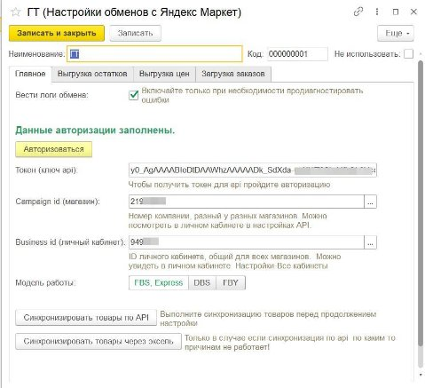

Нажмите кнопку Авторизоваться. Откроется форма авторизации. 

Нажмите кнопку **Получить токен.** Авторизуйтесь в личном кабинете и после того как отобразится ваш токен нажмите кнопку ОК, форма авторизации закроется а в настройке обмена будет уже заполнен токен. Запишите настройку обмена.

Выберите магазин (campaing id), остальные данные (id личного кабинета и модель работы) подставятся автоматически. Запишите настройку обмена.

Сразу же можно синхронизировать товары. Для этого нажмите на кнопку **Синхронизировать товары по API.** Если токен был получен верно откроется форма, которая автоматически заполнится товарами Яндекс Маркета. Программа сама попытается сопоставить товары сначала по штрихкоду затем по артикулу, если это не удастся то номенклатуру надо будет указать вручную. Это надо сделать один раз и повторять только после добавления новых позиций на Маркет. Нажмите кнопку записать чтобы сохранить соответствия карточек яндекс маркета и номенклатуры. 

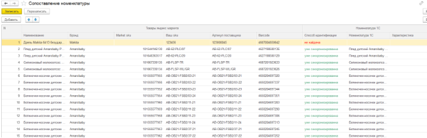

Так же есть возможность синхронизации через эксель. Такой вариант подходит для большого списка товаров, через эксель можно синхронизировать товары порциями, если скачивать файл не по всему списку. Где скачивать файл вы увидите в инструкции при нажатии кнопки **Синхронизировать товары через эксель.**

## Выгрузка остатков

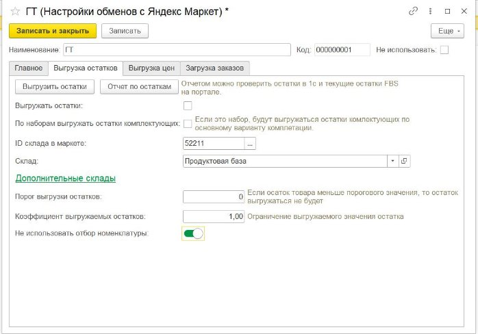

Вам надо заполнить ID вашего склада. Его можно выбрать на форме или взять из личного кабинета  (**Логистика –Склады)**

Указать склад из 1С. Можно указать дополнительные склады, если вы хотите чтобы показывался общи остаток по нескольким складам.

Если вы используете наборы, можно выгружать остаток исходя из расчета остатков комплектующих, для этого поставьте галочку «По наборам выгружать остатки комплектующих»

Порог выгрузки остатков понадобится если вы не хотите выгружать товар которого у вас мало на остатках. 

Коэффициент выгружаемых остатков это модификатор позволяющий выгружать например только 10% от реальных остатков на складе, для этого укажите коэффициент  0,1.

Далее вам надо добавить в таблицу весь перечень номенклатуры, остатки по которой вы хотите выгружать выгружать на портал. Если вы все правильно сделали со свойствами указанными выше, то в таблице отобразятся их значения, это для проверки правильности заполнения.

Позиции можно добавить списком, нажав кнопку **Загрузить из Списка** и вставив в открывшееся окошко список артикулов , штрихкодов или кодов номенклатуры. Список можно получить, например, копированием колонки артикул в любом отчете.

## Выгрузка цен.

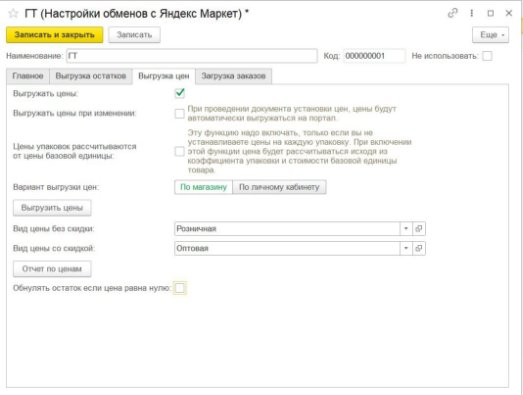

Для использования выгрузки цен, надо поставить галочку Выгружать цены. Выбрать вид цены без скидки и цены со скидкой. Укажите вариант выгрузки цен, по магазину или всему личному кабинету. Отчет по ценам позволит просмотреть цены на портале и в 1с для проверки. Кнопка «Выгрузить цены» запустит фоновое задание по выгрузке цен, выгрузка выполняется по 500 товаров в секунду, но не более 5000 в минуту. Галочку «Обнулять остаток товара, если цена равна нулю» можно использовать как способ вывода позиции из продажи, в этом случае если в 1с на него установить нулевую цену, по нему будет выгружаться нулевой остаток. 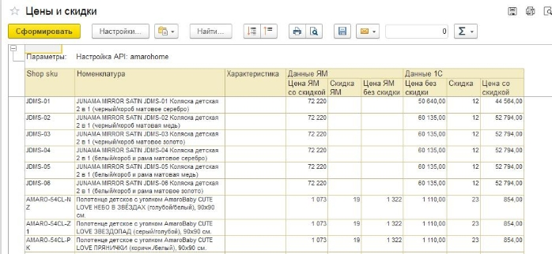 

 **настройки загрузки сборочных заданий.**

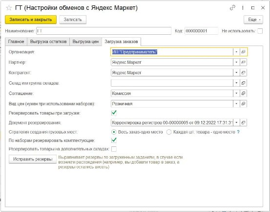

Здесь указываются данные которые будут использованы при создании отгрузки.

Партнера надо указать обязательно, иначе у вас не будут видны кнопки в заказе клиента на яндекс. Видимость кнопок определяется по партнеру.

«Стратегия создания грузовых мест» - эта настройка отвечает за автоматическое создание грузовых мест. По умолчанию стоит значение «Весь заказ-одно место», в этом случае грузовые места будут загружаться так как их автоматически сформировал яндекс. В варианте «Каждая шт. товара-одно грузовое место» на каждую единицу товара будет сформировано отдельное грузовое место, и соответственно при печати этикеток для каждого грузового места будет сформирована своя этикетка. 

Галочка «резервировать товары при загрузке» нужна для того чтобы предварительно резервировать товар по заказам маркета, до того как вы добавите их в отгрузку.

Галочка «по наборам резервировать комплектующие» понадобится, если вы используете наборы.

Иногда в результате ошибок возникает расхождения между загруженными сборочными заказами и зарезервированным товаром, кнопка исправить резервы поможет исправить ситуацию.

## Использование.

Если вы используете расписание обмена, то новые  заказы наверно уже загрузились,

Если же нет то переходим в раздел **Яндекс Маркет- Обработка заказов**

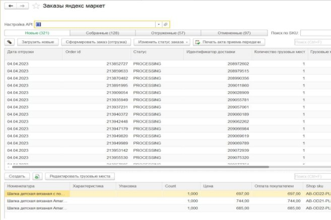

Укажите вашу настройку обмена сверху.

Здесь отображается список  загруженных заказов и их состав товаров ниже.

По кнопке загрузить новые вам загрузятся сборочные задания. Так можно действовать, если вас не интересует предварительное резервирование товара.

Здесь можно отдельно управлять статусами заказов, а так же отменить заказ, если это необходимо(меню «Изменить статус заказа»). А так же вручную разбить заказ на отдельные грузовые места(если весь заказ не помещается в одну упаковку) 

Здесь так же можно создать отгрузку выделив нужные заказы яндекса и нажать кнопку «Сформировать заказ(отгрузка)». Откроется новый заполненный заказ клиента. Но

## Основной вариант работы предполагает работу из заказа клиента.

Допустим новые заказы у вас уже загружены, по расписанию, либо вручную.

Создайте новый заказ клиента на яндекс, заполните шапку, запишите его.

Далее все кнопки работы есть в самом заказе. Используйте их в порядке указанном на скриншоте.

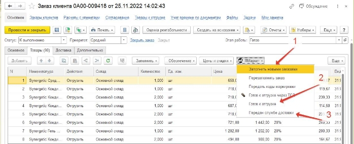

Кнопка  **Заполнить новыми заказами,** производит загрузку свежих заказов и добавляет всю номенклатуру из них в заказ клиента.

Так же добавлена кнопка для **Перезаполнить заказ**, она поможет, если были удалены какие то товары из документа. Эта кнопка перезаполняется заказ только товарами уже ранее добавленными в этот заказ товарами. 

## Сборка и Печать ярлыков.

Из формы заказа можно распечатать сборочный лист. По умолчанию он печатается в порядке отправлений. 

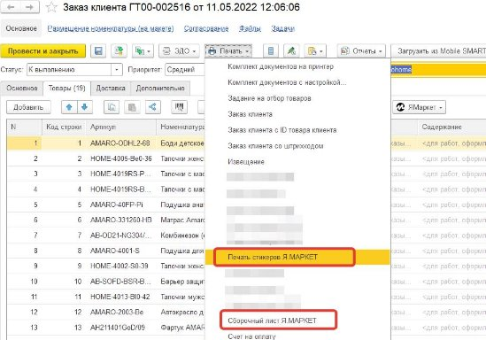 

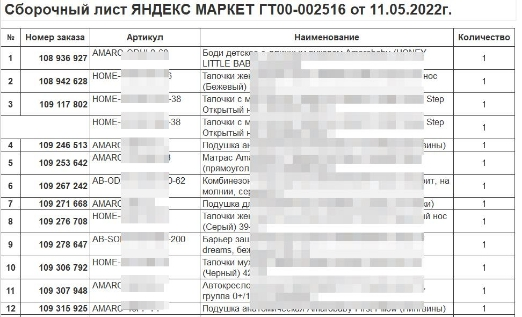

Там же из заказа можно распечатать стикеры.

Стикеры печатаются сериями по одинаковой номенклатуре. Вначале серии печатается стикер с составом заказа, чтобы было понятно на какую позицию клеить данные ярлыки.

Выделите номенклатуру в списке номенклатуры и обработка сформирует все ярлыки с этой позицией.

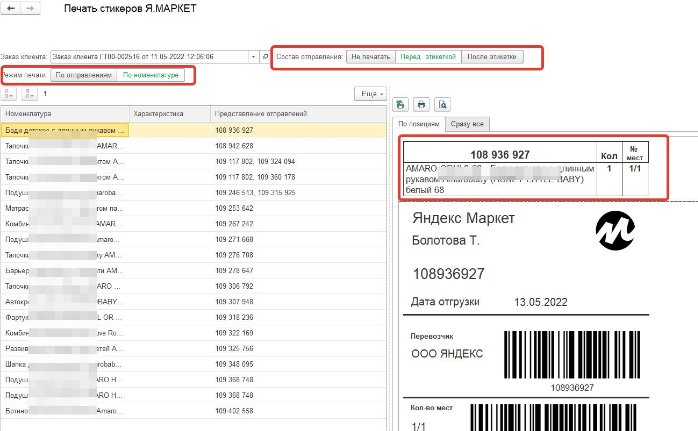

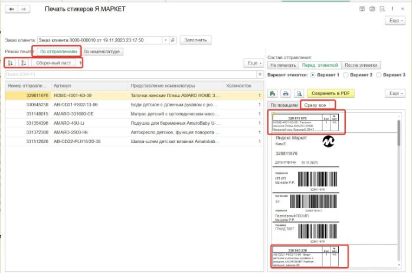

Так же можно печатать в режиме по отправлениям. В этом случае можно распечатать общую ленту со всеми ярлыками и перед каждым ярлыком будет следовать стикер с составом заказа этого ярлыка. Так же в этом варианте можно сформировать сборочный лист, уже в той сортировке которую вы сделаете в таблице отправлений, например, можно отсортировать по номенклатуре в алфавитном порядке. У вас в этом порядке сформируется сборочный лист, а так же лента стикеров. Экспериментируйте, чтобы узнать какой метод сборки вам удобнее. 

После сборки и обклейки отправлений, можно отправить коды маркировок(если у вас есть такой товар), перевести все отправления в статус «Готов к отгрузке», а затем в «Передан службе доставки» . Все это можно так же сделать из документа заказ клиента.

## Загрузка отчета комиссионера.

Для загрузки отчета комиссионера нам нужен новый пустой документ Отчет комиссионера. Заполняете его шапку как вам требуется (Партнер, соглашение и т.д.).Затем с помощью кнопки **Загрузить по API** **Яндекс** вызываем форму загрузки. Если кнопка не видна в верхней панели, то ищите ее под кнопкой Еще.

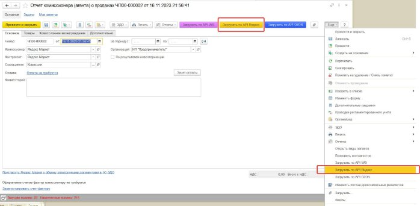

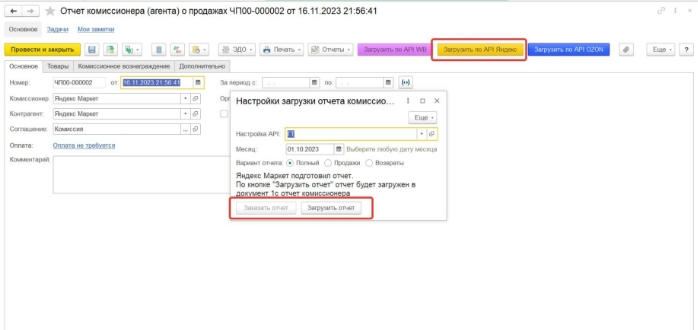

Далее следуйте инструкциям на форме. Надо выбрать настройку обмена и любую дату месяца за который грузим отчет. Нажимаем Заказать отчет, ждем некоторое время.Если отчет заказывается долго, можно закрыть форму и вернуться позже, отчет уже будет готов к загрузке. Затем жмем Загрузить отчет. Доступны варианты загрузки Продажи, Возвраты или Полный (продажи и возвраты в один документ)

## Дополнительные возможности.

Загрузка номенклатуры из маркетплейса в 1С.

Добавлена возможность загрузки номенклатуры с маркетплейса в 1С. Подойдет для пустых баз 1С, если вы только начинаете вести учет, при этом на маркетплейсе у вас уже есть номенклатура. Кнопка доступна на форме синхронизации номенклатуры, далее все инструкции указаны в самом модуле. 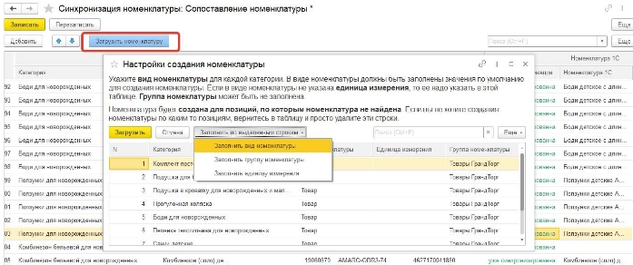

