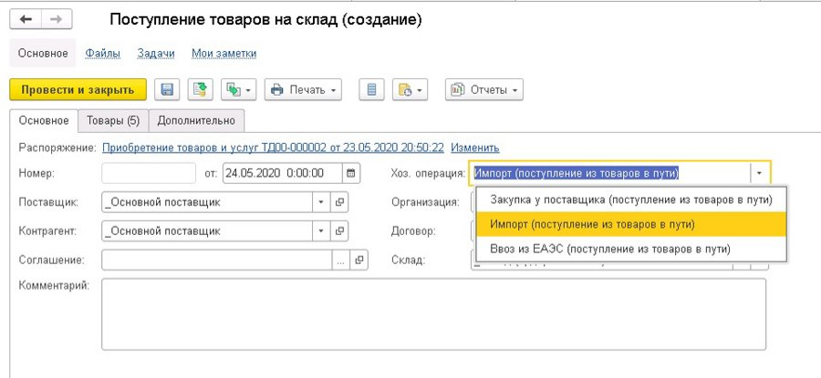
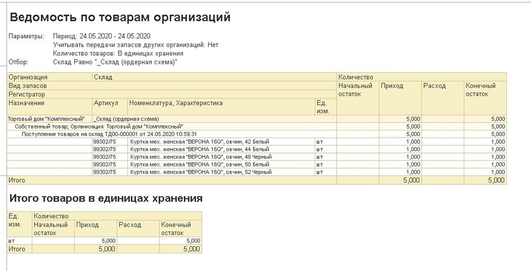

# Использование схемы Импорт в пути Поступление товара

Для оформления документа «Поступление товаров и услуг» перейдем в рабочее место «Накладные к оформлению» в разделе «Закупки» - «Накладные к оформлению» - «К оформлению поступления». Нажимаем «Оформить» - «Поступление товаров».

Документ имеет три вида хоз. операций и означает, что товары фактически прибыли в организацию. В нашем примере нас интересует операция «Импорт (поступление из товаров в пути)».

Этот документ заполняется фактическими данными по ТМЦ, указанными в документах от поставщика, и приходуется в финансовом учете организации. Т.е. сейчас, воспользовавшись отчетом «Ведомость по товарам организации», мы увидим в нем наши товары. Убедимся в этом.

Сформируем его и увидим, что наш документ «Поступление товаров на склад» сделал движения прихода по остаткам товаров организации. При этом вид запасов стал «Собственные товары».

