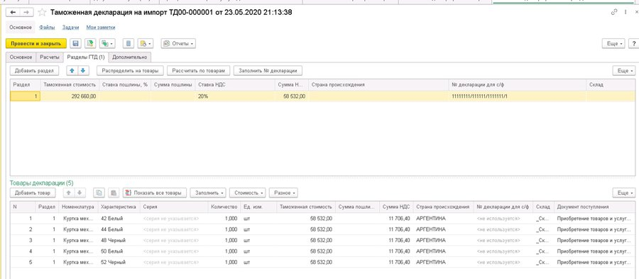

# Использование схемы Импорт в пути Таможенная декларация

Ввести таможенную декларацию можно на основании документа «Приобретение товаров и услуг», либо в специальном рабочем месте. Воспользуемся вторым вариантом.

Перейдем в рабочее место для оформления таможенных деклараций. Раздел «Закупки» - «ГТД к оформлению».

В этом рабочем месте отображаются все документы закупки, по которым необходимо оформить таможенные документы. Выбираем введенный ранее документ приобретения и нажимаем кнопку «Создать декларацию».

Оформляем таможенную декларацию в соответствии со всеми имеющимися данными. На закладке «Основное» заполняем Поставщика и указываем номер Таможенной декларации.

На закладке «Расчеты» заполняем поле, кто оформляет ГТД, а также информацию по таможенному сбору и таможенному штрафу.

На закладке «Разделы ГТД» необходимо будет указать Страну происхождения товаров, Склад, на который товары поступают, Ставку НДС.

После документ «Таможенная декларация на импорт» можно провести.

Следующим шагом является оформление документа «Поступление товаров и услуг», который необходимо ввести в систему в момент, когда товары и комплект документов фактически будут у нас.

Воспользуемся нашим отчетом и убедимся, что следующий шаг – оформление поступления товаров.

