# Использование схемы импорт в пути полная

Использование схемы "Товары в пути" для оформления закупок по импорту в системе "1С:УТ" 11.4, "1С:КА" 2.4, "1С:ERP" 2.4

Иногда на предприятии возникает необходимость разделить фактическое поступление товара и переход права собственности на него. Например, при закупках по импорту, когда право собственности на товар и задолженность перед поставщиком появляются гораздо раньше, чем товар фактически окажется на нашем складе.

Важно не перепутать эту схему с ордерной схемой учета на складе.

Отличие в том, что ордерная схема используется для оперативного складского учета. В момент оформления документа кладовщик несет материальную ответственность за фактически принятые товары. А бухгалтерия отражает финансовые документы, принятые от поставщика. При этом предполагается, что переход права собственности и фактическое поступление товара происходит одновременно.

При использовании схемы «Товары в пути» право собственности на товар и финансовая задолженность перед поставщиком появляются гораздо раньше, чем товар физически окажется на нашем складе. В этом случае используются документы «Приобретение товаров и услуг» и «Поступление товаров и услуг». А если используется ордерная схема товарооборота, то дополнительно оформляется складской документ «Приходный ордер на товары».

«Приобретение товаров и услуг» фиксирует переход права собственности на товар и образует финансовую задолженность нашей компании перед поставщиком. Оформляется, когда получены, либо оплачены расчетные документы на ТМЦ.

«Поступление товаров и услуг» оформляется, когда товар фактически оказался на нашем складе, и был получен полный комплект документов. Оформляется, когда необходимо оприходовать ТМЦ в учете.

«Приходный ордер на товары» оформляется кладовщиками и означает, что товар физически оприходован на склад. После оформления кладовщики начинают нести материальную ответственность за товары.

Далее будем рассматривать эту схему для предприятия, на котором ведется ордерный складской учет. 

Для тех предприятий, на которых не разделены финансовые и складские операции, логика оформления документов для схемы «Товары в пути» будет аналогичной, за исключением того, что оформление «Приходного ордера на товары» не требуется.

Для начала проведем необходимые настройки. Для этого переходим в раздел «НСИ и администрирование» - «Закупки» - «Документы закупки». Ставим галочку напротив пункта «Товары в пути».

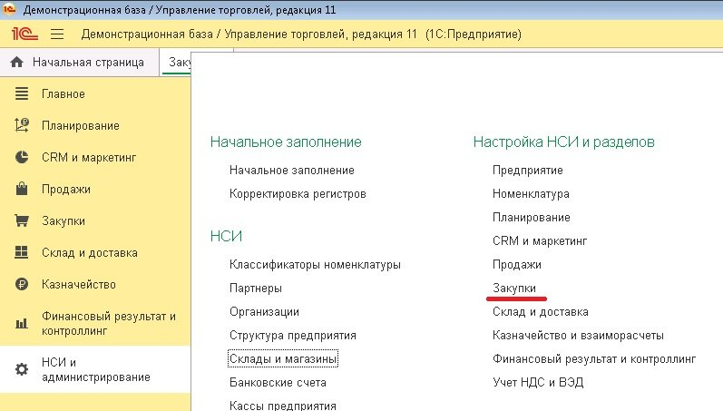

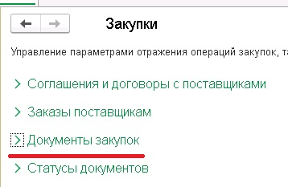

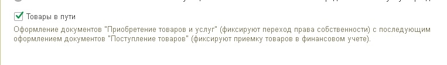

Далее убедимся, что в системе включена возможность оформления закупок по импорту. Переходим в раздел «НСИ и администрирование» - «Учет НДС и ВЭД» - «Импорт». Ставим галочку напротив пункта «Импортные закупки».

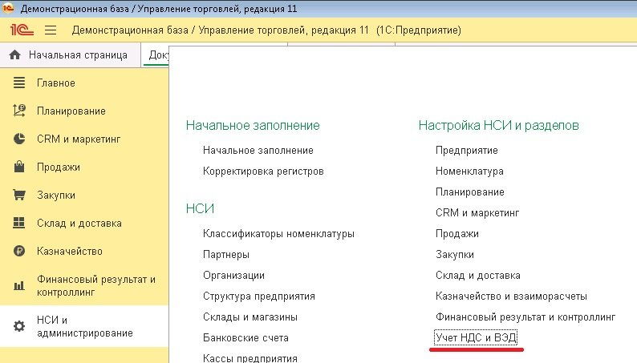

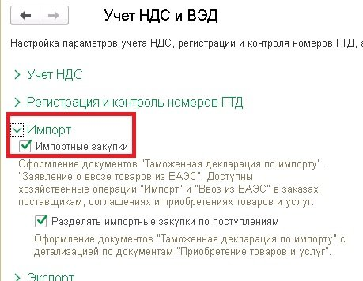

Затем необходимо настроить соответствующим образом договор с контрагентом. Выделим основные настройки для использования схемы «Товары в пути».

На закладке «Основное» устанавливаем тип взаимоотношений «Импорт».

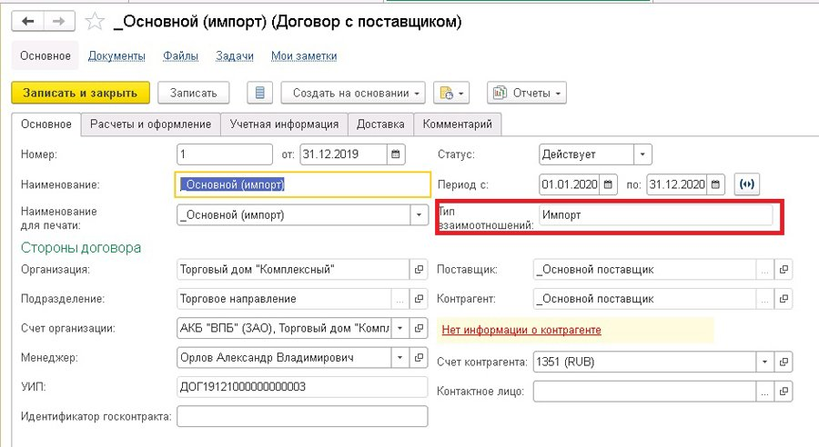

Переходим на закладку «Расчеты и оформление». Обратим внимание на раздел «Оформление закупок». Именно здесь настраивается возможность оформления поступления товаров двумя документами: «Приобретение товаров и услуг» и «Поступление товаров и услуг».

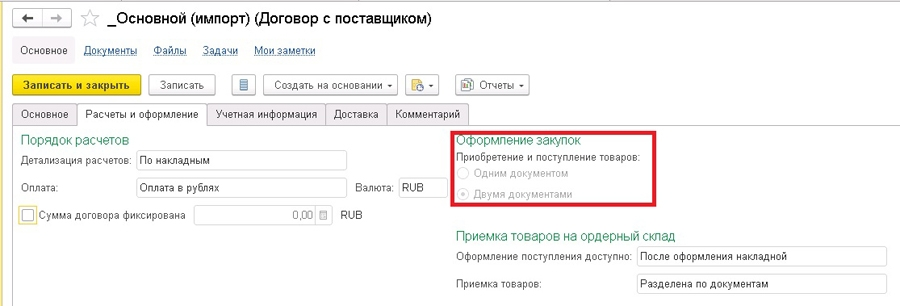

Остальные настройки на этой и других закладках настраиваются в соответствии с принципами ведения управленческого учета в организации.

Переходим к оформлению документа закупки товаров.

Оформим документ «Приобретение товаров и услуг». Заполняем поставщика товаров, указываем организацию и созданный нами договор. Основное внимание уделим хоз. операции документа. После включения настройки «Товары в пути» нам становятся доступными к выбору операции «Закупка у поставщика (товары в пути)», «Импорт (товары в пути)» и «Ввоз из ЕАЭС (товары в пути)». Выбираем «Импорт (товары в пути)».

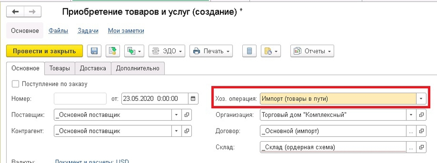

Остальные закладки заполняем обычным образом и проводим документ.

Сформируем отчет «Себестоимость товаров организации». Для этого переходим в раздел «Финансовый результат и контроллинг» - «Отчеты по финансовому результату» - «Себестоимость запасов».

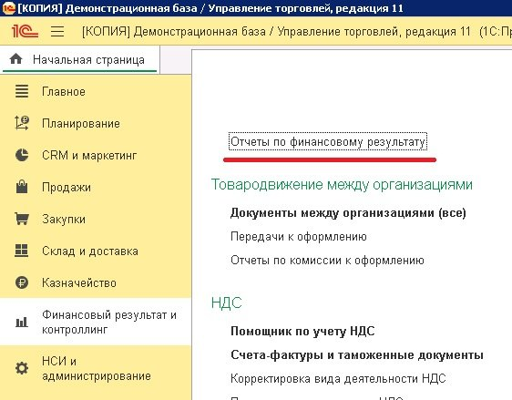

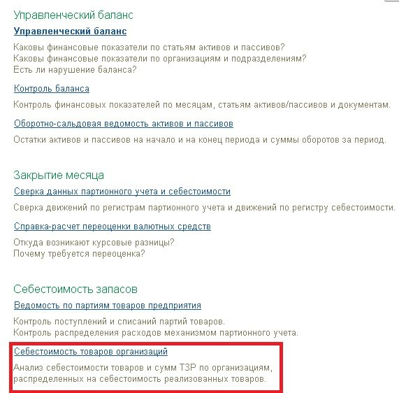

В отчете мы видим основное отличие от стандартной операции закупки товаров – вид запасов «Собственные товары в пути». Т.е. эти товары еще не числятся за нашей организацией как собственный товар, поэтому в отчетах по остаткам товаров мы их не увидим. Но при этом долг перед поставщиком сформирован.

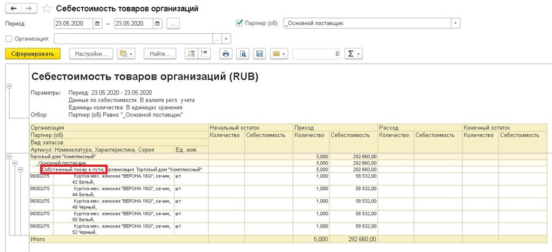

Давайте убедимся в этом и сформируем отчеты по остаткам товаров организации, по остаткам товаров на складах и по взаиморасчетам с контрагентами.

Начнем с остатков товаров по организации. Переходим в раздел «Финансовый результат и контроллинг» - «Отчеты по финансовому результату» - «Ведомость по товарам организации».

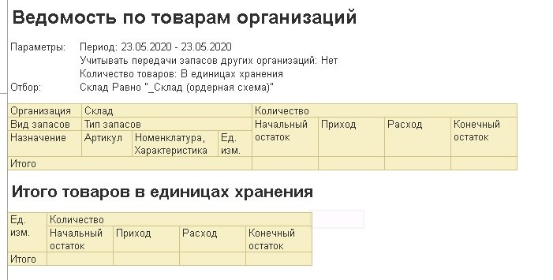

Видим, что в базе нет данных о приходе и об остатках товара.

Далее обратимся к отчету «Ведомость по товарам на складах». Переходим в раздел «Склад и доставка» - «Отчеты по складу» - «Анализ запасов». 

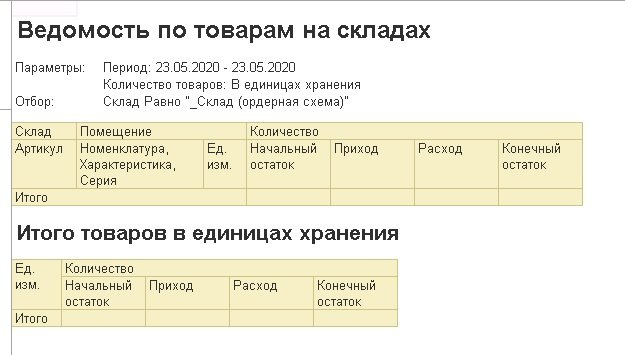

Видим, что здесь ситуация аналогичная, и в складском учете товары не числятся.

Теперь посмотрим «Ведомость расчетов с поставщиками». Переходим в раздел «Закупки» - «Отчеты по закупкам» - «Расчеты с поставщиками».

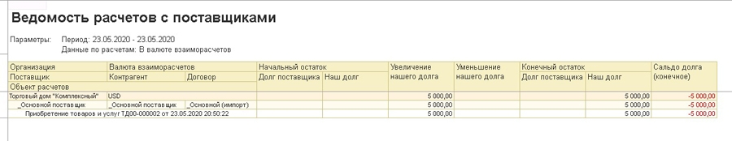

Видим, что у нас имеется долг перед поставщиком, и в качестве объектов расчетов идет документ «Приобретение товаров и услуг».

Воспользуемся отчетом «Контроль оформления товаров в пути и неотфактурованных поставок». Этот отчет показывает, на какой стадии сейчас находится оформление документов по схеме «Товары в пути». Также можно увидеть, какой следующий документ необходимо оформить для корректного учета.

В разделе «Закупки» - «Отчеты по закупкам» посмотрим, что показывает отчет на этом этапе.

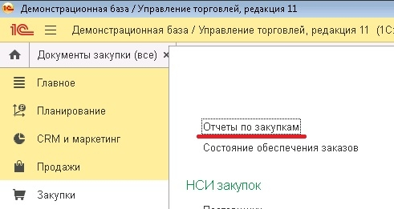

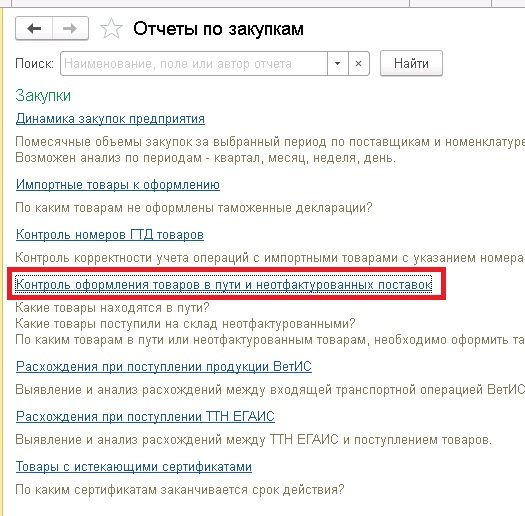

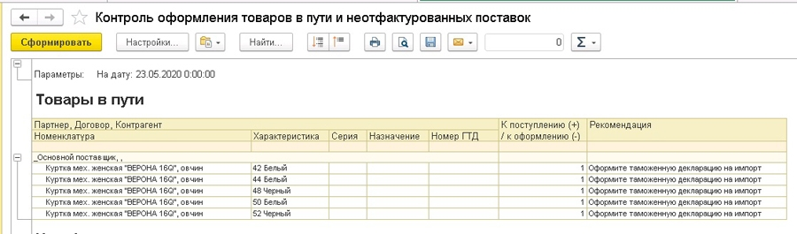

Мы видим, что следующим шагом совместно с оформлением документа «Приобретение товаров и услуг» является оформление «Таможенной декларации на импорт».

Ввести таможенную декларацию можно на основании документа «Приобретение товаров и услуг», либо в специальном рабочем месте. Воспользуемся вторым вариантом.

Перейдем в рабочее место для оформления таможенных деклараций. Раздел «Закупки» - «ГТД к оформлению».

В этом рабочем месте отображаются все документы закупки, по которым необходимо оформить таможенные документы. Выбираем введенный ранее документ приобретения и нажимаем кнопку «Создать декларацию».

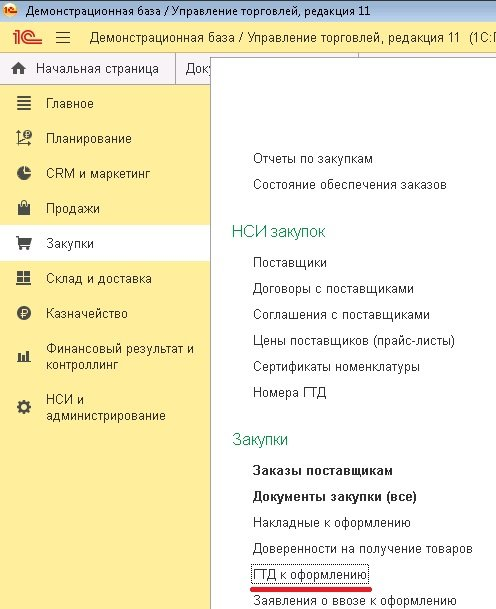

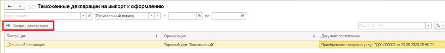

Оформляем таможенную декларацию в соответствии со всеми имеющимися данными. На закладке «Основное» заполняем Поставщика и указываем номер Таможенной декларации.

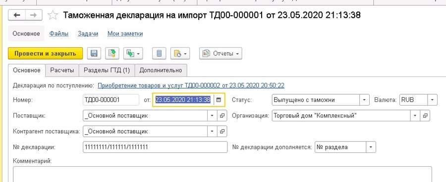

На закладке «Расчеты» заполняем поле, кто оформляет ГТД, а также информацию по таможенному сбору и таможенному штрафу.

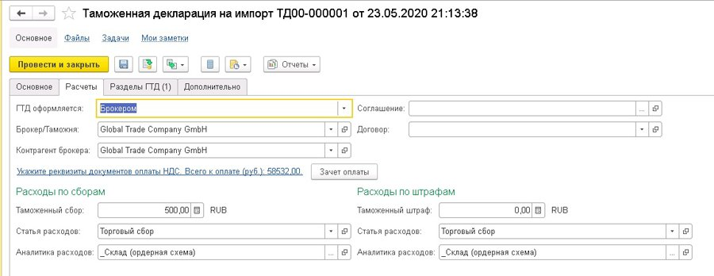

На закладке «Разделы ГТД» необходимо будет указать Страну происхождения товаров, Склад, на который товары поступают, Ставку НДС.

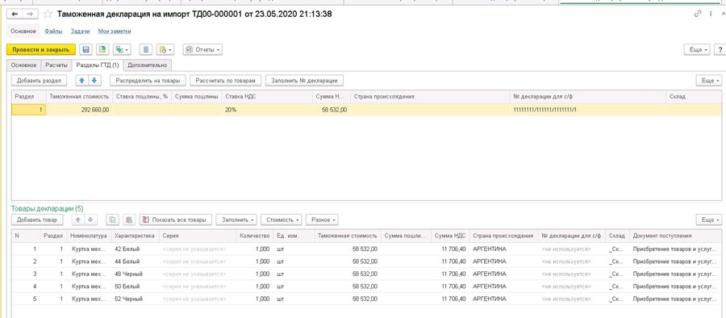

После документ «Таможенная декларация на импорт» можно провести.

Следующим шагом является оформление документа «Поступление товаров и услуг», который необходимо ввести в систему в момент, когда товары и комплект документов фактически будут у нас.

Воспользуемся нашим отчетом и убедимся, что следующий шаг – оформление поступления товаров.

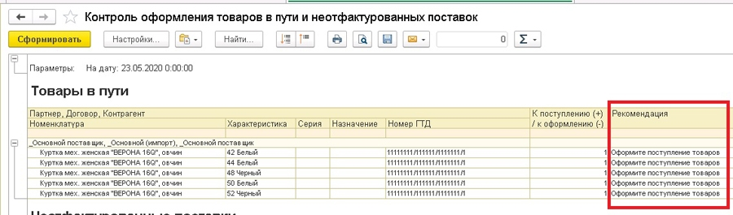

Для оформления документа «Поступление товаров и услуг» перейдем в рабочее место «Накладные к оформлению» в разделе «Закупки» - «Накладные к оформлению» - «К оформлению поступления». Нажимаем «Оформить» - «Поступление товаров».

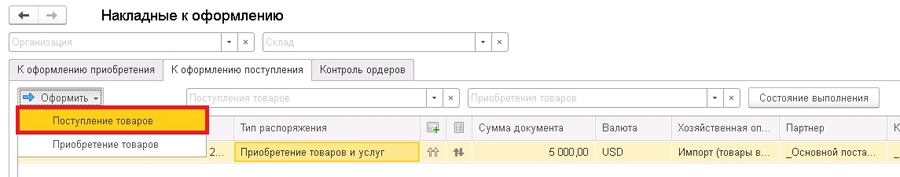

Документ имеет три вида хоз. операций и означает, что товары фактически прибыли в организацию. В нашем примере нас интересует операция «Импорт (поступление из товаров в пути)».

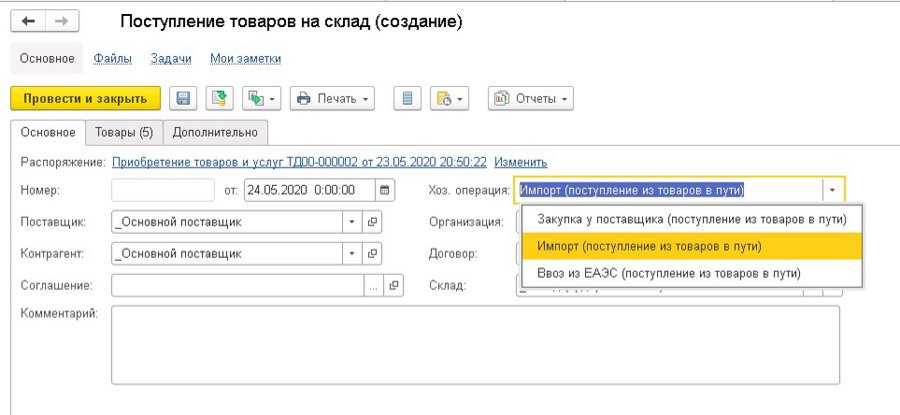

Этот документ заполняется фактическими данными по ТМЦ, указанными в документах от поставщика, и приходуется в финансовом учете организации. Т.е. сейчас, воспользовавшись отчетом «Ведомость по товарам организации», мы увидим в нем наши товары. Убедимся в этом.

Сформируем его и увидим, что наш документ «Поступление товаров на склад» сделал движения прихода по остаткам товаров организации. При этом вид запасов стал «Собственные товары».

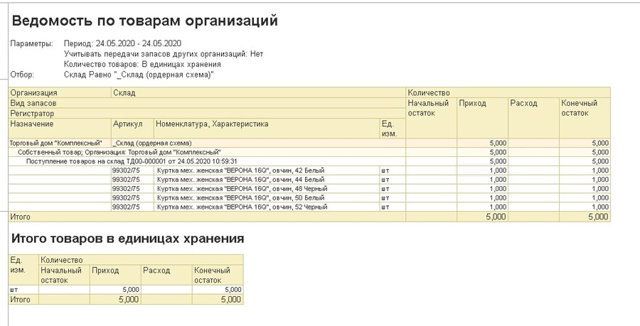

Т.к. в нашей организации используется ордерная схема товарооборота, для того, чтобы отразить товары в складском учете, потребуется оформить документ «Приходный ордер на товары».

После оформления документа посмотрим отчет по складским остаткам. Видим, что приходный ордер сформировал приход на склад.

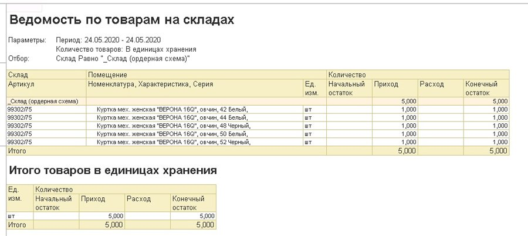

Теперь откроем отчет «Контроль оформления товаров в пути и неотфактурованных поставок» и убедимся, что мы ввели все необходимые документы и ничего не забыли. 

Отчет показывает, что все необходимые документы по товарам были оформлены и больше не выводит никаких данных по нашей поставке.

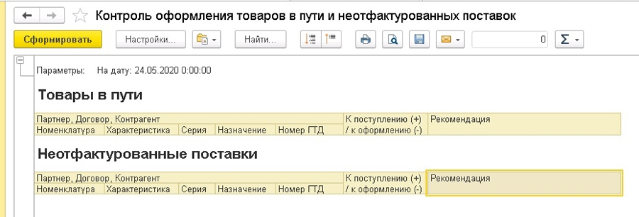

