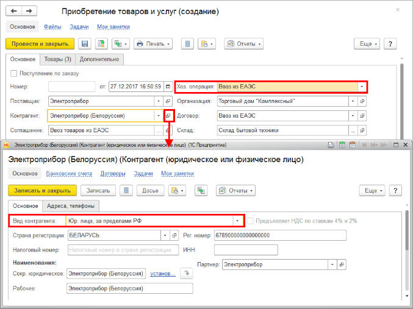
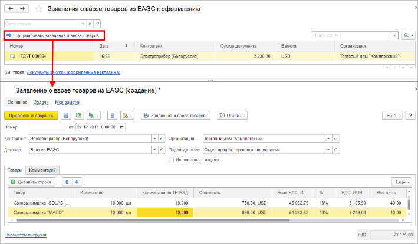
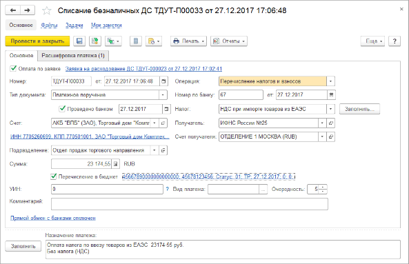
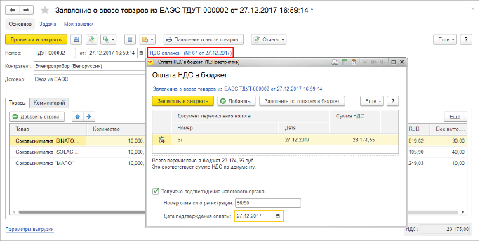

# Как оформить поставку из стран ЕАЭС

### **Как оформить поставку товаров из стран ЕАЭС?**

Из стран Евразийского экономического союза (ЕАЭС) могут поступать как товары, произведенные странами – участниками ЕАЭС, так и импортные товары, которые прошли таможенное оформление в странах ЕАЭС. Если поступает импортный товар, то в документе поставки должны быть указаны номер ГТД и страна происхождения. При оформлении поставки из стран ЕАЭС необходимо дополнительно оформить документ **Заявление о ввозе товаров из ЕАЭС** для уплаты налогов ФНС.

Порядок оформления поставки из стран ЕАЭС можно разбить на следующие этапы:

1. Оформление документа поставки.
2. Регистрация заявления на оплату налогов в ФНС.
3. Перечисление оплаты ФНС.
4. Подтверждение факта оплаты от ФНС.
5. Перечисление оплаты поставщику.

## Оформление документа поставки

Поставка товаров из стран ЕАЭС оформляется документом **Поступление товаров и услуг** с установленным видом операции **Ввоз из ЕАЭС**.

## Оформление поставки товаров из стран ЕАЭС

В качестве поставщика товара в документе указан контрагент-нерезидент «Электроприбор (Белоруссия)» – **Юр. лицо, за пределами РФ**.

Документ оформляется по соглашению, в котором указан вид операции **Ввоз из ЕАЭС**, с указанием соответствующего договора. В договоре должен быть указан тип **Закупка (ЕАЭС)**. Поставка товаров оформляется на «Склад бытовой техники». Поскольку данный склад является ордерным, дополнительно оформляется документ **Приходный ордер на товары**. Поставка товаров из стран ЕАЭС, так же как и любая другая поставка товаров, может быть оформлена по предварительно оформленному заказу поставщику.

## Заявление на оплату налогов ФНС

Для регистрации заявлений на оплату налогов ФНС по ввозу товаров из ЕАЭС используется рабочее место **Закупки – Заявление о ввозе к оформлению**. В рабочем месте показываются все документы поставки из ЕАЭС, по которым еще не оформлено заявление на ввоз из ЕАЭС.

Оформление заявления о ввозе товаров из стран ЕАЭС

С помощью команды **Сформировать заявление о ввозе товаров** необходимо сформировать документ **Заявление о ввозе товаров из ЕАЭС**.** Документ может быть сформирован и из формы документа поставки по соответствующей ссылке.

## Перечисление оплаты ФНС

Оплата налогов ФНС производится путем перечисления денежных средств на расчетный счет ФНС. Оплату можно производить по предварительно оформленной заявке на расходование денежных средств или без оформления заявки. Заявка на расходование денежных средств может быть оформлена из формы документа **Заявление на ввоз товаров из ЕАЭС**.

Перечисление на расчетный счет ФНС суммы налогов

## Подтверждение факта оплаты от ФНС

После подтверждения факта получения оплаты от ФНС в документе **Заявление о ввозе товаров из ЕАЭС** устанавливается отметка **Получено подтверждение налогового органа** и указывается дата, когда поступило подтверждение от ФНС.

## Подтверждение факта оплаты от ФНС

Оплата поставщику

В зависимости от тех условий оплаты, которые зарегистрированы в соглашении с поставщиком, следует оформить документ оплаты **Списание безналичных денежных средств**. Документ можно оформить по предварительно согласованной заявке на расходование денежных средств.

