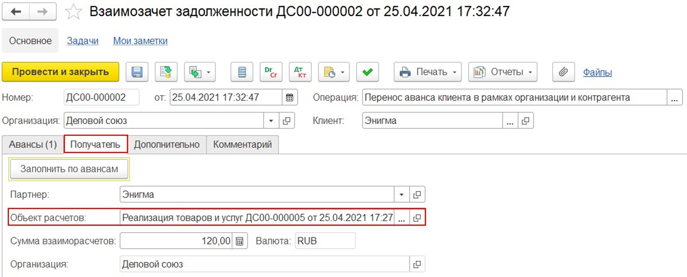

# Взаимозачет задолженности

Для оформления операций взаимозачета предназначен документ `Казначейство – Взаимозачеты и списание задолженности – Взаимозачет задолженности.`

Документ `Взаимозачет задолженности` предназначен для отражения прекращения (полностью или частично) существующих встречных обязательств по оплате, переноса дебиторской и кредиторской задолженности с одного договора на другой (в том числе между организациями и контрагентами), отражения операций зачета/корректировки задолженности по любому договору, а не только по договору уступки права требования.

Взаимозачет можно оформлять между двумя контрагентами, а можно «перебрасывать» задолженность внутри контрагента с одной аналитики расчетов на другую.
В документе `Взаимозачет задолженности` предусмотрена возможность выбора операции и стороны зачета. Выбор типа операции осуществляется в форме `Помощник настройки взаимозачета`:

Перенос аванса клиента - перенос поступивших ранее авансов c нескольких объектов расчетов на один. Если  же оплата поступила текущим днем, то рекомендуется в документе оплаты указать верный объект расчетов, что исключает необходимость использования данного типа операции.
- `Перенос долга клиента` - перенос задолженности клиента по нескольким объектам расчетов на один.
- `Перенос аванса поставщику` - перенос выданных ранее авансов c нескольких объектов расчетов на один. Если  же оплата перечислена текущей датой, то рекомендуется в документе оплаты указать верный объект расчетов, что исключает необходимость использования данного типа операции.
- `Перенос долга поставщику` - перенос задолженности поставщику по нескольким объектам расчетов на один.
- `По встречным обязательствам` - взаимозачет кредиторской задолженности организации перед контрагентом как поставщиком и дебиторской задолженности контрагента как клиента перед организацией. Операция может быть оформлена в рамках одной организации и одного контрагента.
- `Прочие - Отражение оплаты через комиссионера` – поступление оплаты  от конечного покупателя комитенту через комиссионера. Возникает долг комитента перед клиентом и долг комиссионера перед комитентом. По данным этой операции комитентом создается счетфактура на аванс выданный.
- `Прочие - Отражение возврата оплаты через комиссионера` – возврат оплаты от комитента покупателю через комиссионера.
- `Произвольный взаимозачет`.

Операции могут быть выполнены между разными сторонами зачета:
- в рамках одной организации и одного контрагента; 
- в рамках одной организации и между двумя контрагентами; 
- между двумя организациями в рамках одного контрагента.

Команда `Рассчитать взаимозачет` запускает фоновое распределения взаиморасчетов по документам, по окончанию которого заполняются табличные части на возможную сумму зачета оплаты. Команда доступна для операций «Произвольный взаимозачет», «По встречным обязательствам».
Команда `Подобрать по остаткам` вызывает форму подбора остатков расчетов по документам.

## Перенос аванса и долга
Операции `Перенос аванса клиента (Перенос аванса поставщику)` предназначены для переноса аванса с сохранением расчетного документа и курса расчетов. При использовании этих операций задолженность переносится с одного объекта расчетов на другой без вычета НДС с аванса, формирования нового счета-фактуры на аванс и записей в книгах покупок и продаж. Движения по НДС будут сформированы при реализации, поставке по новому объекту расчетов и зачете аванса.
Взаимозачет задолженности с типом операции по переносу аванса клиента/поставщику между разными валютами взаиморасчетов не поддерживается, рекомендуется использовать тип операции «Произвольный взаимозачет».
Если необходимо отразить погашение задолженности, то используется тип операции `Перенос долга клиента (Перенос долга поставщику)`, при которой также сохраняются расчетный документ, курс расчетов и дата планового погашения задолженности.
Отражение данных операций предусматривает указание одного получателя и объекта расчетов на закладе `Получатель`, суммы регламентированного и управленческого учета скрыты и рассчитываются вручную.

Если требуется отразить зачет встречных обязательств, при котором будет выполняться погашение задолженности, то рекомендуется использовать тип операции `По встречным обязательствам`.

## Произвольный взаимозачет
Если ни один из предложенных типов операции не подходит, то можно использовать тип операции Произвольный взаимозачет, что позволяет настроить необходимые параметры взаимозачета.

При данном типе операции:

- при переносе аванса закрывается аванс по «старому» объекту расчетов и возникает аванс по «новому» объекту расчетов;
- предусмотрен перенос аванса, долга с нескольких объектов расчетов на несколько других объектов расчетов;
- поддерживается перенос аванса между разными валютами взаиморасчетов, для этого при выборе операции «Произвольный взаимозачет» становятся доступными колонки «Сумма регл» и «Сумма упр»;
- при распределении переносимых расчетных документов на объекты расчетов расчетным документом становится сам взаимозачет задолженности;
- становятся видны колонки «Сумма упр» и «Сумма регл».

Тип расчетов определяется выбором типа дебитора/кредитора. Например, выбранный для дебитора тип `Клиент` позволяет подобрать объекты расчетов в таблицу дебиторской задолженности только по расчетам с клиентами.

Документ `Взаимозачет задолженности` формируется с заполненными суммами регламентированного и управленческого учета. При проведении документа взаимозачета контролируется соответствие сумм управленческого и регламентированного учета в табличных частях документа.

При расчетах в валюте, у.е взаимозачет задолженности проводится по указанному в нем курсу расчетов. Курс расчетов = Сумма (регл)/Сумма взаиморасчетов.
Установить необходимый курс расчетов можно, скорректировав сумму (регл.), сумму (упр.) и сумму взаиморасчетов.

Например, оформлены платежные документы, по курсу 85 - 5000 EUR и по курсу 87 - 20 000 EUR. При создании взаимозачета в табличных частях «Кредиторская задолженность» и «Дебиторская задолженность» заполняются суммы управленческого и регламентированного учета, рассчитанные по среднему курсу остатков взаиморасчетов (5000 EUR * 85 + 20 000 EUR * 87)/ (5000 + 20 0000) = 86,6 (средний курс расчетов).
Взаимозачет задолженности с типом операции `Произвольный взаимозачет`, проведенный в один день с отгрузкой/поставкой, всегда отображается как аванс.
При использовании типа операции `Произвольный взаимозачет` и при проведении в один день накладной и взаимозачета задолженности, которым переносится аванс, изначально отражается аванс, образованный взаимозачетом, и только потом его зачет. Например, поступил аванс 01.09 по договору №1, Реализация 10.09 (в начале дня) по договору №2, Взаимозачет задолженности 10.09 (в конце дня).
Взаимозачетом возникает аванс по договору №2. Поскольку аванс поступил раньше, нежели оформлена реализация, взаимозачет задолженности воспринимается как перенос аванса с договора №1 на договор №2. На договоре № 2 образуется аванс, который зачитывается по реализации с учетом курса аванса.
