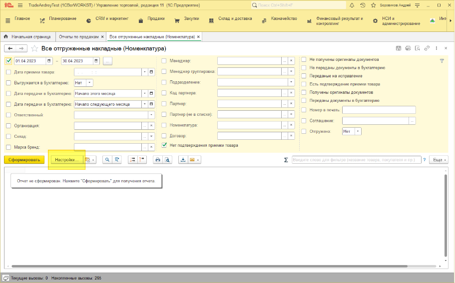
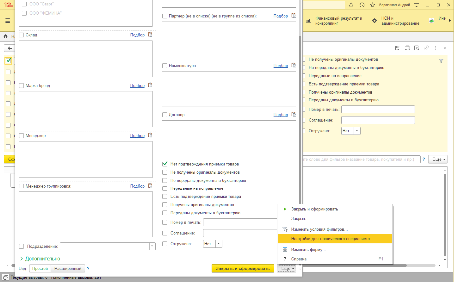
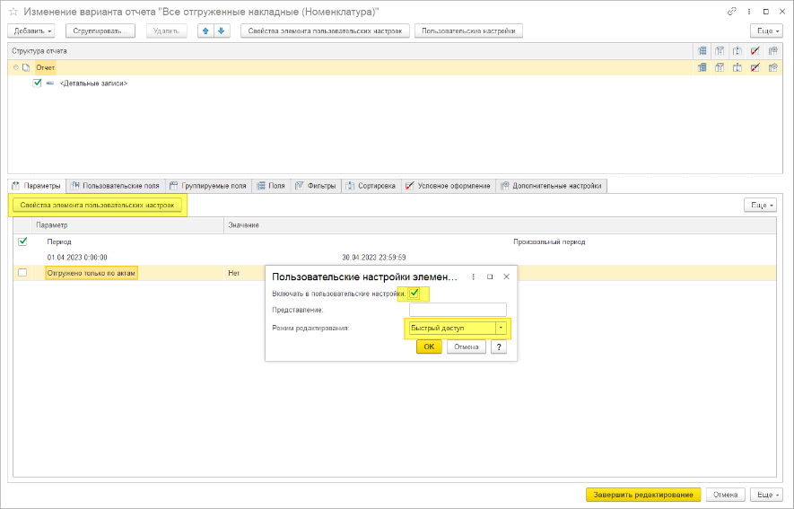
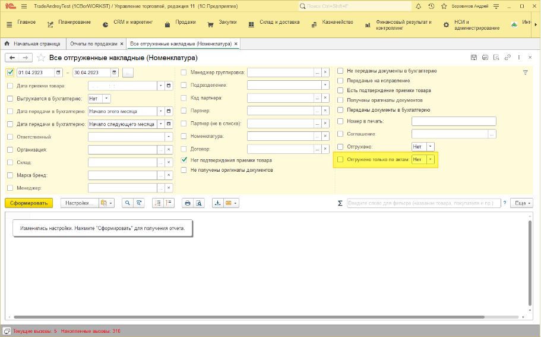

# Добавление отбора в отчет Все отгруженные накладные

## Логика работы отбора «Отгружено только по актам»
В типовом варианте работы отчета «Отгружено» считается если для реализации есть документ «Акт отгрузки WSM», но только для складов что участвуют в обмене с «Акселот», если склад не участвует в обмене, то считается что «Отгружено» всегда.

Работа отбора:

Если у отбора не стоит галочка использование, то он не работает - работает типовой вариант отчёта.

Если стоит галочка использование и значение отбора «Нет» – работает типовой вариант отбора.	

Если стоит галочка использование и значение отбора «Да» – все реализации для которых нет документа «Акт отгрузки WSM» считаются не отгруженными, не зависимо от складов.	

## Добавление видимости отбора	

Открываем любой отчет «Все отгруженные накладные».

Нажимаем «Настройки».

В нижнем правом углу нажимаем «Ещё» - «Настройки для технического специалиста».

Переходим на складку «Параметры», выделяем мышкой поле «Отгружено только по актам», нажимаем кнопку «Свойства пользовательских настроек».

Ставим свойства как на скрине:

Включать в пользовательские настройки – Истина (галочка стоит).

Режим редактирования – Быстрый доступ.

Поле отбора появилось в списке отборов.

