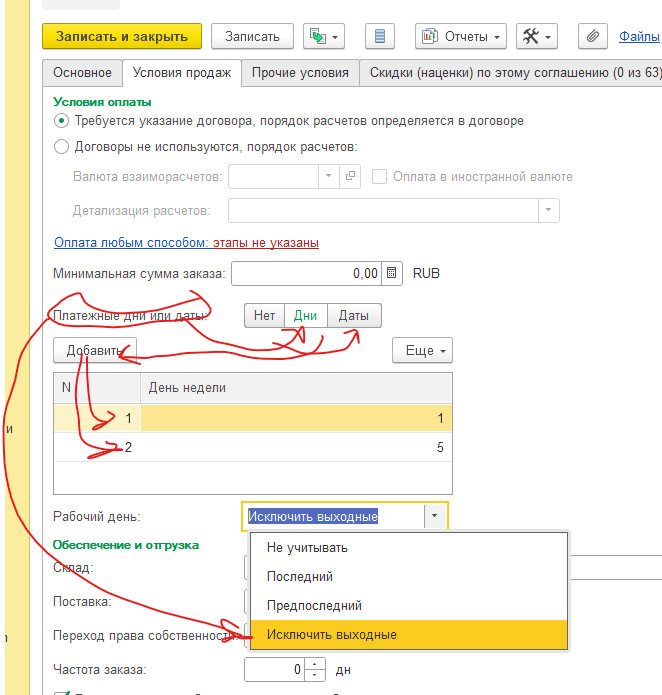

# Платежный день - Инструкция по функционалу

В учетную систему «А Зет Управление торговлей» добавлен функционал «Платежный день», который позволяет в соглашении с клиентом установить платежный день недели один или несколько для более корректного расчета даты платежа. 

Возможно установить платежный день недели от 1 до 7 (понедельник – воскресенье). Платежных дней можно установить несколько (например 1 и 4, 1 и 3 и 5).

Возможно установить платежную дату от 1 до 31 (дата месяца). Платежных дат можно установить несколько (например 5 и20, 1 и 15 и 30).

Возможно установить дату платежа последний рабочий день, предпоследний рабочий день.

Так же возможно исключить выходные. Это если день или дата платежа приходятся на выходной день, то берется следующий подходящий день или дата. 

При расчете даты платежа система рассчитывает дату платежа стандартно. В случае если установлен платежный день четверг, а дата платежа приходится на вторник, то дата платежа итоговая устанавливается на четверг. С платежной датой аналогично. Режим расчета работает с момента ввода и в новых документах. Старые документы остаются без  изменений. Для изменения старого документа необходимо перезаполнить режим расчета в документе и провести его заново.

` `Настройка платежного дня находится в соглашении с клиентом на закладке «Условия продаж». Выбирается режим «День» или «Даты или «Нет». В таблицу добавляются дни или даты, в зависимости от выбранного режима. В поле «Рабочий день» устанавливается необходимый параметр.

