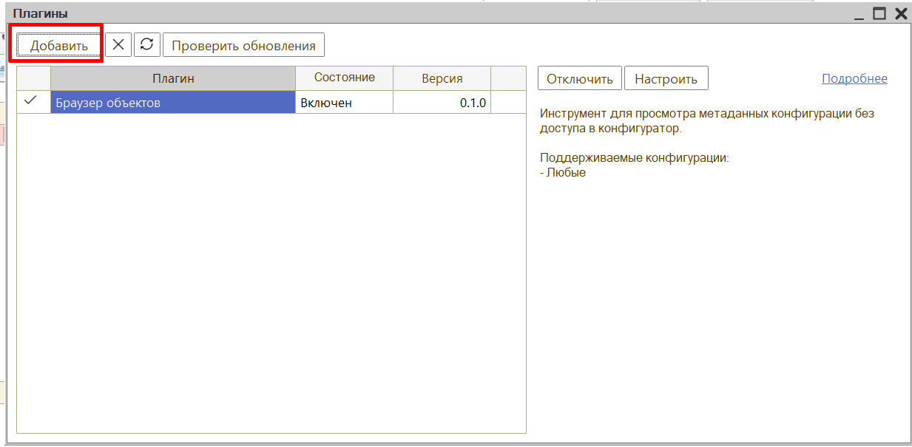
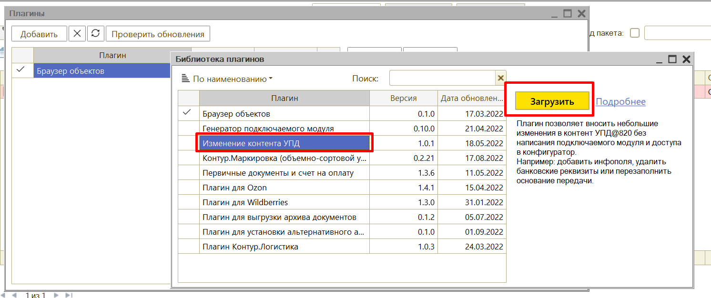
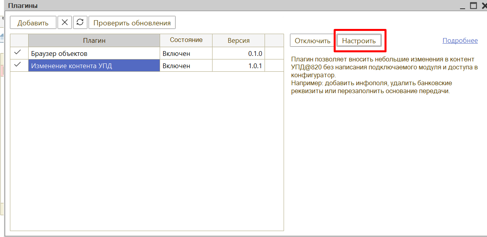
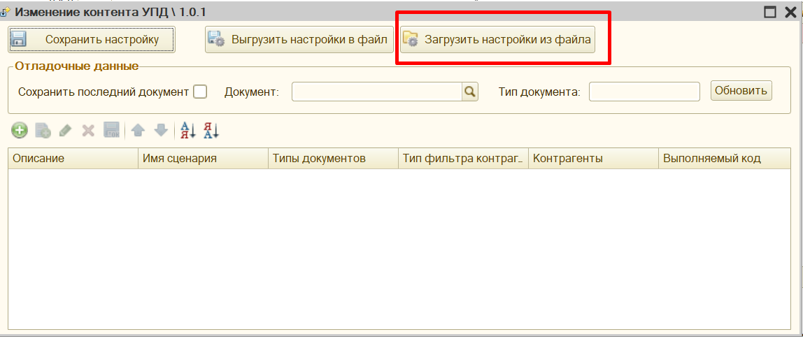
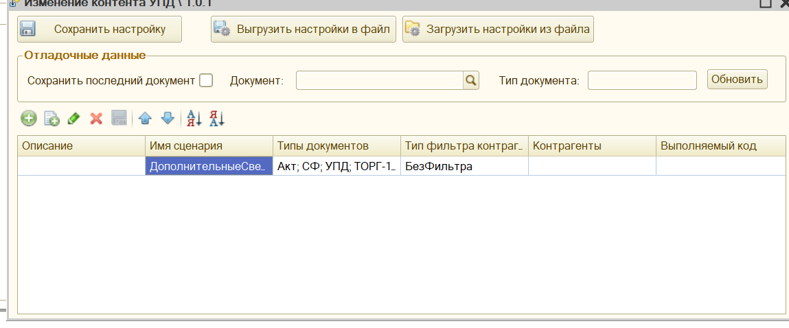
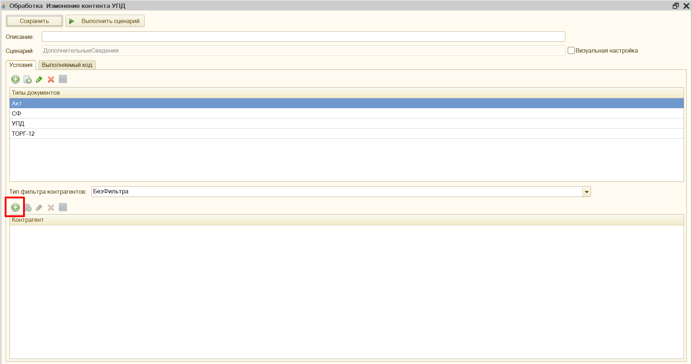
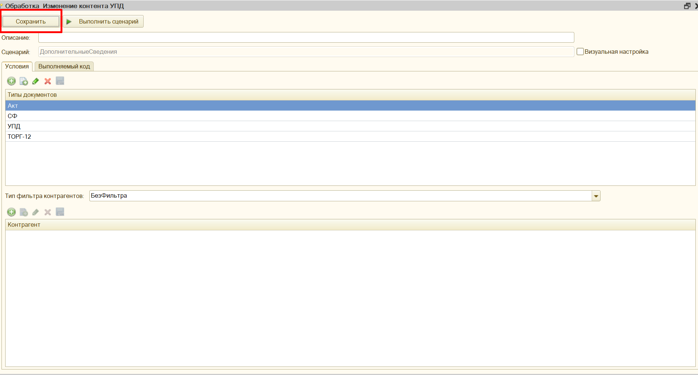
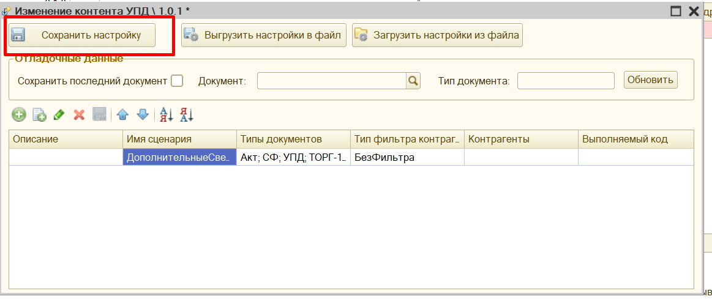

# Инструкция по настройке ДИАДОК

1. Через меню Файл – Открыть запустите файл ДиадокВключениеПлагинов.epf 
2. Нажмите Включить и закройте окно.
3. Запустите модуль Диадок откройте Настройки 
- Расширенные настройки – Плагины 
4. Нажмите Добавить

5. Выберите плагин Изменение контента УПД – Загрузить

6. Закройте окно Библиотеки плагинов и нажмите Настроить: 

7. Загрузите настройки из второго файла во вложении: 

8. Откройте обработку двойным кликом:

9. Выберите контрагентов для которых необходимо перенести настройку и сохраните настройки: 

10. Обновите список документов в модуле и проверьте заполнение
