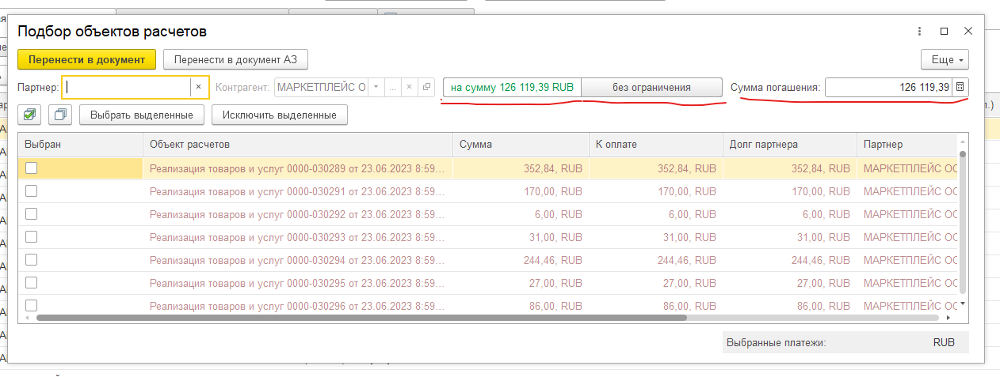

# Контроль подбора платежей во взаимозачетах

При нажатии кнопки «Подобрать по остаткам» на закладке «Дебиторская задолженность» в форме подбора сумм платежей добавлены кнопки «На сумму», «Без Ограничений» и поле «Сумма погашения». При нажатии кнопки «На сумму» и при выборе первого платежа, остальные выбираются автоматически на сумму погашения по списку. Выбрать сверх суммы погашения платежи нельзя. При нажатии кнопки «Без ограничений» можно выбирать  платежи произвольно. При превышении суммы погашения выдается предупреждение и кнопка «Перенести в документ» блокируется.

