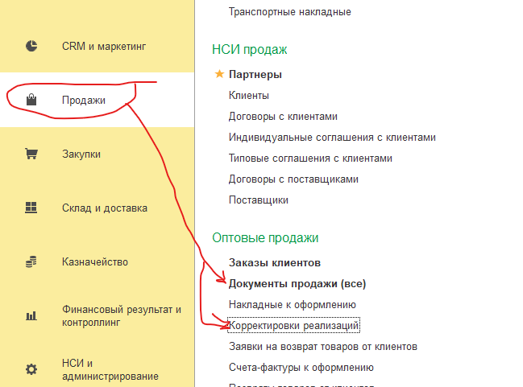
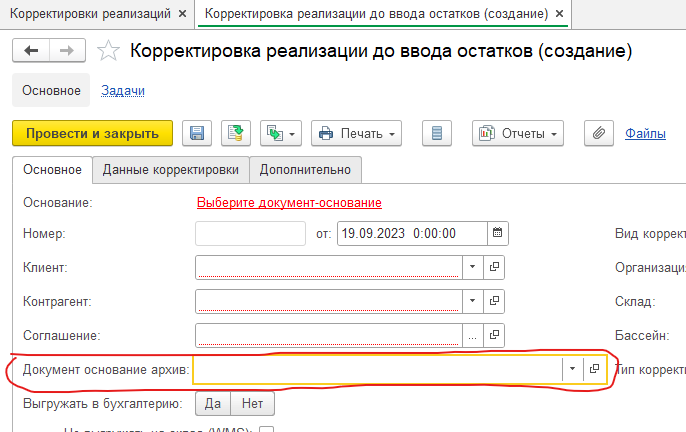
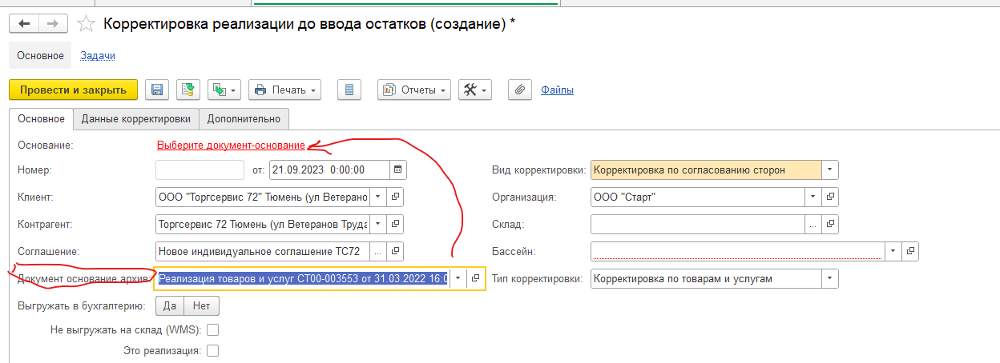
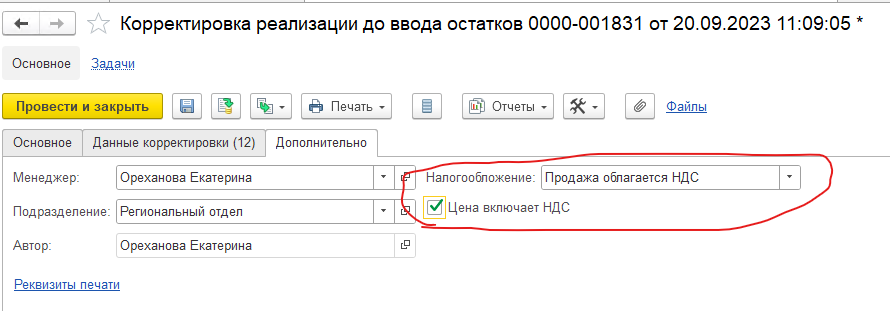
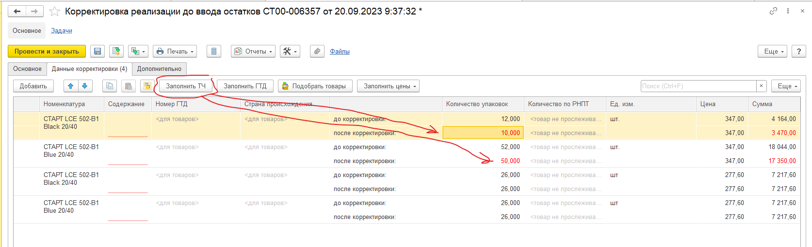
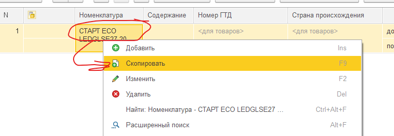
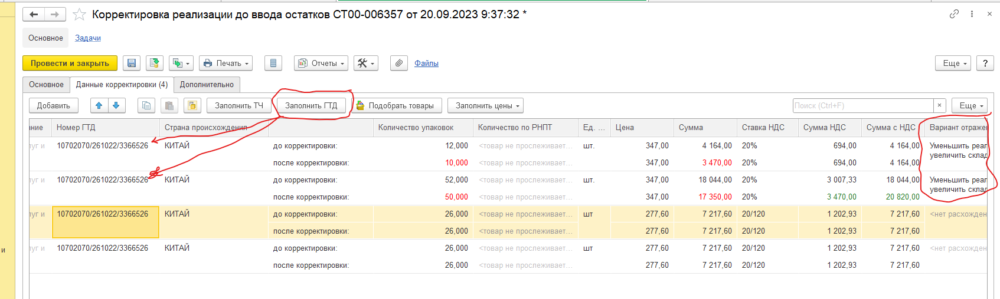

# Корректировка реализации приобретения до ввода остатков

Из списка «Документы отгрузки (все)» или «Документы закупки (все)»

Выбрать документ основание архив:

Выбрать документ основание, записать документ, перейти на закладку «Данные корректировки»:

На закладке «Дополнительно» поставить галочку «Цена включает НДС»

Нажать кнопку «Заполнить ТЧ». Внести нужные корректировки в строках «После корректировки». Колонку «Содержание» заполнить номерами строк при переоценке. Записать документ (Закрывать и отрывать не нужно): 

Если надо добавить строку, то добавление производим копированием. Правой кнопкой мыши на выбранной строке и «Скопировать» или кнопкой «F9». 

После записи документа дозаполнить варианты отражения и заполнить ГТД по кнопке «Заполнить ГТД»:

Провести документ. Оформить счет-фактуру по кнопке «Оформить счет-фактуру». Провести счет-фактуру.

