# Настройка отчётов в программе 1С

Настройка отчётов в программе 1С:Управление торговлей ред. 11.5

1С:Управление торговлей 8 | [Pro 1C](https://www.4dk.ru/content/1c)

Программа 1С:Управление торговлей ред. 11.5 позволяет эффективно вести учёт торгового предприятия, автоматизировать различные учётные задачи торговой организации, минимизировать трудозатраты бухгалтера. Программа предназначена для ведения оперативного и управленческого учёта различными пользователями от кладовщиков до руководителей предприятия. Очень часто к нам обращаются с вопросами по настройке различных отчётов, об этом и поговорим в сегодняшней статье. На примере основных видов отчётов рассмотрим простые и расширенные настройки, раскроем функционал по настройке, доступный типовыми средствами.

Все доступные отчёты в программе можно увидеть в разделе «Главное», подменю «Отчёты». Здесь отчёты сгруппированы по разделам: «Главное», «CRM и маркетинг», «Продажи», «Закупки», «Склад и доставка» и т. д. *(рис.* *1).*

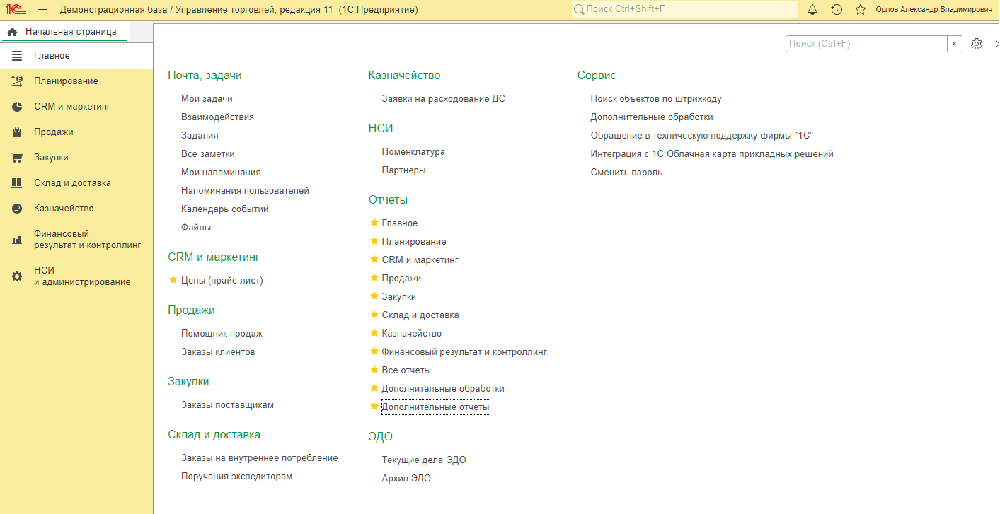

Также можно их открыть из соответствующего раздела по типу отчёта. Настройки каждого отчёта доступны по команде «Настройки», здесь можно выбрать один из вариантов: простой и расширенный. Простой вариант предполагает базовые, основные настройки, которые не требуют сохранения и будут применены при каждом последующем формировании отчёта. Расширенный вариант позволяет нам настроить структуру отчёта под себя, добавив нужные поля, отборы и сортировки, с возможностью последующего сохранения варианта отчёта.

Рассмотрим настройки отчёта «Валовая прибыль предприятия». Этот отчёт является одним из основных, используемых для анализа продаж в разрезе подразделений, менеджеров, номенклатуры. Открыть его можно в разделе «Главное», подменю «Продажи» либо в разделе «Продажи» – «Отчёты по продажам» *(рис. 2)*.

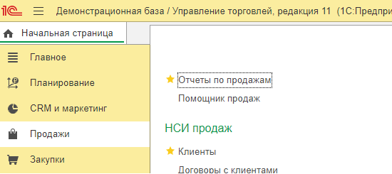

По кнопке «Настройки» открывается окно настройки отчёта.

В простом варианте настроек на закладке «Основное» доступны отборы по подразделению, менеджеру, сегменту номенклатуры или конкретной позиции номенклатуры *(рис. 3).*

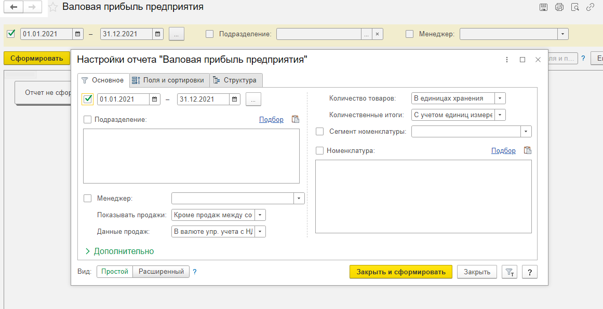

На закладке «Поля и сортировки» можно галочками регулировать отображаемые поля *(рис. 4).*

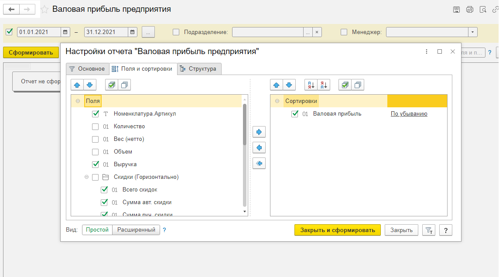

Настройка структуры отчёта недоступна *(рис. 5).*

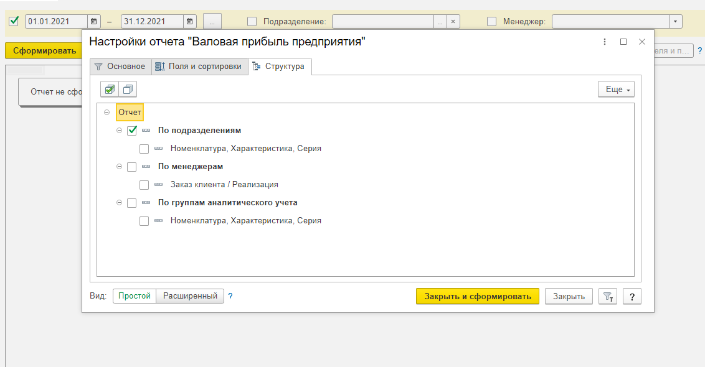

Сначала сформируем отчёт с применением стандартных настроек, сделаем это по кнопке «Закрыть и сформировать». Отчёт сгруппирован по подразделениям, видим показатели выручки, себестоимости, валовой прибыли и рентабельности *(рис. 6).*

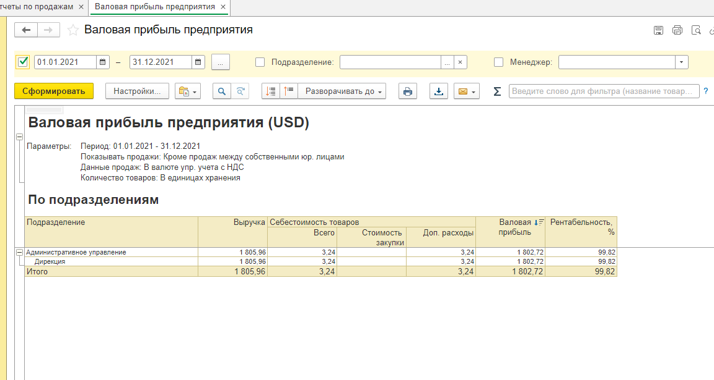

Простой вариант отчёта автоматически сохраняется и будет доступен при следующем формировании.

Теперь перейдём к расширенному варианту настройки. Для этого в окне настройки отчёта ставим «Переключать» на значение «Расширенный». Видим, как изменились настройки отборов и полей, предоставляя нам дополнительные возможности. Предположим, мы хотим видеть результаты продаж в разрезе номенклатуры, в том числе по количеству, и контрагентов. Для этого на закладке «Поля и сортировки» ставим галочку «Количество» и переходим в «Структуру отчета». При расширенном варианте становится доступной настройка структуры, появляются дополнительные кнопки: «Добавить», «Удалить» или «Переместить» текущий элемент *(рис. 7).*

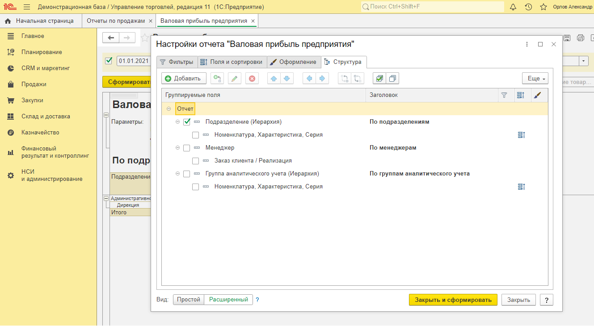

Этими возможностями мы и воспользуемся, и очистим всю текущую структуру отчёта по умолчанию по кнопке «Удалить текущий элемент». Затем построим свою структуру, соответствующую нашим потребностям. По кнопке «Добавить» открывается окно «Выбор поля отчёта» *(рис. 8).*

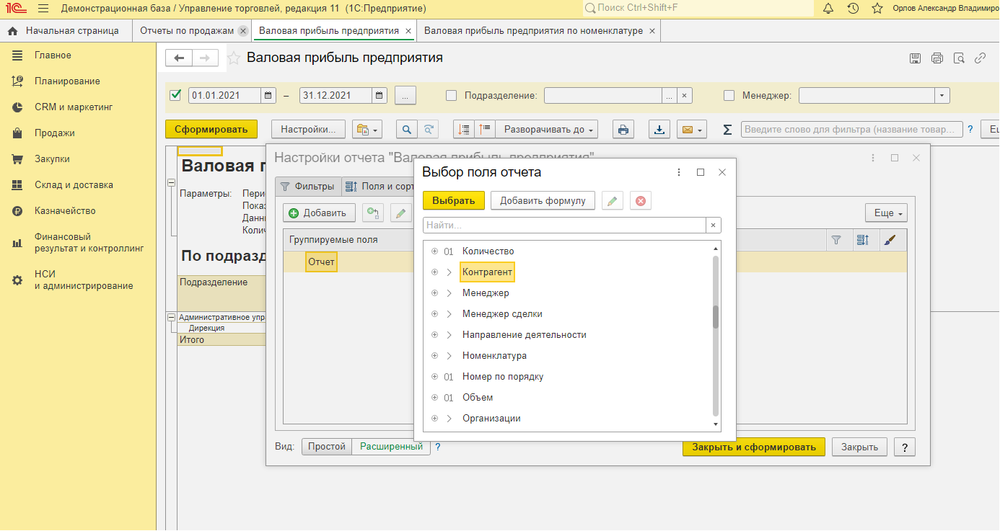

Здесь выберем поля «Контрагент» и «Номенклатура». При необходимости можно вывести в отчёт различные данные контрагента, раскрыв его на «плюсик», такие как ИНН, адрес и т. д., для номенклатуры доступны артикул, вид и многие другие. Структуру можно редактировать, перетаскивая элементы, меняя подчинённость. Когда структура отчёта готова, нажмём «Закрыть и сформировать», чтобы посмотреть результат. Видим красивый, информативный отчёт с группировкой по контрагентам и номенклатуре *(рис. 9).*

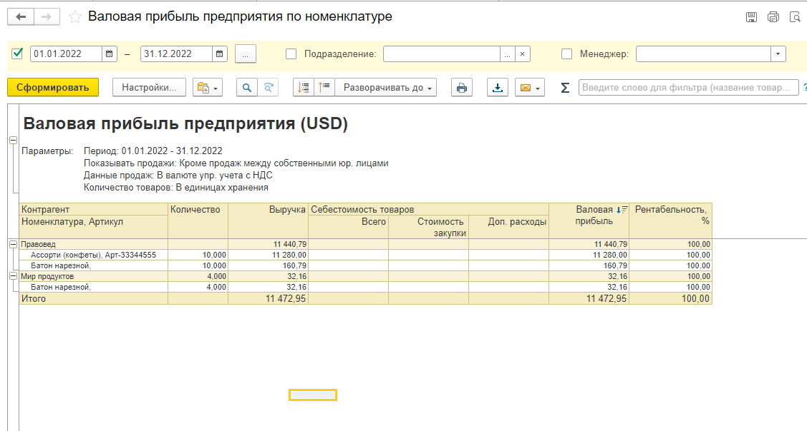

Если вариант отчёта нас устраивает, можем сохранить выбранные настройки.  По кнопке «Сохранить как» открывается окно сохранения варианта отчёта *(рис. 10).*

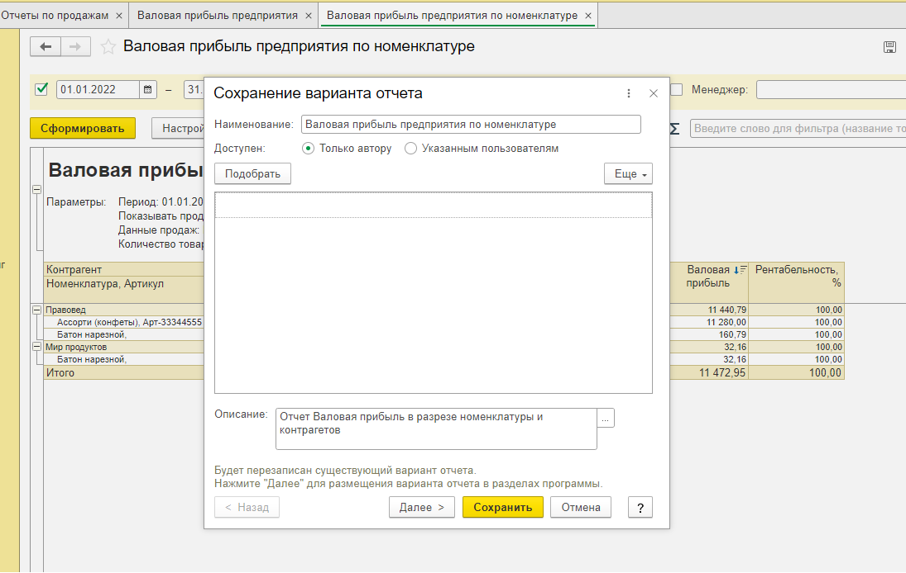

В нём заполняем «Наименование отчёта», по умолчанию программа предлагает своё наименование с возможностью редактирования, также можем добавить «Описание отчёта» для удобства. Нажимаем «Сохранить». Переходим в «Отчёты по продажам» и видим созданный нами вариант отчёта с описанием *(рис. 11).*

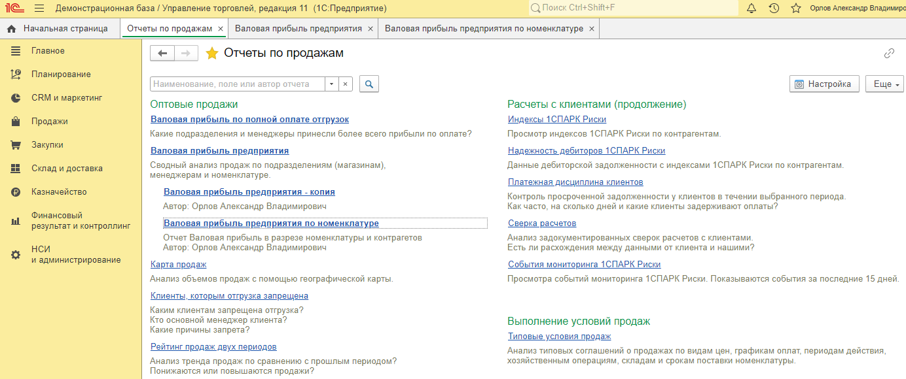

Отсюда мы можем формировать, все настройки сохранены. Это очень удобно, не нужно тратить время на настройку отчёта при каждом формировании.
