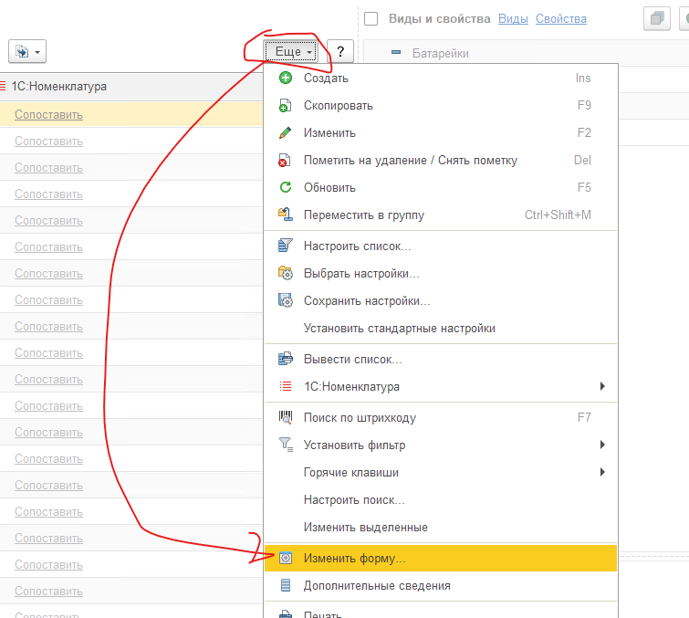
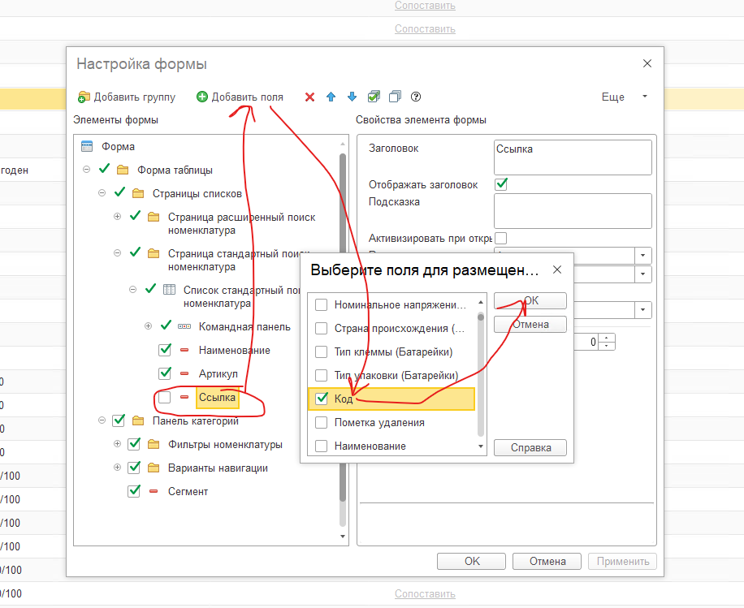

# Добавление колонки в списки

Для того что бы в список (номенклатуры, документов и т.п.) добавить Колонку которой нет в списке:

Надо нажать **Еще** - **Изменить форму**

Найти в открывшемся окне строку «Ссылка». Нажать «Добавить поля». Поставить флажок напротив нужного поля.  Нажать «Ок».  Потом «Применить».

