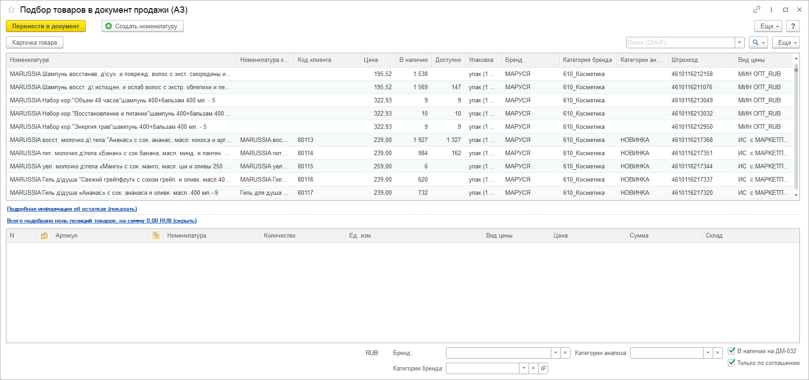
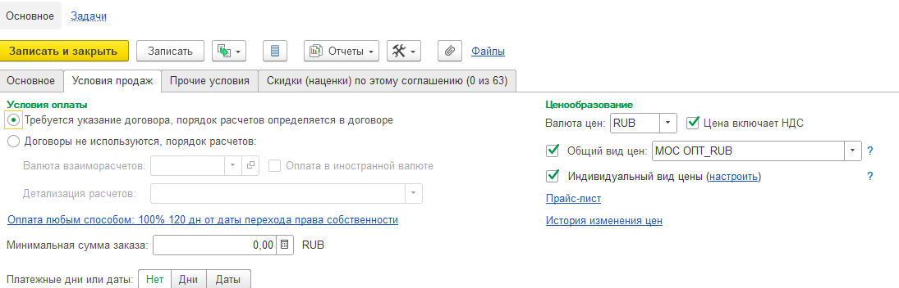
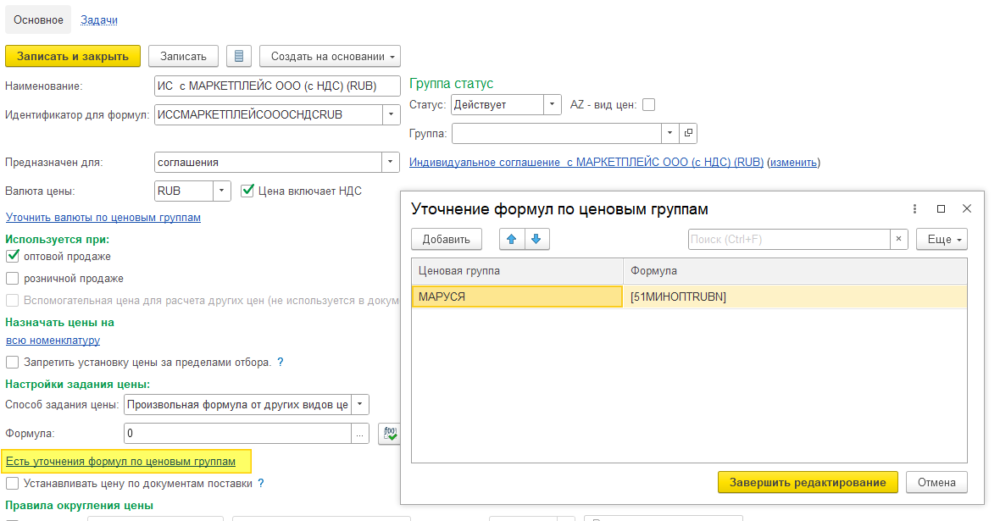
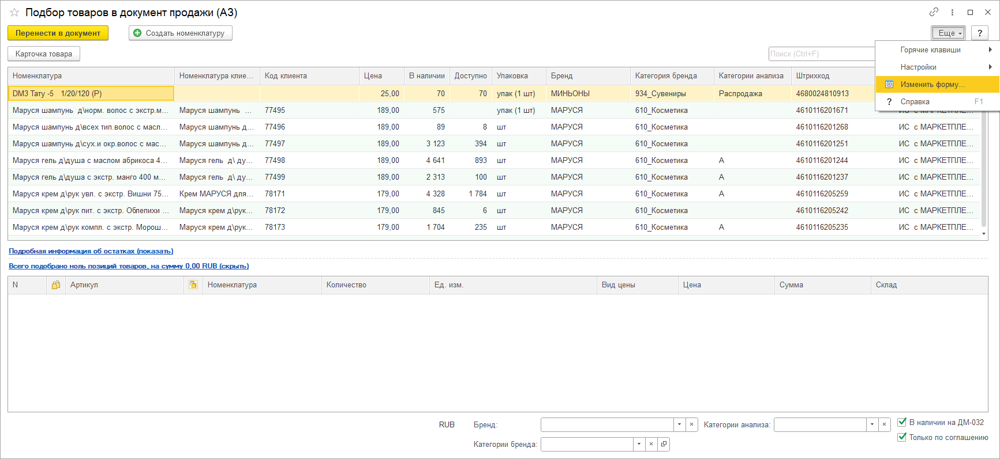
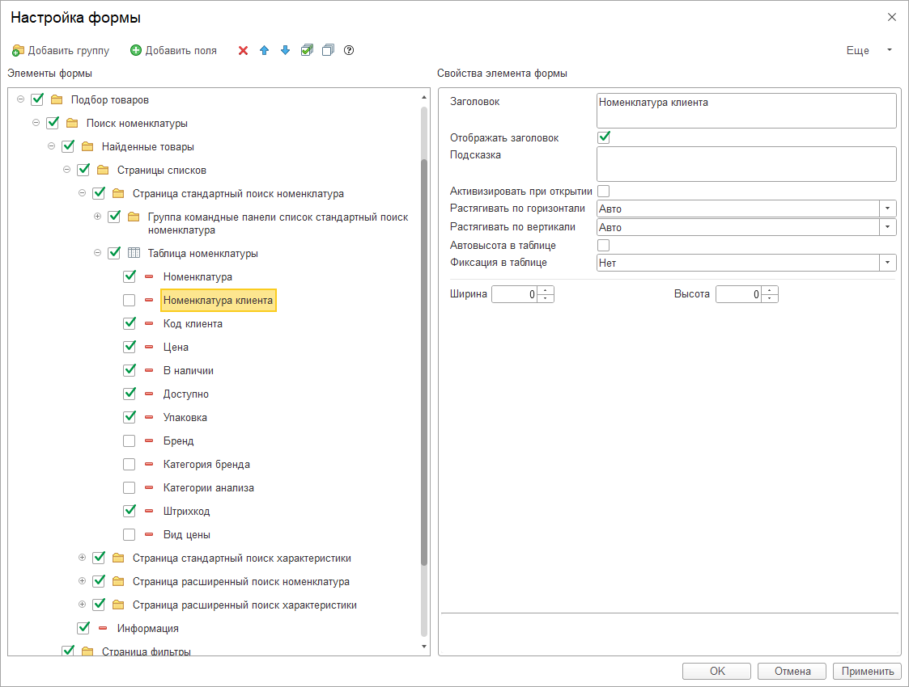
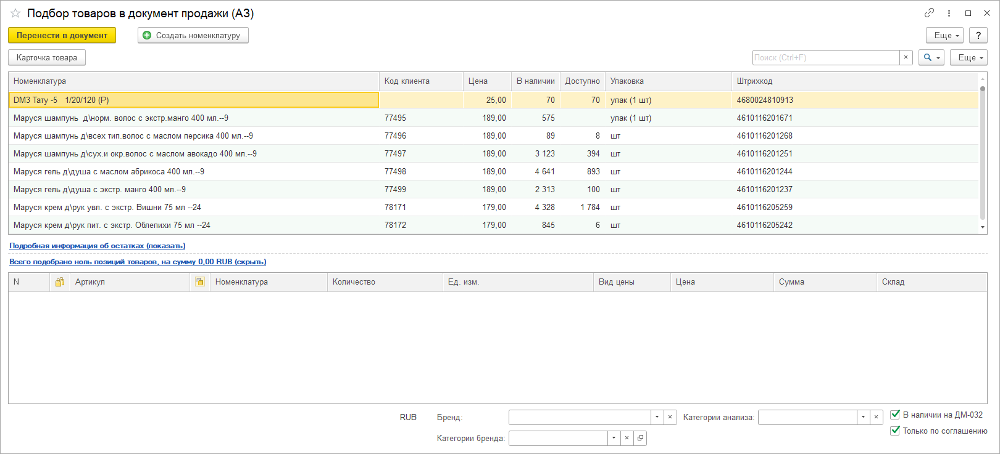

# Подбор товара

Подбор товара теперь формируется с учётом установленных уточнений по ценам и с учетом общего вида цены, указанного в соглашении.

В подборе выводится информация по номенклатуре клиента и дополнительная информация по видам цен и товару. 
## Логика формирования цен
Основной ценой является цены по индивидуальному прайсу (скрин ниже) далее добавляются цены по уточнениям цен (только товары на которые нет индивидуальных цен), после добавляются цены по общему виду цен (только на товары, по которым нет цен по предыдущим пунктам).

Уточнения цен по группам в карточке индивидуальной цены.

## Изменения видимости колонок
Колонок в подборе выводится много, при первом запуске подбора, далее можно самостоятельно скрыть лишние колонки.

Нажимаем кнопку Ещё – Изменить форму.

Находим раздел «Таблица номенклатуры» и снимаем лишни для вас галочки.

После нажатия ОК получаем более компактный вид подбора.
