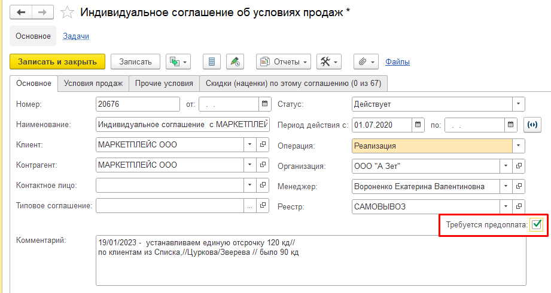
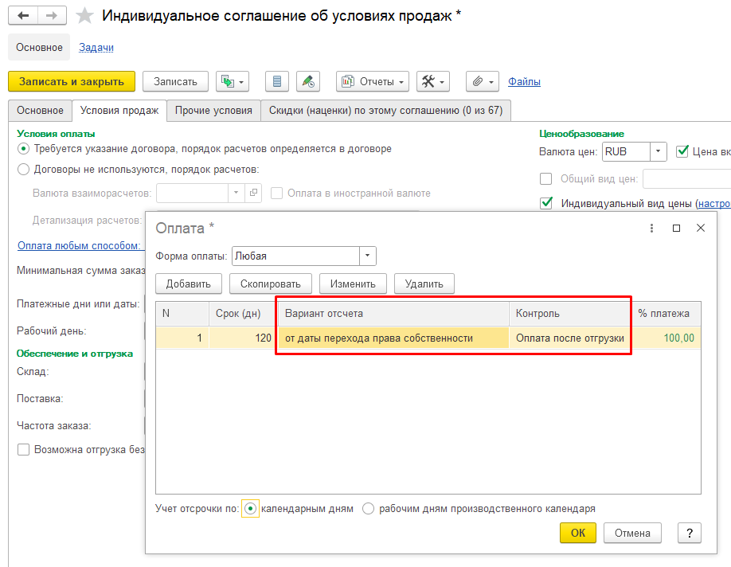
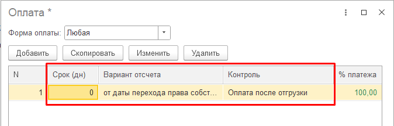
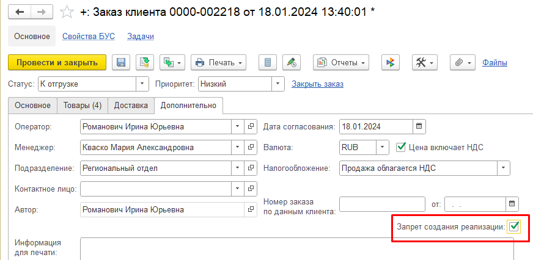

# Предоплатные клиенты обн. 2024-04-27

## Установка предоплаты в соглашении
Для работы с запретом создания реализаций по предоплате необходимо в соглашении установить флаг (галочку) ***Требуется предоплата***. Условие оплаты в соглашении значения не имеет, но чтобы типовой вариант запрета не работал, должен стоять вариант контроля ***Оплата после отгрузки***.  

Для этого необходимо перейти на вкладку ***Условия продаж*** и по гиперссылке открыть форму ***Оплата***. 

Здесь всегда выбираем один единственный вариант: 

вариант отсчета – от даты перехода права собственности;

контроль – оплата после отгрузки.

Если предоплата не требуется, то флаг проставлять не надо, но на форме ***Оплата*** все равно выбираем от даты перехода права собственности и оплата после отгрузки, единственное отличие в том, что в колонке ***Срок (дн)*** нужно проставить ***0***.

## Запрет создания реализаций в заказе
При создании заказа с соглашением, требующим предоплату в заказе автоматически устанавливается запрет. Снятие запрета происходит в самом заказе, доступ имеют пользователи с правами на снятие этого запрета.

