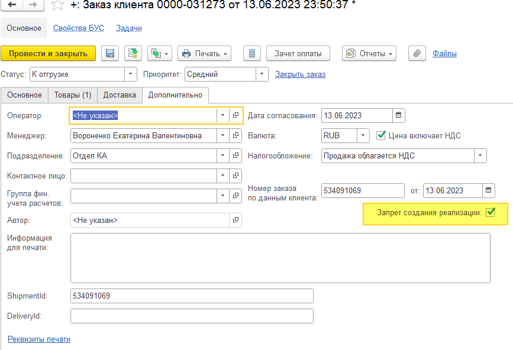

# Предоплатные клиенты

## Установка предоплаты в соглашении
Для работы с запретом создания реализаций по предоплате необходимо в соглашении установить галочку «Требуется предоплата». Условие оплаты в соглашении значения не имеет, но чтобы типовой вариант запрета не работал, должен стоять вариант контроля «Оплата после отгрузки».  

## Запрет создания реализаций в заказе
При создании заказа с соглашением, требующим предоплату в заказе автоматически устанавливается запрет.

Снятие запрета происходит в самом заказе, доступ имеют пользователи с правами на снятие этого запрета.

