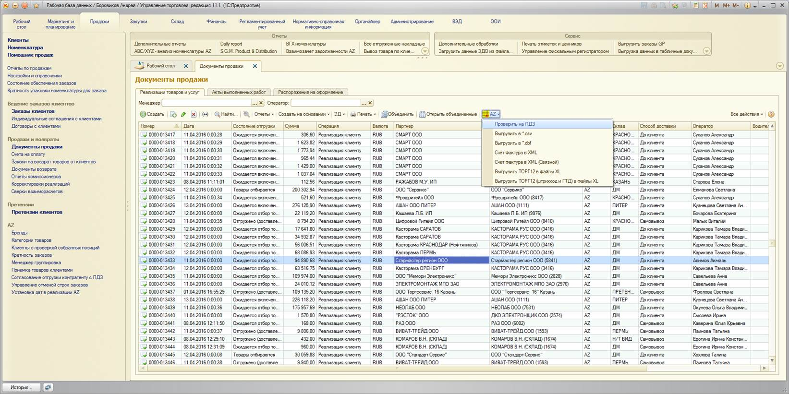

# Проверить на ПДЗ

В список документов продажи добавлена новая команда «Проверить на ПДЗ».

Если у документа стоит запрет отгрузки по ПДЗ, но в данный момент ПДЗ нет, то можно выделить документ в списке и вызвать команду – в результате пройдет проверка на наличие ПДЗ, и если ПДЗ не обнаружится, то запрет отгрузки будет снят.

Т.к. внесение платежей клиентам требует времени, и не всегда есть возможность сделать это быстро, команда поможет обойтись без согласования реализаций, т.к. если ПДЗ уже нет, то и согласование не требуется.

