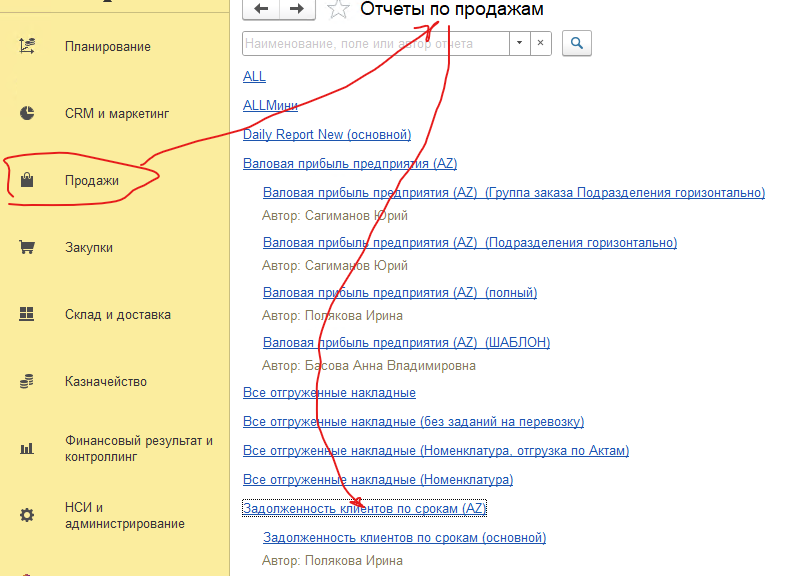
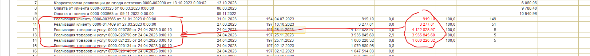
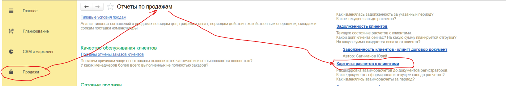
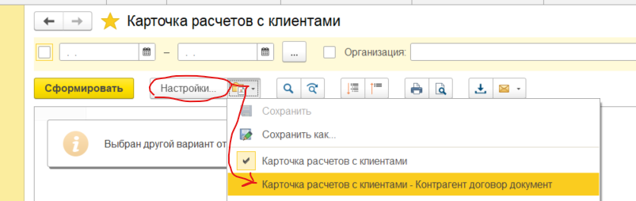
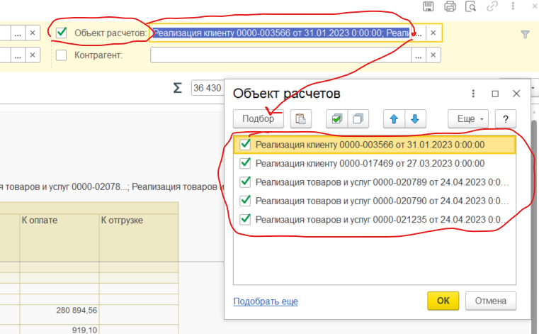
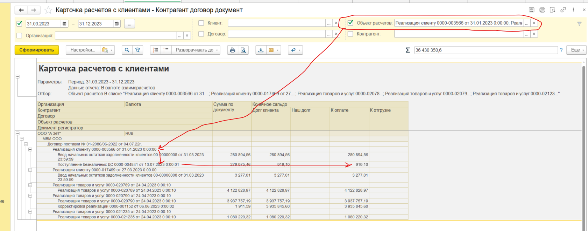

# Проверка корректности дебиторской задолженности

# Проверка корректности дебиторской задолженности

Дебиторская задолженность проверяется по отчету «Задолженность клиентов по срокам (AZ)» (Раздел Продажи – Отчеты по продажам»

Проверим на примере:

Есть ПДЗ по клиенту:

Для проверки корректности ПДЗ используем специальный вариант отчета «Карточка расчетов с клиентами» - «Карточка расчетов с клиентами – Контрагент договор документ»:

В настройках отбора в отборе «Объект расчетов» выбираем реализации по которым проверяем корректность ПДЗ:

|10|**Реализация клиенту 0000-003566 от 31.01.2023 0:00:00**|31\.01.2023|154|04\.07.2023||919,10|0,0|919,10|
| -: | :- | :- | -: | :- | :- | -: | -: | -: |
|11|**Реализация клиенту 0000-017469 от 27.03.2023 0:00:00**|27\.03.2023|197|10\.10.2023||3 277,01|0,0|3 277,01|
|12|**Реализация товаров и услуг 0000-020789 от 24.04.2023 0:00:10**|24\.04.2023|197|25\.11.2023||4 122 828,97|3,0|4 122 828,97|
|13|**Реализация товаров и услуг 0000-020790 от 24.04.2023 0:00:10**|24\.04.2023|197|25\.11.2023||3 935 845,60|2,9|3 935 845,60|
|14|**Реализация товаров и услуг 0000-021235 от 24.04.2023 0:00:10**|24\.04.2023|197|25\.11.2023||1 080 220,32|0,8|1 080 220,32|

Итоговые настройки отчета и сам отчет: В отчете видно что по реализации Реализация клиенту 0000-003566 от 31.01.2023 0:00:00 есть ПДЗ в отчете «Дебиторская задолженность по срокам долга» и Долг клиента по реализации в отчете «Карточка расчетов с клиентами – Контрагент договор документ». Вывод: ПДЗ корректное. 

