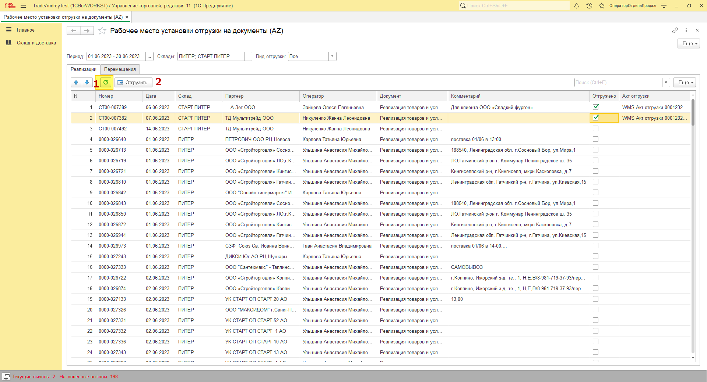

# Рабочее место установки Отгружено

## Открытие рабочего места
Для рабочего места сделаны отдельные права, с доступом только э этой форме.

Расположение этого рабочего места с другим правами не изменится.

Отгруженными документами считаются те документы, для которых сформирован «Акт отгрузки WMS».

Подсистема Склад – Сервис – Рабочее место установки отгрузки на документы (AZ).

## Настройки формы
Период в отчете устанавливается автоматически текущим месяцем, при запуске, постом можно поменять.

Необходимо задать склады, по которым будет проходить поиск документов.

Поле вид отгрузки устанавливает видимость для документов:

1. Все документы
2. Отгруженные документы
3. Не отгруженные документы

## Поиск документов и установка «Отгружено»
Для заполнения документами по установленному отбору необходимо нажать на кнопку «Обновить» (1).

В результате форма заполнится документами по отбору.

Для установки отгружено необходимо поставить галочку «Отгружено» напротив нужных документов и нажать кнопку «Отгрузить» (2), в результате будет создан «Акт отгрузки WMS».

