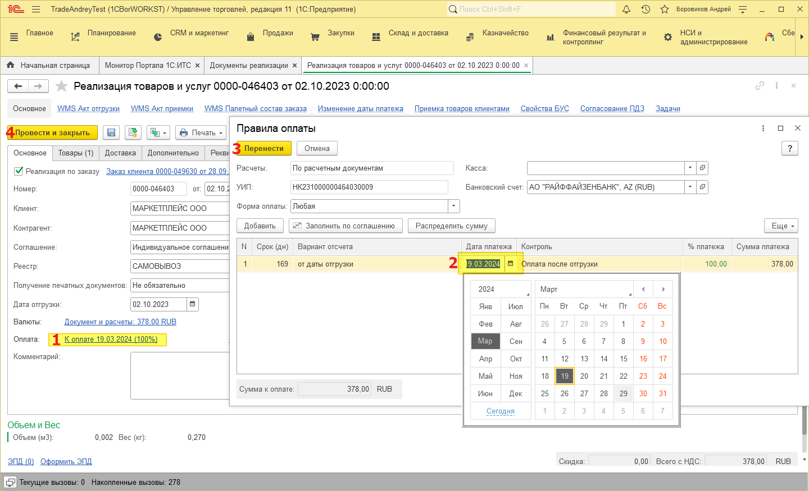
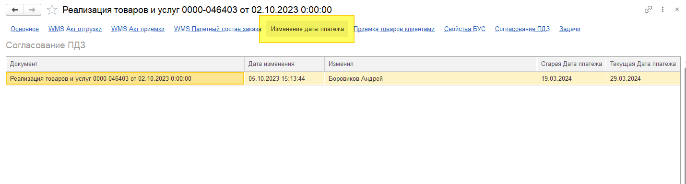

# Изменение дата платежа

## Ручное изменение даты платежа
Открываем документ «Реализация товаров и услуг», нажимаем на ссылку `«Оплата» (1).`

Открывается окно с правилами оплаты, меняем дату платежа на нужную (2), нажимаем кнопку `«Перенести» (3).`

`Проводим документ (4).`

Факт ручного изменения даты платежа можно посмотреть в самом документе, по ссылке `«Изменение даты платежа».`

