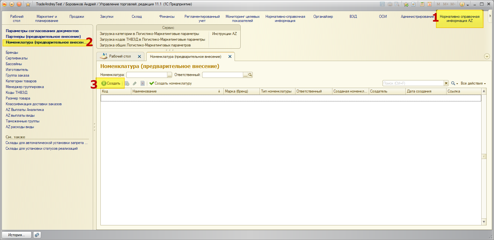
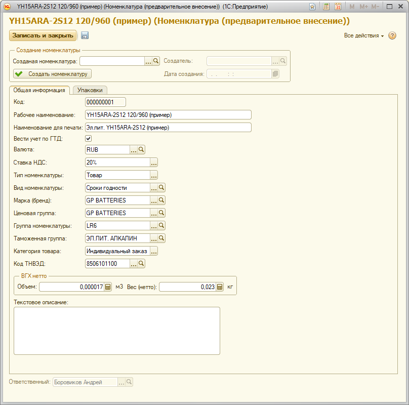
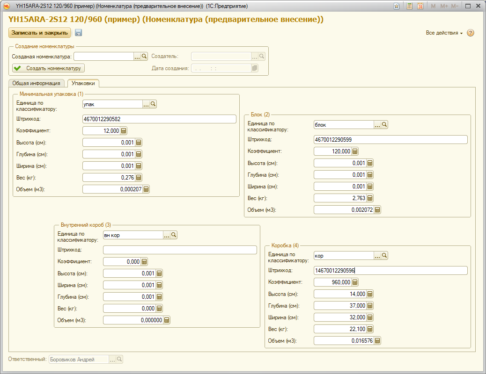
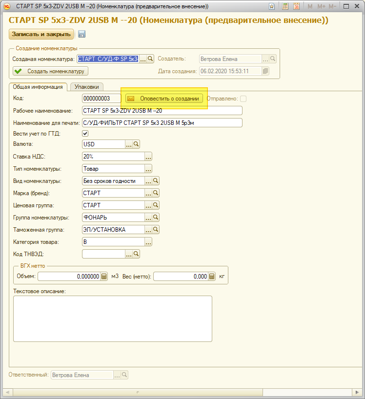
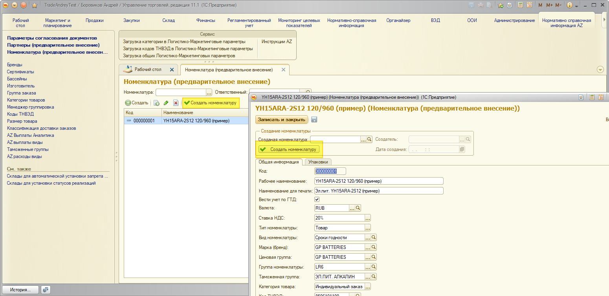

# Создание предварительной карточки Номенклатуры

## Шаблон для внесения номенклатуры в базу
Создан справочник на основании которого будут вноситься данные в основной справочник номенклатуры.

Открываем подсистему **Нормативно справочная информация AZ** – **Номенклатура (предварительное заведение)**. Нажимаем кнопку **Создать**.

## Внесение общей информации

Расшифровка полей:

- Рабочее наименование – это наименование которое отображается в базе 1С
- Наименование для печати – это наименование выводимое на печать в документах
- Вести учет по ГТД – устанавливается для импортного товара, для которого обязательно указание номера ГТД в документах
- Валюта номенклатуры – заполняется автоматически, менять не нужно
- Тип номенклатуры – заполняется автоматически, менять не нужно
- Вид номенклатуры – тут нужно выбрать из двух вариантов «Сроки годности» и «Без сроков годности», в зависимости от того ведется учет по срокам годности у товара или нет
- Марка (бренд) – выбирается марка товара
- Ценовая группа – зачастую дублирует марку, можно не заполнять
- Группа номенклатуры – это группа в которой будет создана карточка номенклатуры, можно не заполнять
- Таможенная группа – указывается принадлежность к одной из таможенных групп 
- Категория товара – категория к которой относиться товар
- Код ТНВЭД – код по классификатору товаров
- Объем – объем одной единицы товара
- Вес (нетто) – указывается вес нетто товара
- Текстовое описание – описание товара

## Упаковки
Упаковки расположены и пронумерованы по порядку подчиненности.

Минимальная упаковка (1) – Блок (2) – Внутренний короб (3) – Коробка (4).

Без минимальной упаковки невозможно создание любых других, т.е. минимальная упаковка должна быть задана обязательно. Если какой-то упаковки у товара нет, то её заполнять не нужно, на примере не заполнен Внутренний короб.

Расшифровка полей:

- Единица по классификатору – это единица измерение упаковки, они уже заполнены, менять их не нужно
- Штрихкод
- Коэффициент – указывается сколько штук в упаковке
- Высота – высота упаковки в «см»
- Глубина – глубина упаковки в «см» 
- Ширина – ширина упаковки в «см»
- Вес – вес брутто упаковки в «кг»
- Объем – объем упаковки в «м3»

При заполнении полей Высота, Глубина, Ширина поле Объем рассчитывается автоматически.

Если не заполнить поле Коэффициент, то такая упаковка не будет создана для номенклатуры. 

## Оповестить о создании
После создания предварительно карточки необходимо нажать кнопку **Оповестить о создании**, в результате в ООИ уйдет письмо о создании предварительной карточки.

## Создание карточки номенклатуры
Для создания номенклатуры на основании предварительной карточки необходимо нажать кнопку «Создать номенклатуру».

После создания номенклатуры карточка созданной номенклатуры будет в поле «Созданная номенклатура».

При создании создаётся карточка номенклатуры, упаковки, штрихкоды, логистические параметры номенклатуры.

По окончании создания карточки товара будет отправлено письмо по электронной почте ответственному.
