# Создание предварительной карточки Партнера

## Шаблон для внесения партнёра в базу
Создан справочник на основании которого будут вноситься данные в основной справочник партнеров.

Открываем подсистему **Нормативно справочная информация AZ** – **Партнеры (предварительное заведение)**. Нажимаем кнопку **Создать**.

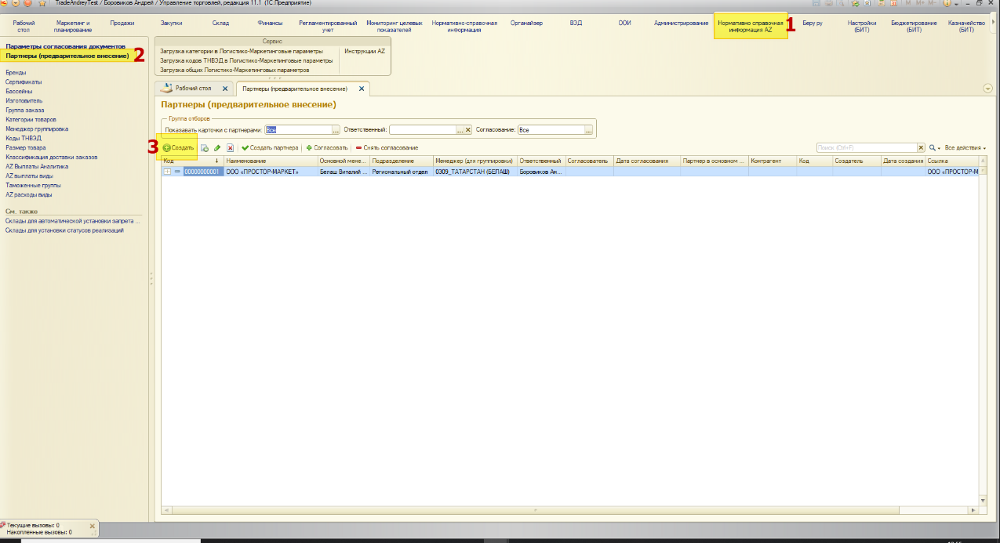

Устанавливаем переключатель «**Адрес доставки – Новый партнер**» в нужно положение.

**Адрес доставки** – устанавливается, когда создаём новый адрес доставки к существующему партнеру.

**Новый партнер** - устанавливается, когда создаём нового партнера с контрагентом или адрес доставки с контрагентом.

## Адрес доставки
При создании адреса доставки следует обратить внимание на поле **Родитель из основного списка** – это партнер родитель из справочника **Партнеры**, если добавляем ещё один адрес доставки партнера, то выбираем нужного, в противном случае создастся партнер верхнего уровня (родитель).

Обязательно заполнить поля:

- Публичное наименование
- Рабочее наименование
- Родитель из основного списка
- Подразделение
- Менеджер для группировки

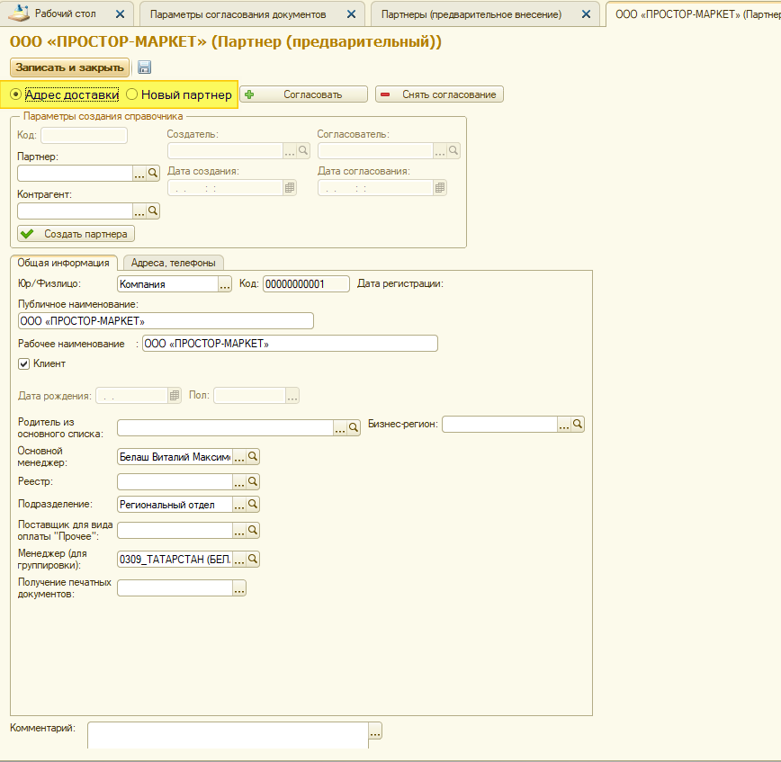

На вкладке **Адреса и телефоны**, вводим адреса и телефоны.

Ввод адресов происходит в соответствии с адресным классификатором, окно ввода открывается нажатием кнопки с тремя точками. Если поля для ввода не активны, необходимо снять галочку **Ввести адрес в свободной форме**. 

Системы электронного документооборота требуют ввода адреса в соответствии с классификатором КЛАДР, поэтому ввод адреса в этом формате обязателен!

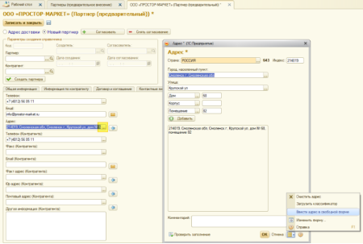

Для адреса доставки заполняеться контактная информация без пометки в скобочках **Контрагент**. 

Ввод города происходит чрез кнопку с тремя точками, сначала нужно выбрать регион потом город. Для быстрого ввода можно набирать на клавиатуре наименование автоматичеки отработает поиск по наименованию, и можно будет выбрать результат из списка.

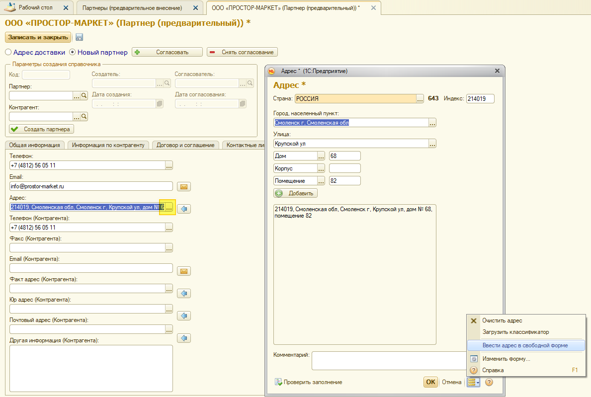

После заполнения всех нужных полей нажимаем кнопку **Записать и закрыть**. Автоматически заполнить поле Ответственный – это тот, кто создал карточку.

## Новый партнер
При установке этой галочки откроются дополнительные поля для заполнения контрагента, договора, соглашения и контрактных лиц.

## Информация по контрагенту
Для начала нужно проверить не заведен ли контрагент с такими данными в базу данных.

Заполняем ИНН и КПП, нажимаем кнопку **Проверить на дубль по ИНН/КПП** и если дубль будет найден, то выйдет сообщение об этом:

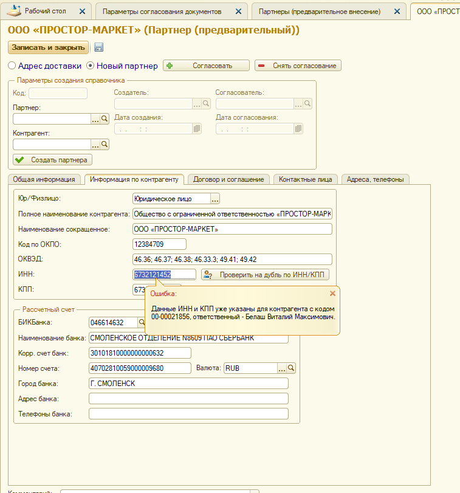

Заполняем все данные по контрагенту.

При вводе БИК Банка и нажатии кнопки Enter произойдет поиск банка по классификатору банков, и, если он будет найден, заполняться все поля из классификатора, останется ввести номер расчетного счета клиента.

## Договор и соглашение

Если не вводить информацию по договору и соглашению, то они не будут созданы. Если у партнера родителя есть договор и соглашение, то они тоже не будут созданы.

Для создания договора обязательно заполнить поля:

- Валюта договора и соглашения
- Дата начала действия 
- Дата окончания действия 

Не обязательно для создания договора

- Кредитный лимит – это лимит долга клиента до наступления запрета на продажу
- Сумма предполагаемой поставки – сумма на которую клиент предполагает осуществить первую поставку товара

Для создания соглашения обязательно заполнить поля:

- Цена включает НДС или нет
- Валюта договора и соглашения
- Операция – это реализация или комиссия
- Налогообложение – облагается или нет НДС
- График оплаты – отсрочка с выбором нужной отсрочки или предоплата 

## Предо платные клиенты
Если клиент будет работать по предоплате, то необходимо выбрать ему график оплаты **Отсрочка - 0 дн., (по календарным)** или **Отсрочка - 0 дн., (по рабочим)**, и установить галочку **Требуется предоплата**. 

Использовать график оплаты **Предоплата (до отгрузки)** нельзя.

## Контактные лица
Заполняются все известные поля, можно не заполнять.

По результату создадутся контактные лица партнеров.

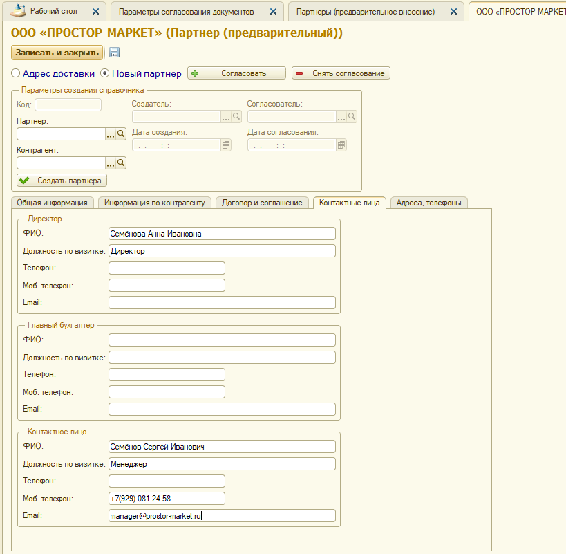

## Адреса и телефоны
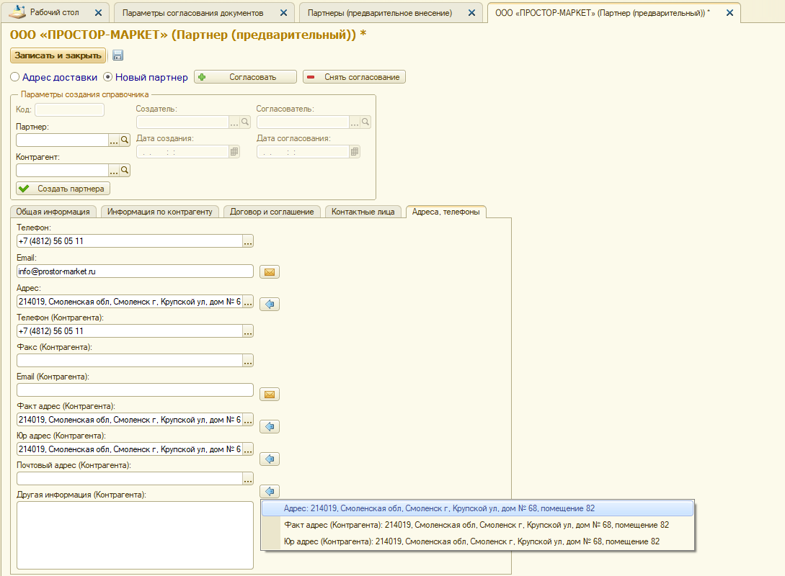

Заполняться поля для контрагента и партнера, если адреса совпадают, то можно их переносить, нажимая кнопку с синей стрелочкой.

Адреса, также, как и в первой части описания, для Адреса доставки, вносим в соответствии с адресным классификатором.

Следует обратить внимание на поле **Юридический адрес контрагента** – адрес должен быть внесен в соответствии с тем как адрес указан в **ЕГРЮЛ** партнера, изменение его, при вводе в справочник, не допускается!

После ввода всех данных нажимаем кнопку **Записать и закрыть**, шаблон для ввода партнера создан.

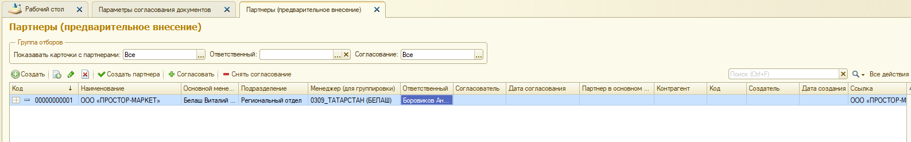

## Оповестить о создании
Для отправки сообщения о создании новой карточки нужно нажать кнопку **Оповестить о создании**, в результате все ответственные сотрудники будут оповещены электронной почтой.

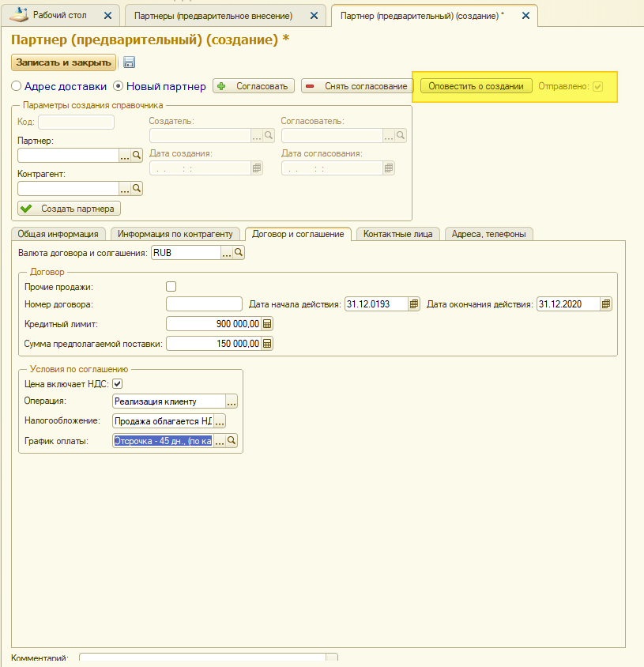

После отправки сообщения установить галочка **Отправлено**, отправить повторно сообщение будет нельзя.

## Выгрузка фала шаблона карточки партнера в XL
Из списка справочника можно выгрузить шаблон карточки партнера в XL, на основании этого шаблона можно будет провести загрузку данных в карточку предварительного партнера.

Открываете список, нажимаете кнопку **Выгрузить шаблон карточки клиента в XL**, выбираете место сохранения в открывшемся диалоге, нажимаете **Выбор папки**, готово, файл сохранен.

Файл имеет наименование **Карточка учета партнера.xls**

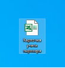

Менять наименования полей, добавлять новые столбцы, менять столбцы местами в файле шаблоне нельзя, в противном случае будет невозможно загрузить данные из этого файла!

## Загрузка из файла шаблона XL карточки партнера
Создаем новую карточку партнера кнопкой **Создать**.

В открывшемся окне нажимаем **Загрузить карточку партнера из XL**.

Выбираем файл, из которого будет проходить загрузка, этот файл должен быть создан из файла шаблона XL из предыдущего абзаца этого описания.

Выбираем файл и нажимаем **Открыть**.

Происходит загрузка и заполнение всех возможных полей.

Не все поля можно точно идентифицировать при загрузке, поэтому после загрузки необходимо проверить заполненные данные.

Особо нужно обратить внимания на поля:

- Валюта договора и соглашения – по умолчанию устанавливается рубль
- Прочие продажи
- Номер договора и даты его действия – без заполнения этих полей договор не будет создан
- Цена включает НДС
- График оплаты
- Требуется предоплата

Также не заполняются данные по адресам и телефонам, т. к. интерпретировать адреса по классификатору точно не представляется возможным. Эти данные нужно заполнить по классификатору вручную.

## Создание партнера на основании шаблона
После того как шаблон для создания партнера заведен можно создать партнера в основном списке.

## Согласование создания карточки партнера
Согласование требуется для ввода нового партнера, для адреса доставки согласование не требуется. При попытке создать нового партнера без согласования выйдет сообщение об отсутствии согласования и новый партнер не будет создан.

Согласовать можно как в общем списке так и в карточке шаблона партнера.

Для согласования необходимо нажать кнопку **Согласовать**, для отмены согласования **Снять согласование**.

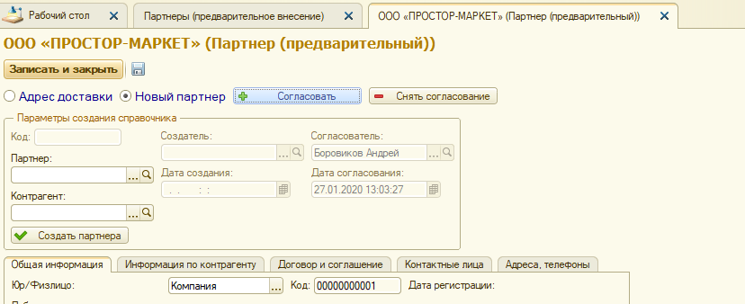

После согласования будут заполнены поля **Согласователь** и **Дата согласования**.

## Создание партнера
Создать партнера можно как из списка справочника, так и из карточки.

Нажимаем кнопку **Создать партнера** и все необходимые справочники будут созданы.

Заполняться поля: **Код**, **Партнер**, **Контрагент**, **Создатель** и **Дата создания**.

После создания автоматически отправиться письмо по эл. почте ответственному и основному менеджеру.

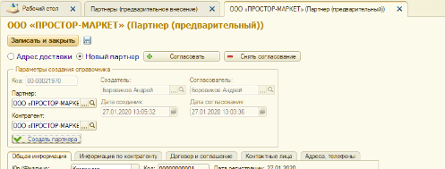

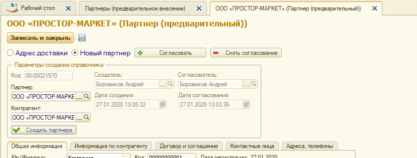

