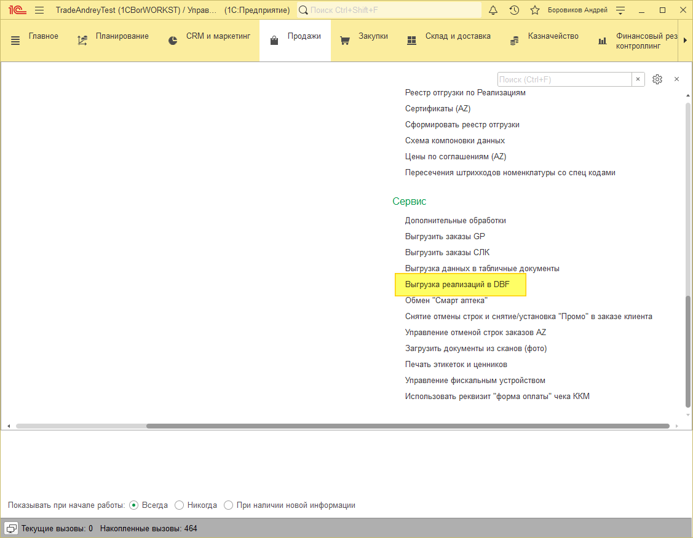
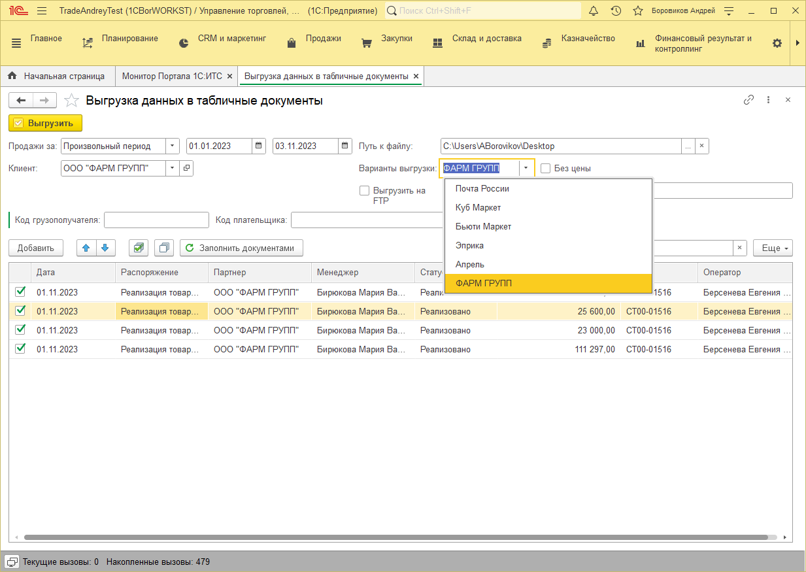

# Выгрузка реализаций в DBF

## Выгрузка в DBF
Выгрузка находится в подсистеме Продажи – Сервис – Выгрузка реализаций в DBF

Для начала необходимо найти документы для выгрузки.

Выбираем период Клиента и нажимаем кнопку «Заполнить документами», получаем список документов для выгрузки.

Галочками, слева от даты рализации, отмечаем какие документы необходимо выгрузить.

Указываем путь в папку куда будут сохранятся наши файлы «Путь к файлу».

Выбираем нужный вариант выгрузки.

Нажимаем кнопку «Выгрузить» в верхней части формы.

