# Загрузка данных в бухгалтерию

## Необходимые настройки
#### ***Справочник Контрагенты***
Переходим в справочник **Контрагенты**: подсистема **Справочники** – **Контрагенты**

Находим нужного контрагента в списке, выделяем его одинарным кликом мышки, далее меню **Ещё** – **Дополнительные сведения**.

Тут одно дополнительное сведение **CUSTOMER\_ID** – это код партнера в базе **УТ** (Управление торговлей), для корректной работы выгрузки эти данные должны быть заполнены корректно.

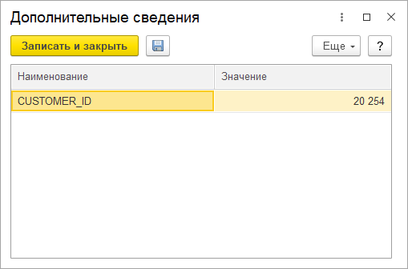

*При загрузке новых контрагентов, которых нет в базе **Бухгалтерии,** они будут созданы **автоматически** и сведение **CUSTOMER\_ID** будет заполнено тоже.* 

*Вручную нужно заполнять **CUSTOMER\_ID** только если вы вручную вводите нового контрагента!*
## Добавление дополнительного сведения в список Справочников/Документов
Для визуально контроля наличия дополнительных сведений у справочников или документов (алгоритм универсален для всех элементов) можно добавить это сведения в список.

Добавим на примере справочника **Контрагенты**.

В списке справочника нажимаем меню **Eщё** – **Изменить форму.**

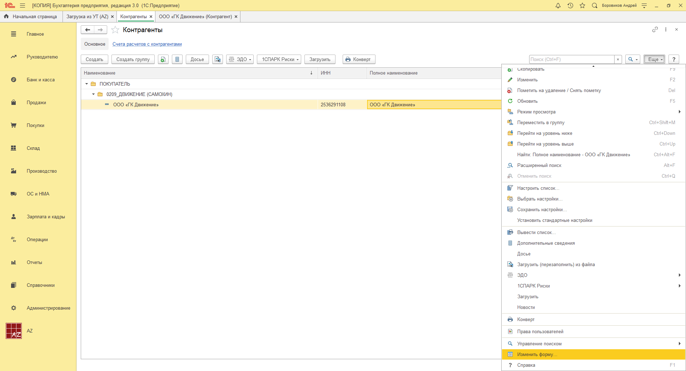

В открывшемся окне слева находим элемент **Ссылка**, выделяем его левой кнопкой мыши, нажимаем кнопку **Добавить поля**, находим нужное сведение, в нашем случае это **CUSTOMER\_ID**, ставим галочку и нажимаем во всех окнах **Ок**.

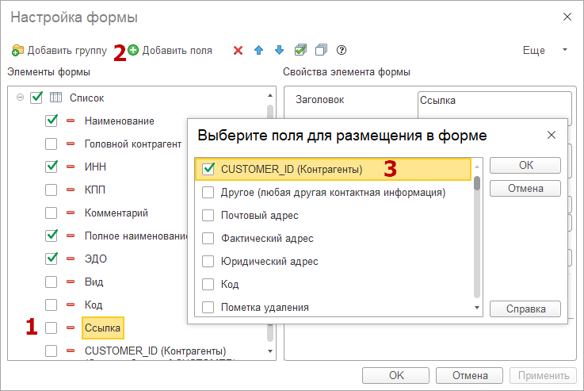

В результате дополнительное сведение будет видно в списке справочника.

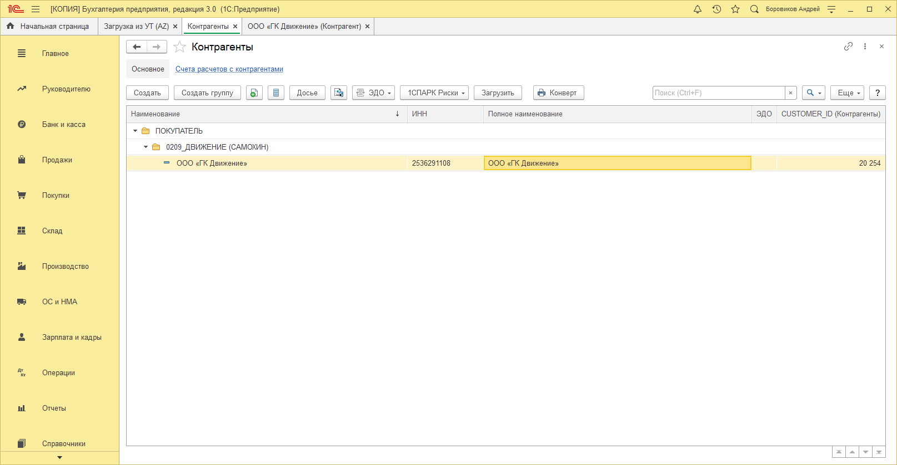
## Договора Контрагентов
У договоров два дополнительных сведения.

**ID Покупателя** – необходимо для работы подмены партнера при загрузке, т.е. в базе УТ может быть несколько партнеров, а в базе бухгалтерии это один партнер с разными договорами. 

В этом случае в сведение **ID Покупателя** вносится **CUSTOMER\_ID** (код основного партнера по базе УТ) для подстановки нужного договора при подмене.

**НомерДоговора** – если у партнера несколько договоров, то можно указать в этом поле номер договора из базы УТ и при загрузке в документы будут подставляться нужный договор. В противном случае будет установлен основной договор контрагента.

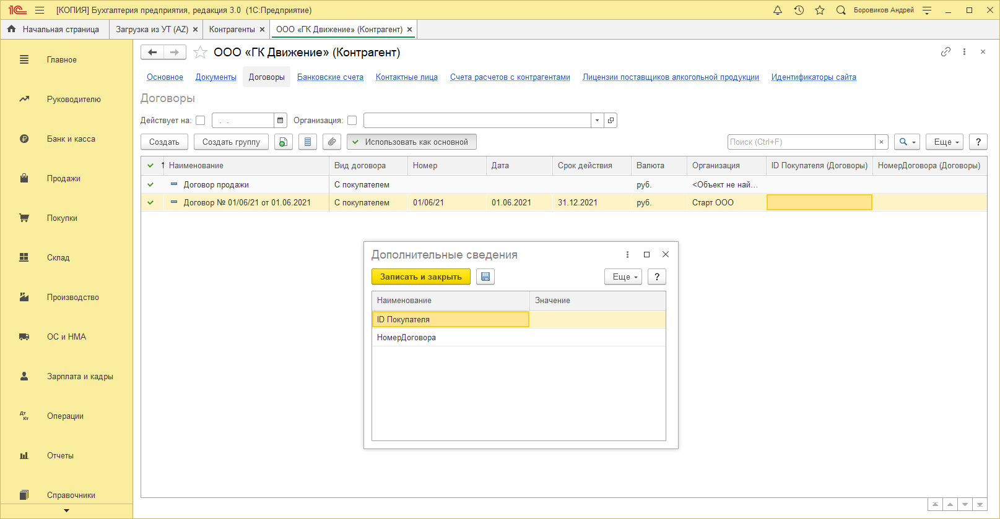

## Справочник Номенклатура
**КодУТ** – это код номенклатуры по базе **УТ**, основное поле по которому происходит поиск номенклатуры при загрузке. Если, при загрузке, номенклатура не будет найдена по **КодУТ**, то произойдет поиск по **Наименованию**, если и в этом случае ничего не будет найдено, то будет создана новая номенклатура.

**АналогНом** – аналог номенклатуры, не используется при загрузке.

**НеИспользоватьПриЗагрузкеИзУТ** – как понятно из названия эта номенклатура будет игнорироваться алгоритмом поиска при загрузке.

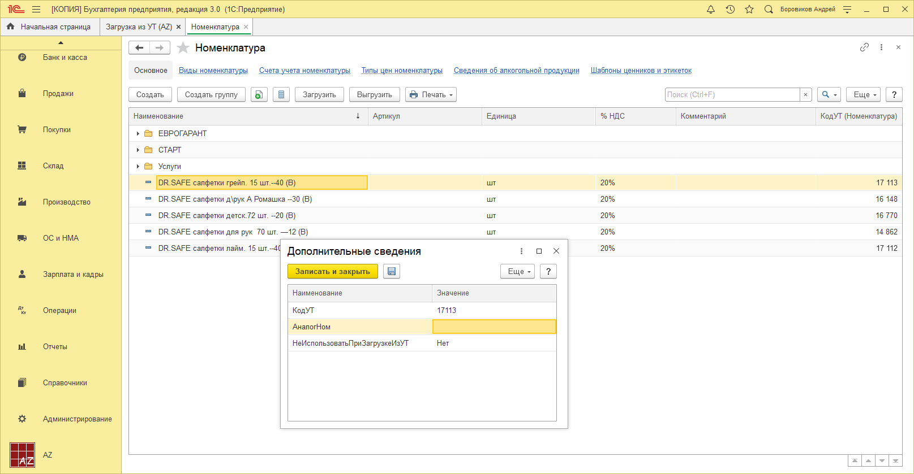

*При загрузке новой номенклатуры, которой нет в базе **Бухгалтерии,** она будет создана **автоматически** и сведение **КодУТ*** *будет заполнено тоже.* 

*Вручную нужно заполнять **КодУТ*** *только если вы вручную вводите новую номенклатуру!*
## Справочник Склады
**Склад\_Склад** – в этом свойстве указывается наименование склада по базе УТ.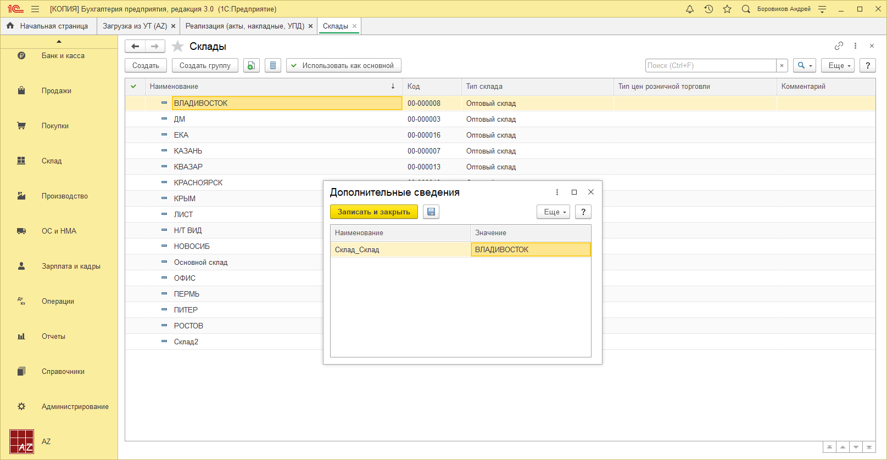

## Сведения документов
У документов, загружаемых загрузкой, одинаковые свойства, посмотрим на примере Реализации.

**Загружен** – значение **Да** говорит о том что документ был загружен загрузкой.

**СвойствоСвязиСклад** – это сведения для связи склада при загрузке.

Эти сведения не требуют ручного ввода.

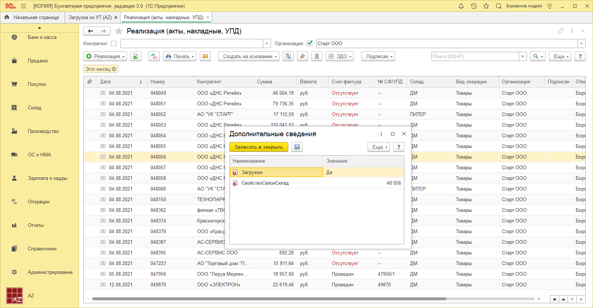

### **Настройки загрузки**
Загрузка находится в подсистеме **AZ** в меню **Сервис** – **Загрузка из УТ (AZ)**.

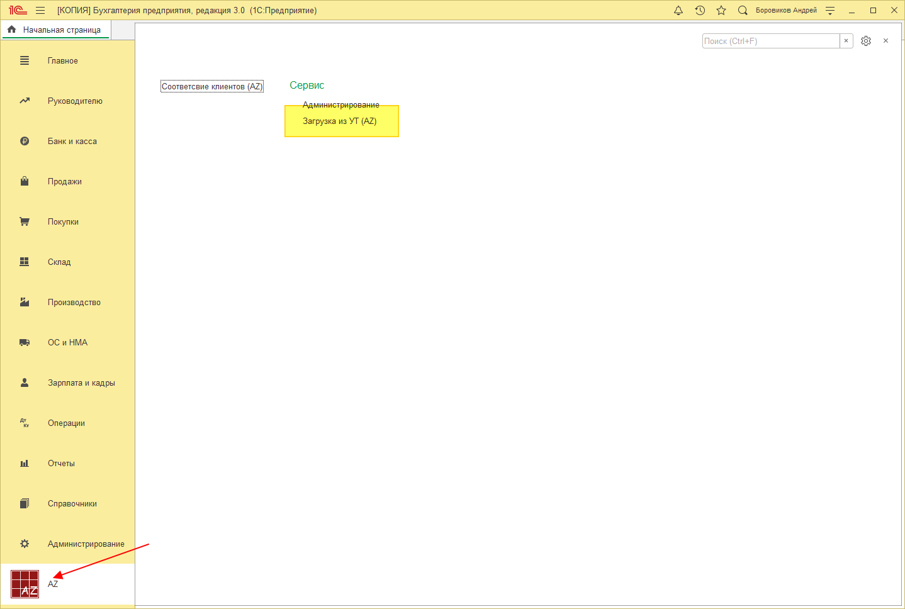
#### ***Вкладка Автозагрузка***
На первой вкладке устанавливаются какие именно данные и откуда мы будем грузить.

Для начала необходимо выбрать **Каталог файлов загрузки** – это папка в которую выгрузили данные.

Галочками отмечаем нужные документы для загрузки.

Обязательно, при первой загрузке выбранной выгрузки, ставить галочку **Справочники**. Если будет необходимость загрузить какие-либо документы из этой выгрузки еще раз, галочку **Справочники** ставить не обязательно. Если вы выгрузили новые данные из **УТ** то галочку **Справочники** необходимо установить снова.

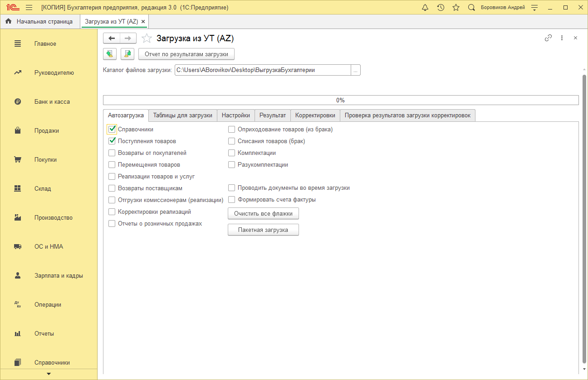

При нажатии кнопки **Пакетная загрузка** происходит загрузка данных.
#### ***Вкладка Настройки***
На этой вкладке находятся основные настройки загрузки.

**Каталог товаров** – это каталог в котором будут создаватся новые товары. Далее их можно будет переместить куда угодно, но создаватся они будут именно в этом каталоге.

**Номенклатурная группа** – она в базе одна, просто выбрать и все.

**Вид номенклатуры** – это вид номенклатуры с которым будут созданы новые карточки, необходимо выбрать **Товары**.

**Повторно загружаемые документы**

- **Перезаполнять** – если, при загрузке, будет найден документ в базе, он будет перезаполнен по данным в выгрузке.
- **Пропускать** – если, при загрузке, будет найден документ в базе, он будет пропущен. Актуально для загрузки новых данных за уже загруженый период.

**Тестовый период** – это период загружаемых данных.

*В работе с периодом есть несколько важный нюанс:*

- Конечный период нужно ставить на день вперед, т.е. если у нас есть выгрузка до 31.08.2021, то конечный период ставим 01.09.2021, иначе документы за 31.08.2021 могут не загрузится. 

**Перезаполнять СЧФ по РТИУ** – при нажатии кнопки номера **СФ** будут заменены номерами **РТИУ**, как в **УТ**.

**Дата основания корректировки** – это дата ранее которой нельзя создавать основание корректировки реализации, возможен только поиск. 

Если смотреть скрин ниже, то, если при загрузке **Корректировки раелизации**, реализация основание корректировки будет датой ранее 01.09.2021, и она не будет найдена в базе, то она будет создана/обновлена загрузкой. Если дата документа основания будет более установленой, то возможен только поиск.

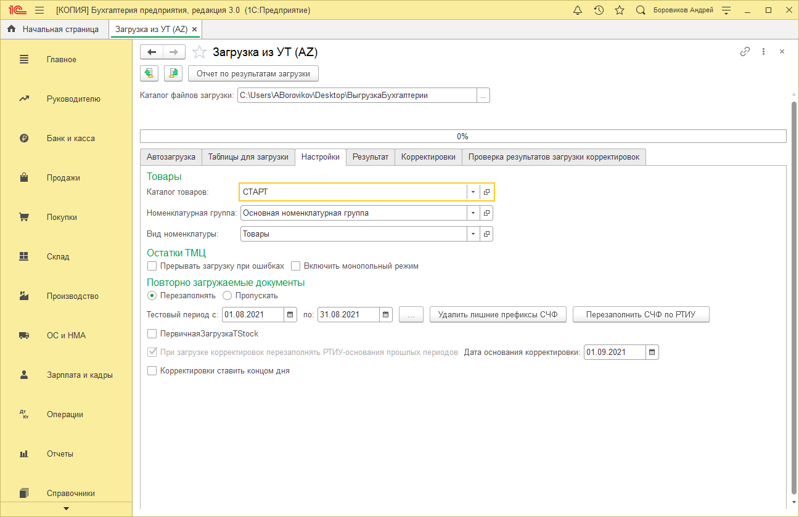

###
### **Загрузка**
При нажатии кнопки **Пакетная загрузка** на вкладке **Автозагрузка** происходит загрузка данных.

Документы загружаются не проведенными и без **СФ** если не установить галочки на вкладке **Автозагрузка**.

**Проводить документы во время загрузки** – документы будут проведены при загрузке.

**Формировать счета фактуры** – будет создаваться **СФ** к документам.

Документы без проведения будет загружены намного быстрее.

**ВАЖНО!**

**При загрузке реализаций товаров и услуг с установленными галочками проведения и создания СФ, номера СФ будут установлены как номер самой реализации, как в УТ.** 

**При ручном проведении РТИУ и создании СФ, номер СФ будет отличаться от номера самого документа и номера в УТ, сработает типовой механизм Бухгалтерии.**

