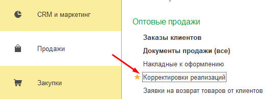
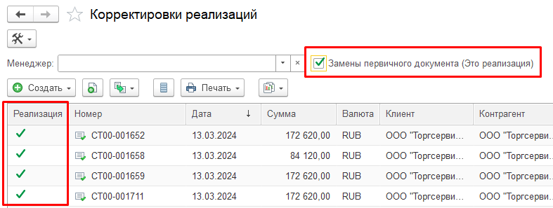
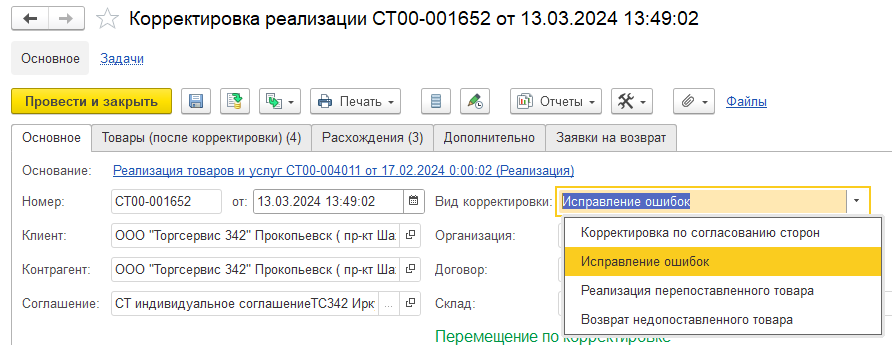
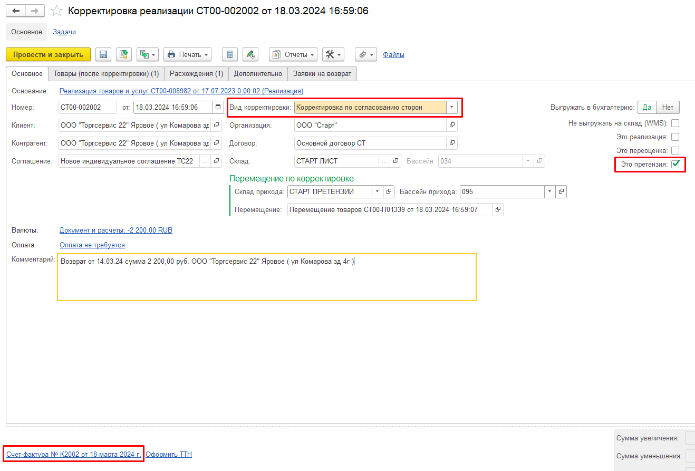

# Обновление 2024-04-04

## Видеоинструкция

В списке *Корректировки реализаций* теперь есть возможность отобрать только реализации – проставляем флаг *Замена первичного документа (Это реализация)*. Показывает реализации замены первичных документов.

Возможные виды корректировок в программе – *Корректировка по согласованию сторон, Исправление ошибок, Реализация пересоставленного товара, Возврат недопоставленного товара*.

Мы используем первые 2 вида – *Корректировка по согласованию сторон* (согласованное изменение цены или объема поставляемых услуг, работ или товаров; выставляется корректировочная счет-фактура)*, Исправление ошибок* (если необходимо исправить ошибку в указании реквизитов документа; например, неправильно указали данные организации, контрагента и т.п.).

На основании документа *Корректировка реализации* оформляется счет-фактура, в номере которой добавляется буква «И» для исправления ошибок, буква «К» для корректировки по согласованию сторон, буква «Р» – замена первичных документов.

