# 2024-04-10 Обновление  УТ и Бухгалтерии 

Изменения касаются одновременно двух конфигураций – **Бухгалтерии** и **Управления торговлей.**

[Скачать Видеоинструкцию](./img/obnovlenie-ut-i-buhgalterii-ot-2024-04-10/Обновление_УТ_и_Бухгалтерии_от_2024_04_10.mov)

## Бухгалтерия   

Покупки – Корректировка поступления

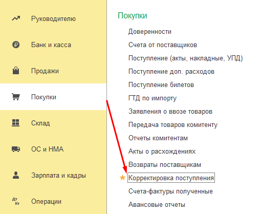

Для примера в списке корректировок выбираем произвольную корректировку. На вкладке *Главное* есть два поля *Документ №* (номер и дата корректировочной счет-фактуры контрагента, в данном примере – поставщик ООО «СТАРТ») и *Номер* (номер и дата из документа контрагента). Эти поля заполняются при загрузке из корректировки реализации, которая выбрана в документе *Корректировка поступления* в бухгалтерии. 

В целом это загрузка корректировок поступления АЗ по корректировке реализации ООО «СТАРТ», мы должны указать дату и номер входящего документа ООО «СТАРТ». Внизу слева мы видим поле *Комментарий* – это номер документа в УТ, в данном случае это номер корректировки приобретения в УТ.

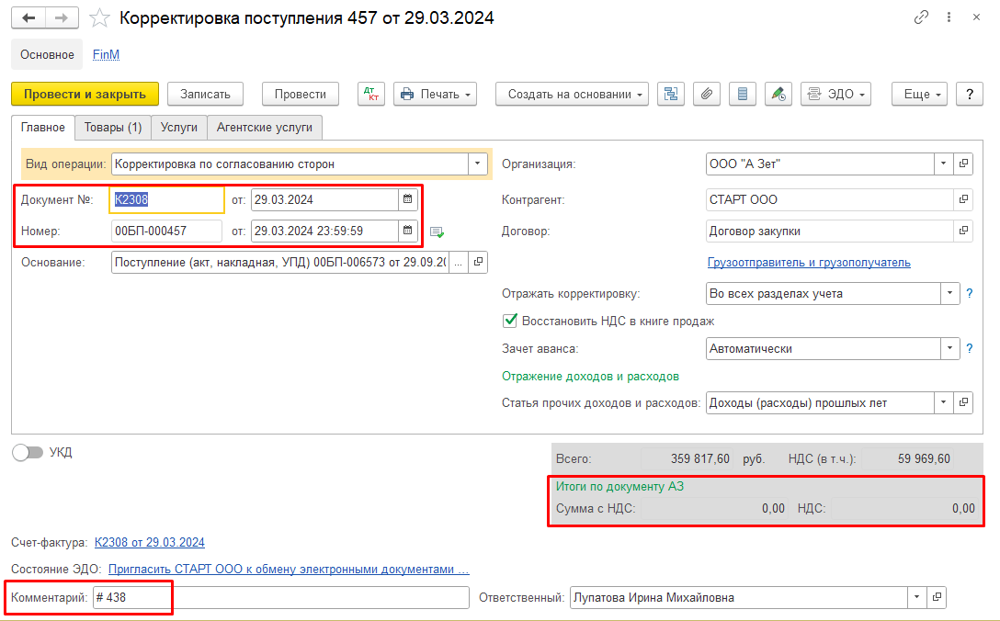

На той же вкладке в итогах внизу формы добавили новую строку *Итого по документу АЗ* и два поля *Сумма с НДС* и *НДС*.* Эти данные подгружаются из УТ в бухгалтерию. Сейчас они пустые, но когда произойдет загрузка, появятся значения.

На вкладке *Товары* мы видим суммы *до изменения* и *после изменения*.

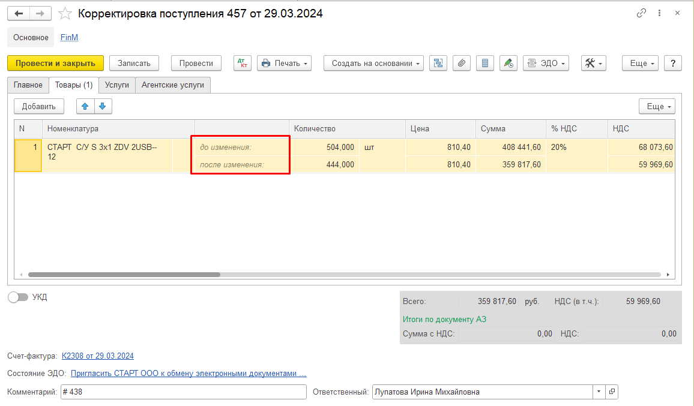

## Управление торговлей

Теперь посмотрим документы в УТ. Раздел *Закупки* – *Документы закупки (все).*

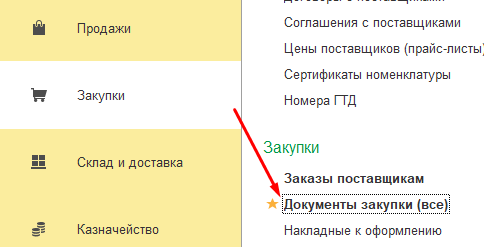

Воспользуемся поиском и найдем необходимые документы *Корректировка приобретения* и *Счет-фактура полученный*.

В корректировке приобретения на вкладке *Основное* есть поля *Номер* и *Дата корректировки реализации* и *Корректировка реализации*, в нашем случае от ООО «СТАРТ» корректировка реализации 2308 от 29.03.24. 

Именно из этого поля выгружаются данные в бухгалтерию по номеру и дате исходной корректировки.

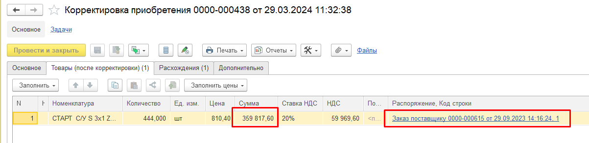

На вкладке *Товары (после корректировки)* мы увидим итоговую сумму и ссылку на заказ поставщику, а на вкладке *Расхождения* – сумму изменения.

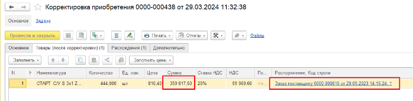

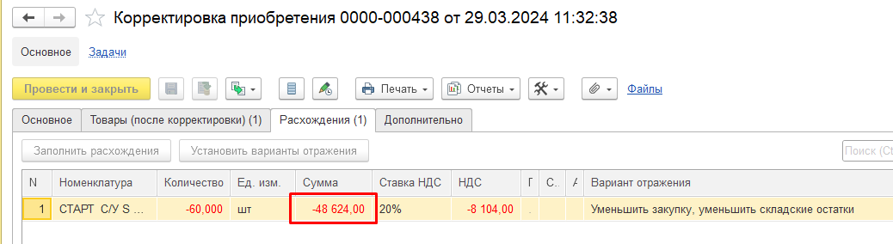

На обеих вкладках есть ссылка на счет-фактуру, есть итоговая сумма, а также сумма увеличения или уменьшения.

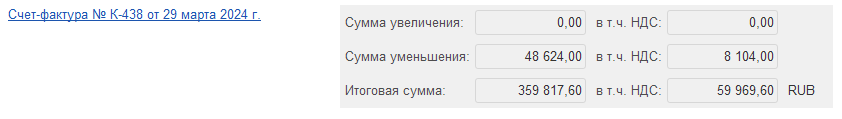

## Сверка в бухгалтерии

Для выявления расхождений между бухгалтерией и УТ в бухгалтерии в разделе *Расширение А Зет – Отчеты* был добавлен новый отчет – *Сверка загрузки корректировок поступлений (АЗ)*. Работа с отчетом происходит стандартным образом, особое внимание стоит уделить следующим флагам: *Только с расхождением, Без расхождений, Без пустых значений из УТ*. 

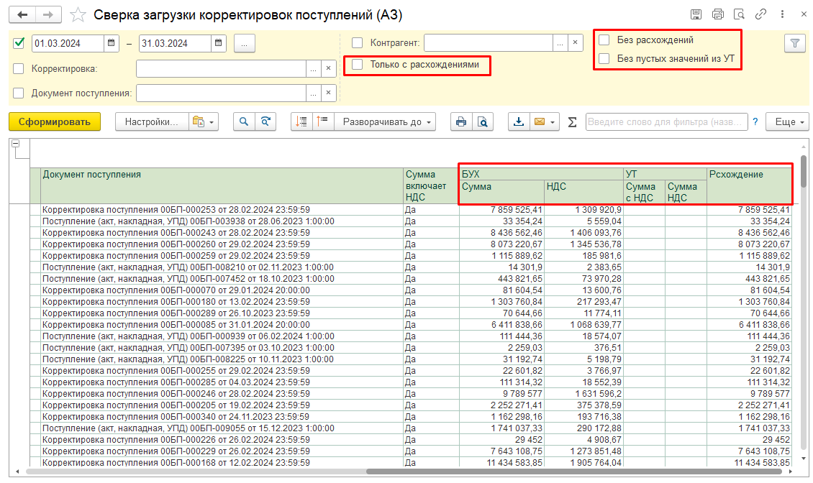

*Без пустых значений из УТ* – сейчас значений нет, потому что не было загрузки из УТ.

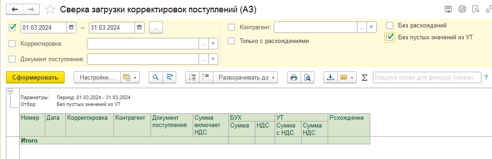

*Без расхождений* – показаны строки, в которых совпадают поля БУХ и УТ, сейчас совпадение происходит по пустым ячейкам.

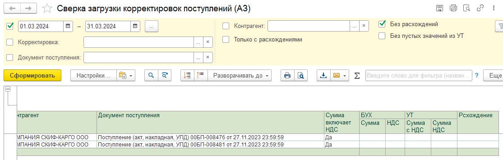

*Только с расхождением* – выводятся только те строки, в которых есть расхождения между ячейками БУХ и УТ.

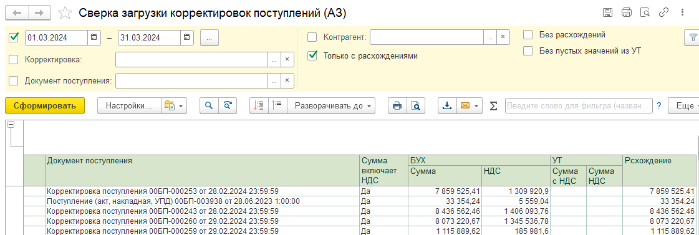

[ref1]: ./img/obnovlenie-ut-i-buhgalterii-ot-2024-04-10/Aspose.Words.bf950e0c-d16b-47eb-860e-47f4c68d645b.005.png
[ref2]: ./img/obnovlenie-ut-i-buhgalterii-ot-2024-04-10/Aspose.Words.bf950e0c-d16b-47eb-860e-47f4c68d645b.006.png
