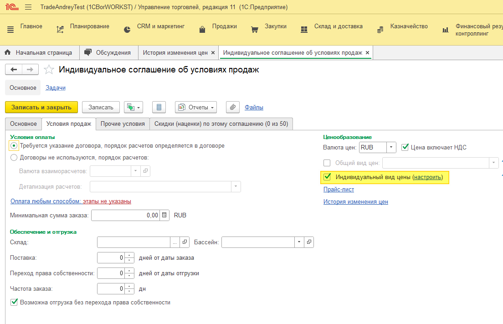
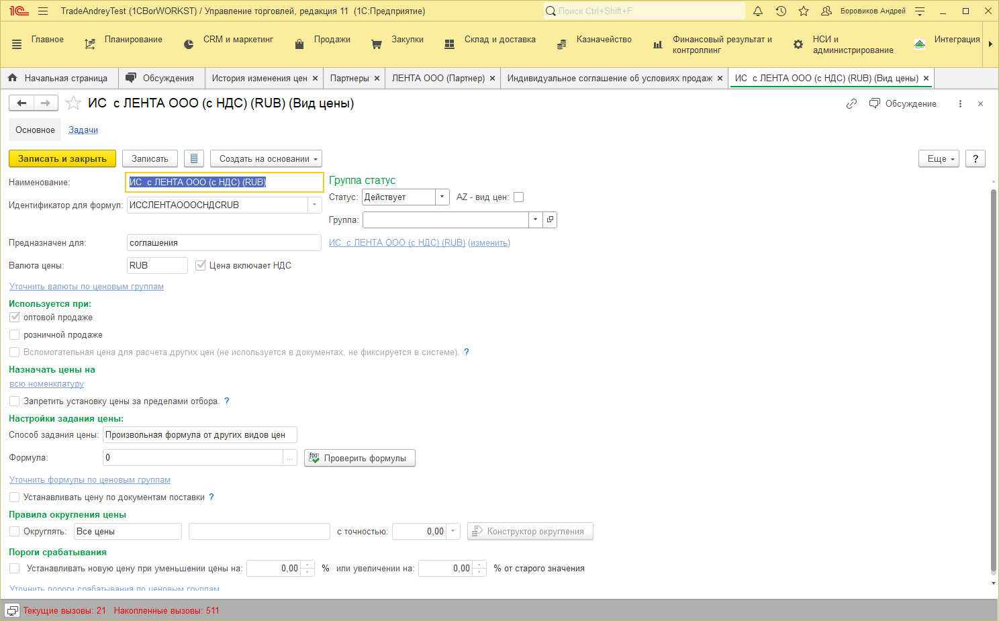
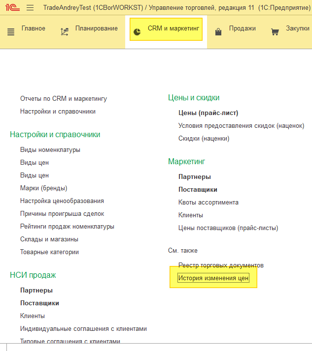
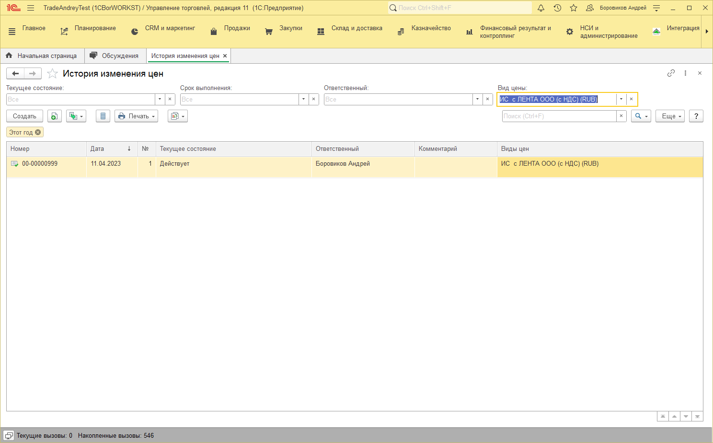
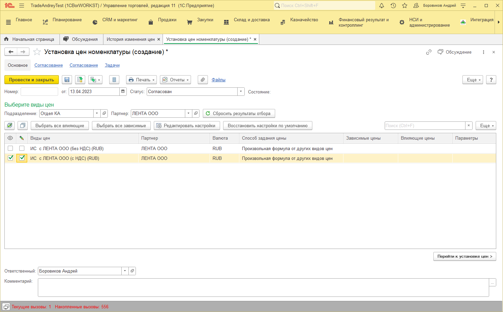
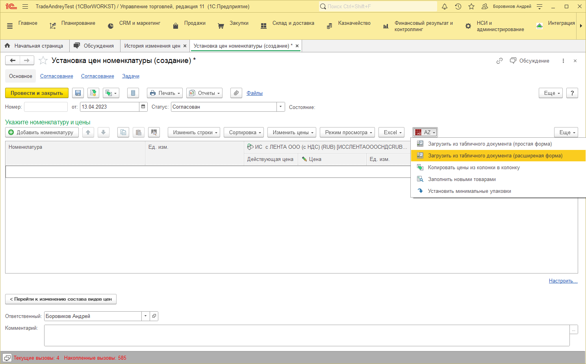
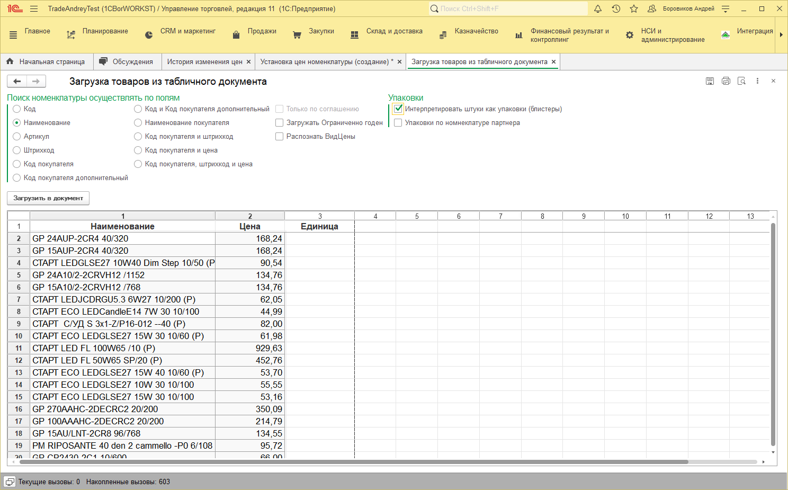
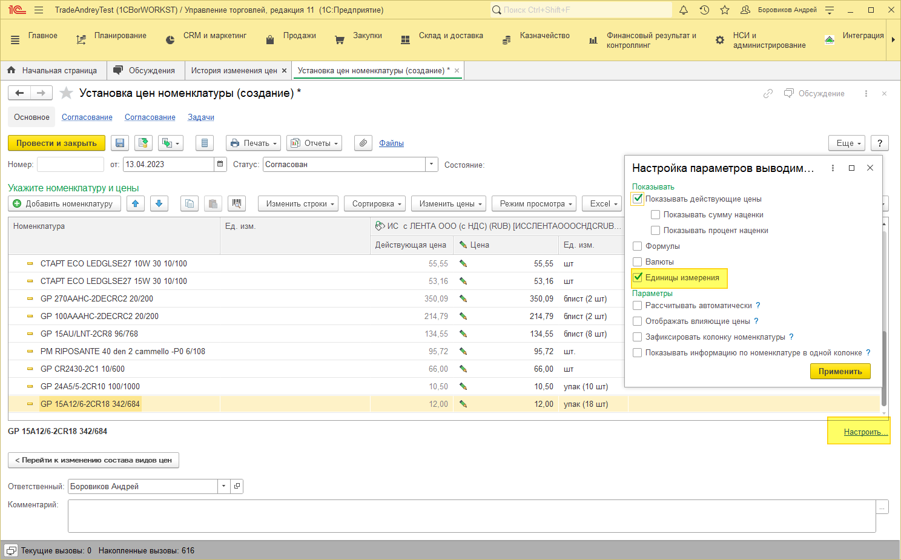

# Установка цен

## Вид цены в соглашении
В каждом соглашении с клиентом на вкладке «Условие продаж» есть галочка «Индивидуальный вид цены», именно по этому виду цены происходит установка цен.

При нажатии кнопки «Настроить» происходит открытие этого вида цен.

Наименование вида цены зачастую совпадает с наименованием соглашения. Но это не обязательное условие.

## Установка цены
Документы установки цен находится в подсистеме «CRM и маркетинг» - «История изменения цен».

В списке можно искать свои соглашения по виду цены.

Для создания новой установки цен нажимаем кнопку «Создать».

Поиск нужного вида цен происходит по «Подразделению» (заполняется автоматически от подразделения пользователя) и Партнеру, выйдет список доступных видов цен.

Если списко пуст, то для соглашений партнера не созданы виды цен. 

Выбираем нужный вид цены и нажимаем кнопку «Перейти к установке цен».

Далее можно добавлять позиции подбором, по одной или «Загрузить из табличного документа (расширеная форма)», используйте именно эту форму загрузки.

Откроется форма знакомая по прошлой весрсии программы.

Далее выбираем по какому полю загружаем данные.

Галочка «Интерпритировать штуки как упаковки (блистеры)» говорит о том цены мы вставили за шт, или за минимальную упаковку.

Нажимаем «Загрузить в документ».

Для того чтобы была видна колонка с упаковками нажимаем кнопку «Настройка» и ставим галочку «Единицы измерения».

После проведения документа цены будут установлены.

**Имейте ввиду что цены начинают действовать с момента их установки, т.е. увидеть установленные цены в документе продажи ранее даты установки цен будет нельзя.**

