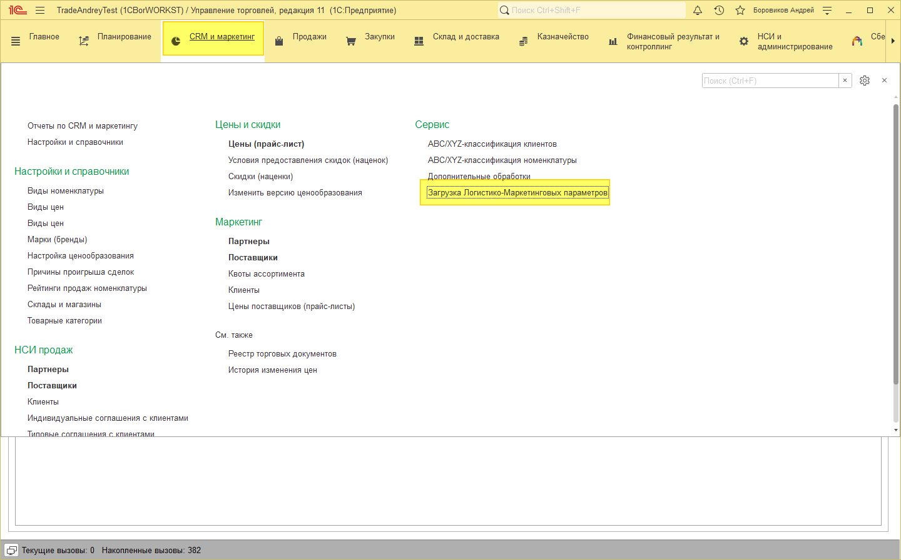
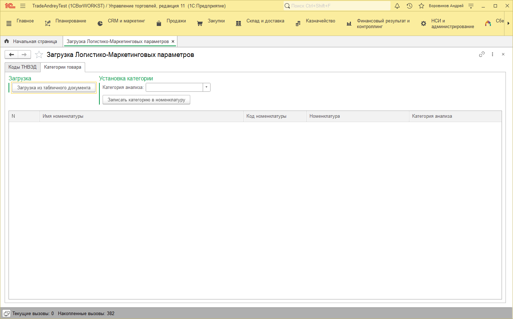
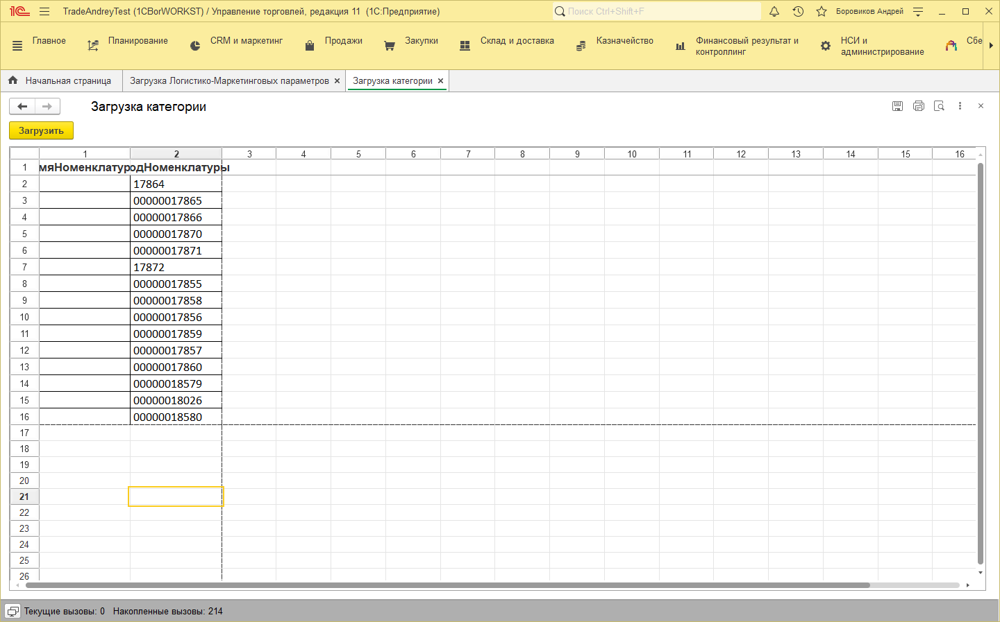
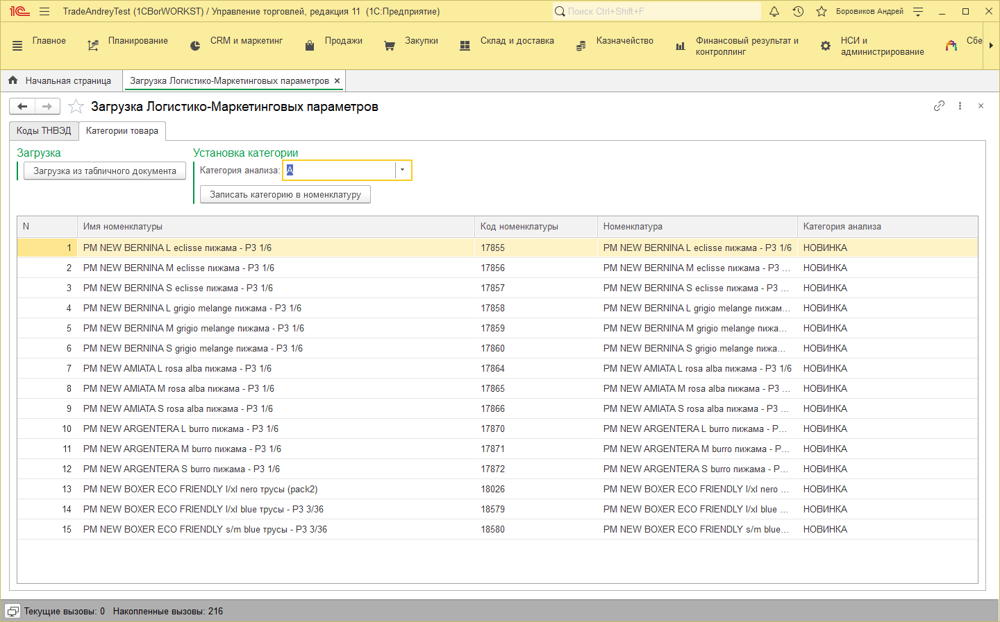
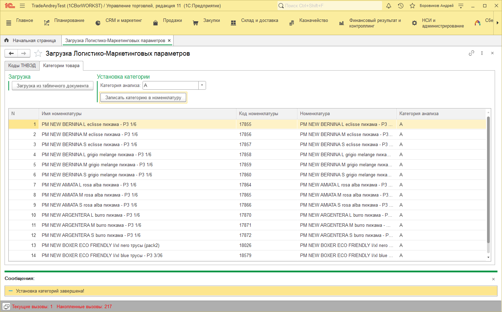

# Установка категорий по списку товара

## Загрузка категорий анализа
Загрузка находится в подсистеме «CRM и маркетинг» - Сервис – «Загрузка Логистико-Маркетинговых параметров».

После открытия переходим на вкладку «Категории товара».

Нажимаем кнопку «Загрузка из табличного документа».

В открывшемся окне заполнить одну из колонок «ИмяНоменклатуры» или «КодНоменклатуры», одновременно заполнять не нужно. Нажимаем кнопку «Загрузить».

Если товар найден, то он будет заполнен в таблице.

Далее выбираем «Категория анализа» на которую нужно изменить категорию в товаре.

Нажимаем кнопку «Записать категорию в номенклатуру», в результате категория будет изменена.

В списке категория будет изменена на выбранную.

Установка прошла!

