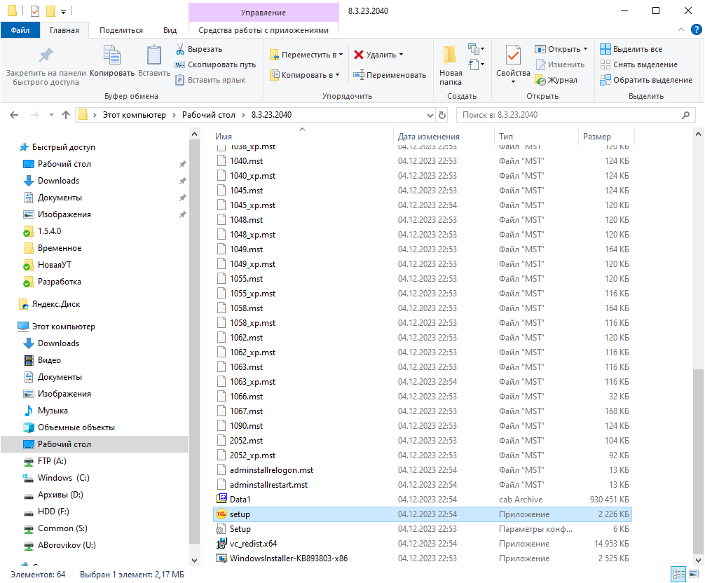
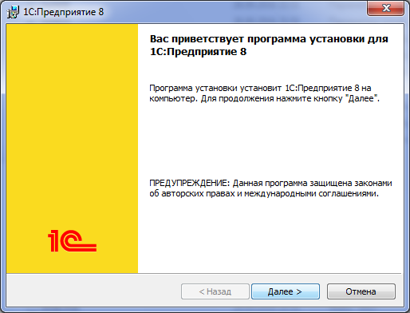
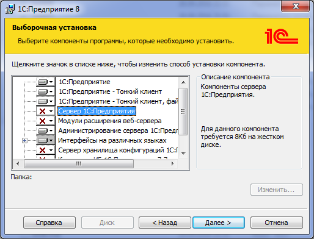
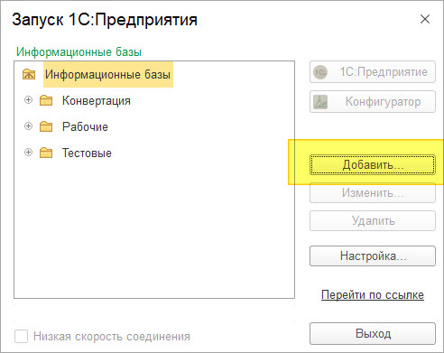
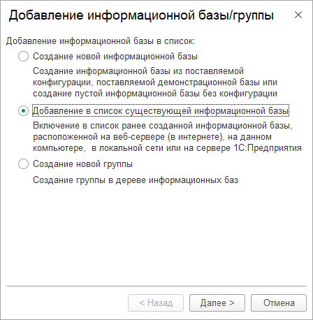
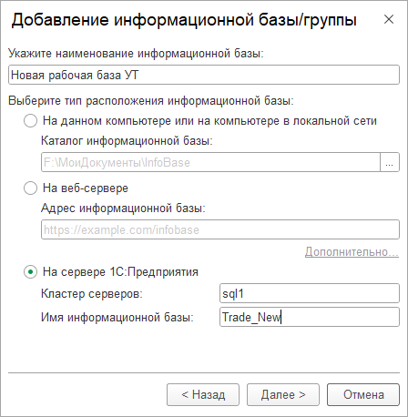

# Установка новой весрии программы 8.3.23.2040

Для всех пользователей программы, работающих через **VPN соединение**, необходимо самостоятельно установить новую версию платформы 1С, после обновления сервера 1С, работа со старой версией платформы в программе будет невозможна.

Нужно скачать платформу по ссылке: [скачать](https://disk.yandex.ru/d/q3JadKfi-SsEwQ)

После скачивания программы её нужно извлечь из архива.

Далее запускаете файл Setup.exe из папки куда распаковали архив с платформой

Для успешной установки программы во всех появляющихся окнах жмем Далее – Установить и в конце Готово. 

Если при установке выходит сообщение что дистрибутив не подходит для этой системы нужно скачать другой дистрибутив 
[скачать](https://disk.yandex.ru/d/EGHnUET4BtteEA)

Пару окон для примера:

# Если после установки программы не отображается база данных в окне запуска 1С.
## Делать только если рабочей базы нет в окне запуска программы!

Запускаете программу через Пуск – Все программы – 1С Предприятие 8 – 1С Предприятие 

Добавить – Добавление в список существующей базы – На сервере 1С предприятия (необходимо задать имя) – Задать имя сервера (sql1) и базы (Trade\New).

