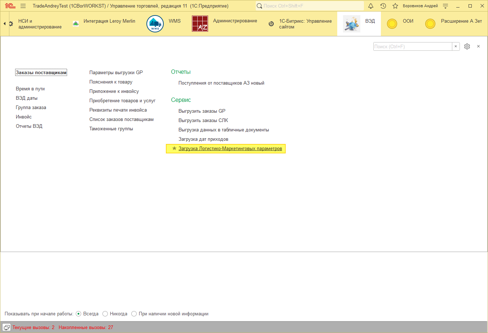
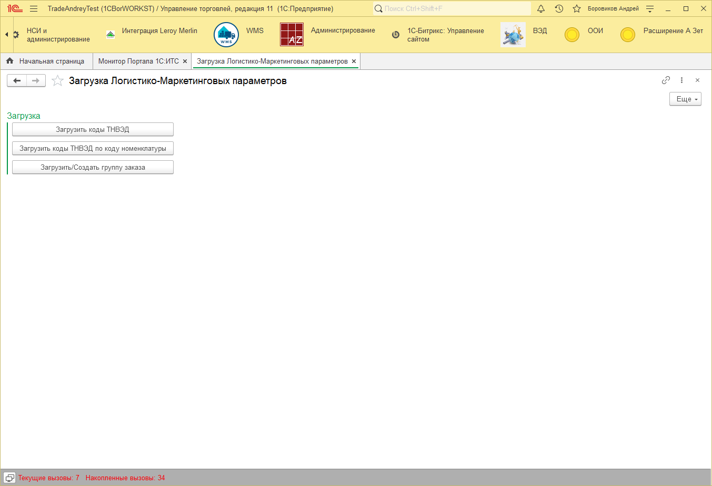
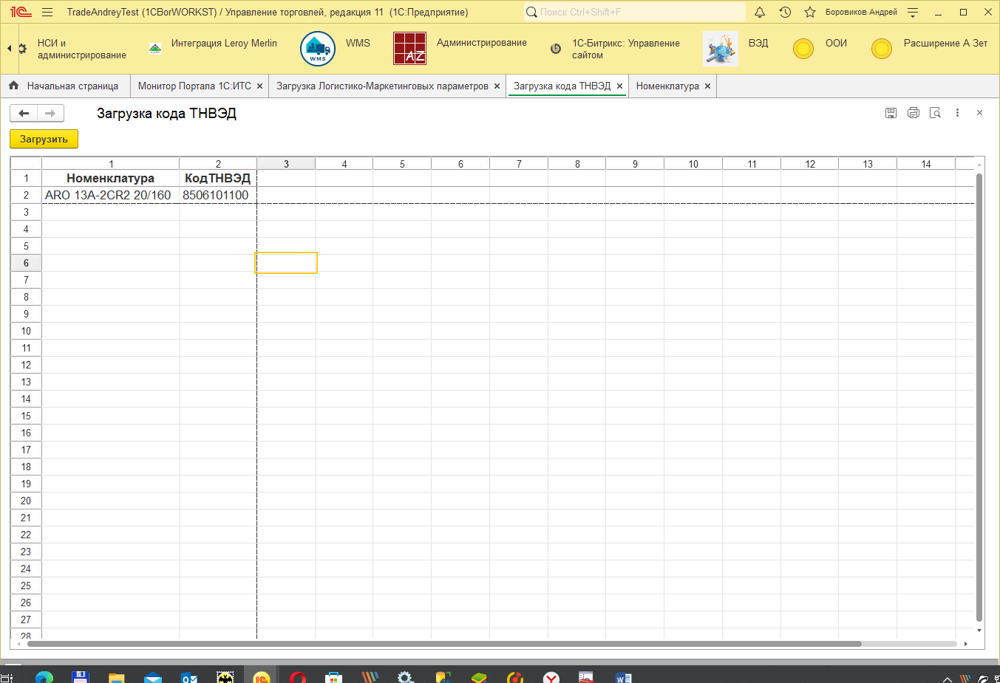
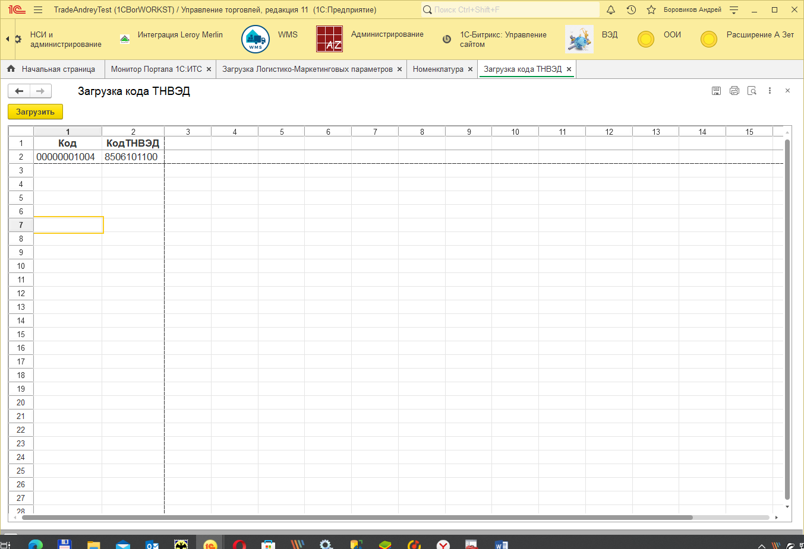
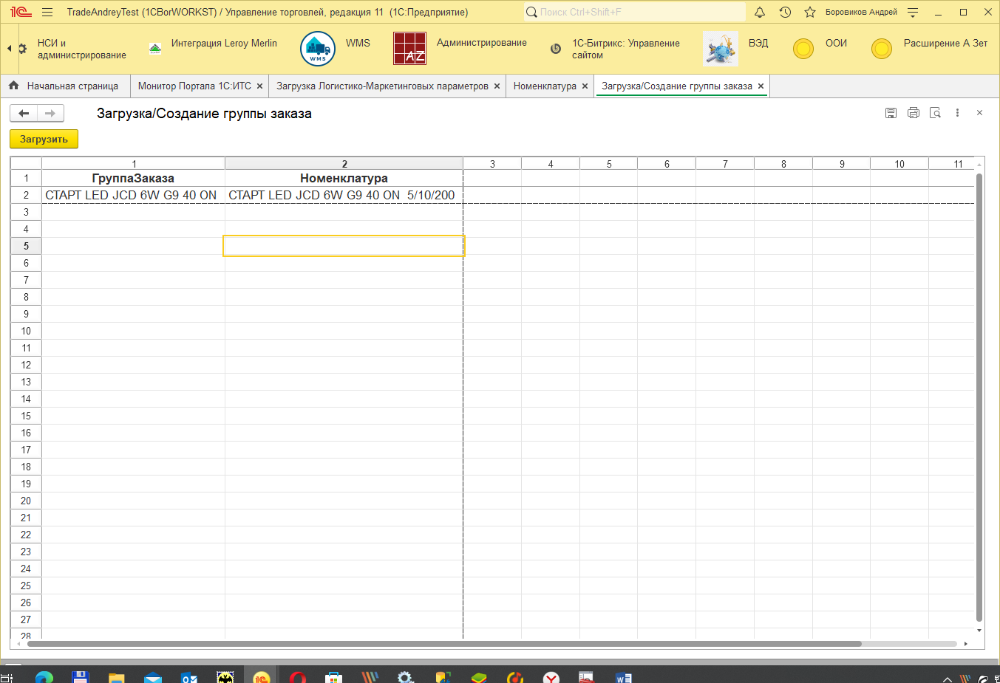

# Загрузка маркетинго-логистических параметров

В подсистеме «ВЭД» в группе «Сервис» добавлена обработка загрузки логистических параметров номенклатуры.  

## Загрузить коды ТНВЭД
Для загрузки заполняем колонки:

«Номенклатура» - это наименование номенклатуру в нашей базе.

Код ТНВЭД – это код по товарной номенклатуре внешнеэкономической деятельности.

При загрузке происходит добавление найденных позиций номенклатуры в табличную часть. 

Если в результате поиска «Код ТНВЭД» не был найден, то он создастся в справочнике «ТН ВЭД».

Загрузка происходит по нажатию кнопки «Загрузить».

## Загрузить коды ТНВЭД
Для загрузки заполняем колонки:

«Код» - это код номенклатуры в нашей базе, его можно заполнять как с нулями впереди (как на скрине ниже), так и без них.

Код ТНВЭД – это код по товарной номенклатуре внешнеэкономической деятельности.

При загрузке происходит добавление найденных позиций номенклатуры в табличную часть. 

Если в результате поиска «Код ТНВЭД» не был найден, то он создастся в справочнике «ТН ВЭД».

Загрузка происходит по нажатию кнопки «Загрузить».

## Загрузить/Создать группу заказа
Загрузка ищет существующие группы заказа в базе, и перезаполняет их, если они были найдены, или создает новые группы заказа. 

Для загрузки/Создания заполняем колонки:

«ГруппаЗаказа» - это наименование группы заказа.

«Номенклатура» - это наименование номенклатуру в нашей базе.

Загрузка происходит по нажатию кнопки «Загрузить».

